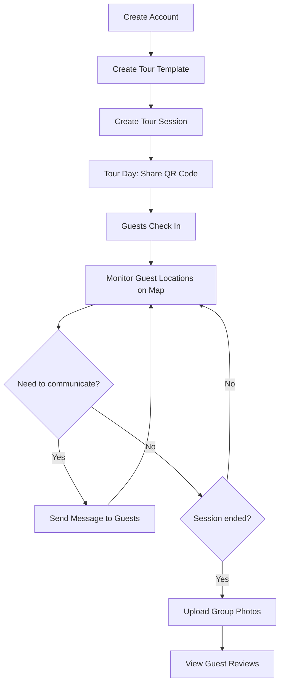
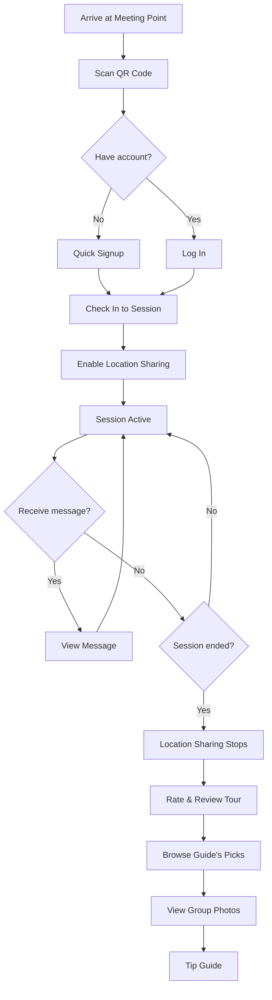
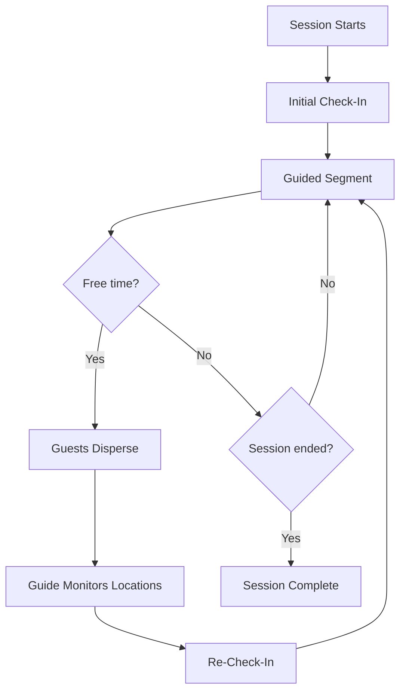

# Product Overview

Audience: Product Manager, Stakeholders

## Introduction

### What is TripToe?

TripToe is a mobile platform that connects tour guides with their guests during guided walking and bus tours. It solves the common problem of managing groups of tourists in busy, unfamiliar environments — where guests get lost, can't hear the guide, or miss important information.

The platform gives guides real-time visibility into where every guest is, and gives guests a simple way to stay connected to their guide throughout the tour.

### The Problem

Tour guides today face several challenges:

- **Lost guests** — In crowded cities and attractions, guests wander off or fall behind. The guide has no way to know who is missing or where they are.
- **Communication gaps** — Guides shout over traffic noise or use expensive radio equipment. Guests at the back of the group miss instructions.
- **Manual check-ins** — Roll calls waste time. Paper sign-up sheets are error-prone. There's no reliable record of who attended.
- **No post-tour engagement** — Once the tour ends, there's no channel to collect reviews, share group photos, collect tips, or build a repeat customer relationship.

### The Solution

TripToe provides two connected experiences:

**For Tour Guides:**

- **Create Tour Templates** — Define reusable tours with a title, description, duration, meeting point (with map coordinates), and cover image (auto-cropped to square thumbnail).
- **Create Tour Sessions** — Pick dates and times for specific occurrences of a template. Each session gets a unique QR code for guest check-in.
- **Track guests in real-time** — See every guest's location on a live map during the tour session. Know immediately if someone falls behind or goes the wrong way.
- **Send messages** — Push text messages to all guests or to individual guests within a session. Useful for instructions ("We're moving to the next stop"), alerts ("Meet back here in 15 minutes"), or emergencies.
- **Audio broadcast** — Broadcast voice to all guests' phones during the tour session, replacing expensive radio equipment.
- **Post-tour engagement** — After the session ends, upload group photos for guests, view guest reviews and ratings, and collect tips via an external payment link (Venmo, PayPal, etc.).
- **Guide's Picks** — Curate a persistent list of local recommendations (restaurants, bars, sights, shops, activities) that guests automatically see after a completed tour. Each pick has a name, category, optional personal note, and optional map link.

**For Tour Guests:**

- **Quick signup** — Designed for walk-up tourists. Minimal friction to create an account and join a tour session within minutes.
- **Join via QR code** — Scan the guide's QR code to instantly join the tour session. No searching, no typing codes.
- **Location sharing** — Opt-in to share location during the tour session so the guide can keep track of the group. Location sharing stops automatically when the session ends.
- **Receive messages** — Get real-time messages from the guide on your phone. Never miss an instruction.
- **Listen to audio** — Hear the guide's broadcast directly on your phone, even in noisy environments.
- **Rate and review** — Leave a star rating and optional review after the tour session ends.
- **View group photos** — Access group photos uploaded by the guide after the session.
- **Tip the guide** — Tap a tip button that opens the guide's external payment link (Venmo, PayPal, etc.).
- **Guide's Picks** — After a completed tour, browse the guide's curated local recommendations grouped by category (eat, drink, see, shop, do) with optional map links.
- **Discover nearby tours** — Find tour sessions starting soon near your current location.

## Key User Journeys

### Guide: Setting up and running a tour

1. Guide creates an account and sets up their profile
2. Guide creates a **Tour Template** (e.g., "Historic Rome Walking Tour — 3 hours")
3. Guide creates **Tour Sessions** — a single session or a recurring series (daily, weekly, custom)
4. On tour day, guide shares the session QR code with arriving guests
5. Guide starts the tour and monitors guest locations on the live map
6. Guide sends messages as needed during the session
7. After the session, guide uploads group photos and views guest reviews
8. Guide curates local recommendations (Guide's Picks) that guests see post-tour



### Guest: Joining and experiencing a tour

1. Guest arrives at the meeting point and sees the guide's session QR code
2. Guest scans the QR code, creates a quick account (or logs in)
3. Guest is checked into the **Tour Session**
4. Guest enables location sharing when prompted
5. Guest receives messages from the guide throughout the session
6. After the session, guest can rate the tour, view group photos, tip the guide, and browse the guide's local recommendations



### Guide: Managing multiple check-ins

Some tours have free-time segments (e.g., "Explore the market on your own for 30 minutes"). TripToe supports multiple check-ins per tour session:

1. Initial check-in at session start
2. Guests disperse for free time (guide monitors locations)
3. Re-check-in when the group reconvenes
4. Tour continues



## Product Details

### User Types

| User | Description | How they sign up |
|---|---|---|
| **Guide** | Professional or freelance tour guide | Google OAuth |
| **Guest** | Tourist joining a tour | Quick signup (name + email), or QR code scan |

### Multi-Operator Support

Guides can work for multiple tour operators or companies. TripToe supports this by allowing guides to be associated with different operators, each with their own branding and tour catalog.

### Tour Lifecycle

```
Template Created  →  Session Created  →  Guests Check In  →  Tour Active  →  Tour Completed
                                                                    │
                                                              Location tracking
                                                              Messaging
                                                              Audio broadcast
```

- **Location tracking** is active only during the tour session window
- **Messages** can be sent during the active tour
- **Post-tour features** (reviews, group photos, tips) are available after completion

### Platform

TripToe is a **mobile-first** application. The product depends on native mobile capabilities — background location tracking and push notifications — that a web app cannot reliably provide. A web browser loses access to location when the user navigates away or closes the tab, and push notifications are limited or unsupported on many mobile browsers. A native mobile app ensures location sharing and message delivery work even when the app is in the background or the screen is off.

- **Guests** use the mobile app exclusively (they are tourists on foot)
- **Guides** use the mobile app during tours (on foot with the group) and can use a web dashboard for tour setup and management if needed in the future

### Success Metrics

- **Guest signup time** — Target: under 60 seconds from QR scan to checked in
- **Location accuracy** — Guests visible on map within 30 seconds of enabling sharing
- **Message delivery** — Push notifications delivered within 5 seconds
- **Guide adoption** — Guides can create their first tour session within 10 minutes of signing up

## Summary

### First Release Features

Implemented in the existing codebase and will carry over.

**Guide Features:**
- Account creation and authentication (Google OAuth)
- Tour template creation and management (with cover image upload, server-side crop to square thumbnail)
- Tour session creation with specific dates and times, including recurring sessions (daily, weekly, weekday, custom) with batch creation
- Bulk session deletion (this session, this and following, all sessions)
- QR code generation for guest check-in
- Multiple check-ins per tour session (start, after free time, etc.)
- Real-time guest location tracking on interactive map
- Broadcast and direct messaging to guests
- Quick messages (reusable message presets)
- Guide's Picks: curate local recommendations (eat, drink, see, shop, do) with optional notes and map links
- Post-tour: upload group photos, view guest ratings and reviews
- Post-tour push notification (30 min after tour ends) nudging guests to view guide's picks
- Tip link on profile (external payment URL)
- Multi-operator support (guides working for multiple companies)

**Guest Features:**
- Quick signup (name + email) and QR code join
- Check-in to tour sessions
- Location sharing with automatic stop when tour ends
- Receive messages from guide
- Booking management
- Post-tour: star rating and review, view group photos, tip guide via external link, browse guide's local recommendations

### Future Features

Not yet implemented — planned for later releases.

**Guide Features:**
- Audio broadcasting to guest phones
- Tour analytics and reporting
- Social media sharing

**Guest Features:**
- Nearby tour discovery (find tours starting soon within a given distance)
- Listen to guide's audio broadcast
- Push notifications (messages delivered when app is in background)

**Platform:**
- Multi-language support
- Offline mode for areas with poor connectivity
