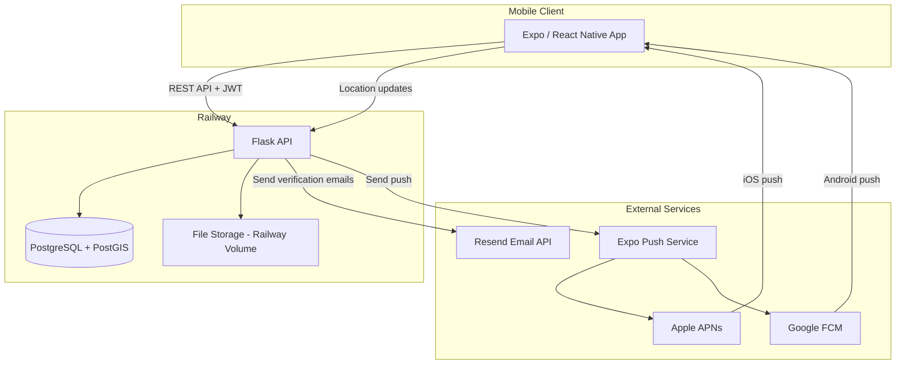
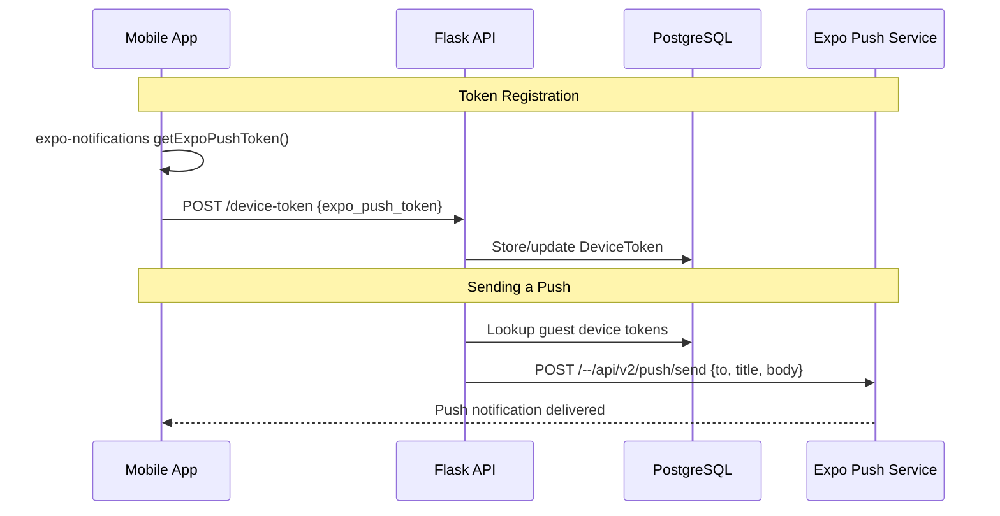

# Architecture

Audience: Architect, Tech Lead

## Overview

TripToe is composed of two codebases deployed on a single infrastructure provider:

```
triptoe-mobile (Expo / React Native)  →  triptoe-backend (Flask)  →  PostgreSQL + PostGIS
                                                                       (all hosted on Railway)
```

### Design Principles

- **Single provider** — All infrastructure runs on Railway to minimize operational complexity and cost
- **Mobile-first** — The mobile app is the only client; there is no web frontend
- **Self-contained auth** — Authentication is built into the backend (Google OAuth for guides, email verification codes for guests, JWT via flask-jwt-extended)
- **Push via Expo** — Push notifications use Expo Push Service, which abstracts APNs and FCM

## System Architecture



## Technology Stack

### Mobile Client (triptoe-mobile)

| Concern | Technology |
|---|---|
| Framework | Expo SDK 55 (React Native 0.83) |
| Navigation | Expo Router (file-based) with bottom tabs (Ionicons) |
| Styling | NativeWind (Tailwind CSS for React Native) |
| State management | Zustand |
| HTTP client | Axios |
| Maps | react-native-maps (Google Maps native) |
| Location | expo-location (foreground + background) |
| Timezone detection | expo-localization (device timezone auto-detect) |
| Date/time pickers | @react-native-community/datetimepicker |
| Push notifications | expo-notifications |
| QR scanning | expo-camera |
| Deep linking | Expo Router file-based routes (`app/s/[id].tsx`, `app/t/[id].tsx`) |
| Network images | expo-image (uses Coil on Android — does not cache failed loads unlike React Native's Fresco) |
| Secure storage | expo-secure-store (for JWT tokens) |

Components, hooks, utilities, color tokens, and coding patterns are documented in `triptoe-mobile/CLAUDE.md`. That file is the primary reference for frontend engineers — it stays current because it's co-located with the code.
- Theme colors for JS props (mirrors `tailwind.config.js` tokens)

#### Real-time Updates (Silent Polling Strategy)

To ensure the UI stays updated without jarring loading spinners, the app uses a **Silent Polling Strategy**:

- **Initial Load**: Shows `LoadingScreen` and resets component state.
- **Background Refresh**: Every 25–30 seconds, the app fetches fresh data from the API and updates state "silently."
- **Affected Screens**:
    - `tour_session_details.tsx`: Updates guest list and check-in counts.
    - `tour_booking_details.tsx`: Updates session metadata and status.
- **Auto-Termination**: Polling intervals are cleared automatically when the tour status transitions to `completed`.

#### Guest Dashboard Refresh Strategy

The guest dashboard uses a three-layer refresh approach:
- **On focus**: Fetches fresh booking data from the API when the screen gains focus (`useFocusEffect`)
- **Local timer**: A 60-second `setInterval` updates `Date.now()` to re-evaluate which tours are "starting soon" (within 60 minutes) — triggers the day-of nudge (meeting place photo + "To Meeting Point" button) with zero network cost
- **Pull-to-refresh**: Manual swipe-down to fetch fresh data from the API

#### Post-Tour Tabs

When a tour session is completed, both guide and guest detail screens switch to a tabbed layout:

| Role | Tabs (in order) |
|---|---|
| **Guide** (Session Details) | Guests, Reviews, Photos, Messages |
| **Guest** (Tour Details) | Review & Tip, Guide's Picks (conditional), Photos, Messages |

The guest's "Guide's Picks" tab only appears if the guide has picks. Default tab for guests is "Review & Tip".

#### Timezone Strategy

Three distinct timezones interact: guide device, guest device, and tour template. All tour times display in the **tour template's timezone**. All datetimes are stored in **UTC** in the database. Session creation uses **wall-clock projection** to correctly convert picker values into the tour's timezone. Recurring sessions project per-date to avoid DST drift.

For the full rules, DST handling, and common pitfalls, see **[9c_feature_timezone_strategy.md](9c_feature_timezone_strategy.md)**.

#### Navigation

Both guide and guest flows use **bottom tab navigation** (Expo Router `<Tabs>`):

| Role | Tab 1 | Tab 2 | Tab 3 |
|---|---|---|---|
| Guide | My Tours (dashboard) | Schedule (day planner) | Profile |
| Guest | My Tours (dashboard) | Join Tour (QR/code) | Profile |

Non-tab screens are hidden from the tab bar with `href: null`:
- **Guide**: `tour_sessions`, `tour_session_details`, `tour_session_messages`, `create_tour_template`, `create_tour_session`, `edit_tour_template`, `quick_messages`, `guide_picks`, `tip_links`, `edit_account`, `signin`
- **Guest**: `tour_booking_details`, `join_tour_session`, `tour_session_messages`, `signin`, `signup`

Auth screens (`signin`, `signup`) additionally hide the tab bar entirely via `tabBarStyle: { display: 'none' }`. This prevents unauthenticated users from tapping into protected screens.

#### Returning User Auto-Skip

The welcome screen (role selection) is shown only on first launch. For returning users, the app persists `lastUserType` in `SecureStore` across logout and auto-redirects to the appropriate signin screen on cold start. Users can still switch roles via "Sign in as Guest" / "Sign in as Guide" buttons on the signin screens, which navigate back to the welcome screen.

#### Edit Navigation

Edit screens use a `back_to` param to return to the originating screen:

| Screen | Accessible from | Back/Save goes to |
|---|---|---|
| Edit Tour Template | My Tours (edit icon + text), Tour Sessions (tap title/thumbnail) | My Tours or Tour Sessions (based on `back_to` param) |
| Edit Session | Tour Sessions (Edit link on card), Schedule (Edit link on card), Session Details (Edit Session button) | Tour Sessions, Schedule, or Session Details (based on `back_to` param) |

Delete Tour always returns to My Tours (since the tour no longer exists). Schedule uses `router.navigate()` instead of `router.replace()` to trigger data reload via `useFocusEffect`.

#### Session Grouping (TabBar)

Both the guide's tour sessions and the guest's My Tours dashboard group sessions into three tabs:

| Tab | Contents | Sort |
|---|---|---|
| **Today** | Sessions starting today (timezone-aware date comparison) | Ascending (soonest first) |
| **Upcoming** | Sessions starting after today | Ascending (soonest first) |
| **Completed** | Sessions whose end_datetime has passed | Descending (most recent first) |

Bucketing uses `end_datetime` for completed (past end = completed) and timezone-aware date comparison for today. The default tab is the first non-empty one (Today → Upcoming → Completed). Auto-select resets when the session list changes (e.g., navigating to a different tour). Both guide and guest use the same client-side grouping via the `useTourSessionTabs` hook.

#### Guide Dashboard Sorting

Tour templates on the guide's My Tours dashboard are sorted by nearest upcoming session first. The `GET /tours` API returns a `next_session_date` field (batch-queried) and each card shows "Next: [date]" when an upcoming session exists.

### Backend (triptoe-backend)

| Concern | Technology |
|---|---|
| Framework | Flask |
| ORM | Flask-SQLAlchemy |
| Migrations | Raw SQL scripts (manually applied) |
| Database | PostgreSQL + PostGIS |
| Auth | Google OAuth (guides) + email verification code (guests) + flask-jwt-extended |
| Email | Resend (verification codes for guest signup/sign-in) |
| Push notifications | HTTP POST to Expo Push API (requires Firebase/FCM for Android delivery) |
| File storage | Railway volume (local disk) |
| CORS | Flask-CORS |
| Scheduled jobs | APScheduler (BackgroundScheduler) |
| WSGI server | Gunicorn |

### Infrastructure (Railway)

| Resource | Purpose |
|---|---|
| Web service | Flask API (deployed from Dockerfile) |
| PostgreSQL | Database with PostGIS extension |
| Volume | File storage (generated QR codes, profile photos, tour cover images, meeting place photos, tour session photos) |

## Data Model

The data model follows a **template-session pattern**: guides create reusable **Tour Templates**, then create **Tour Sessions** for specific occurrences of those tours.

### PostgreSQL Schemas

Tables are organized into five PostgreSQL schemas:

| Schema | Purpose | Key tables |
|---|---|---|
| `guide` | Guide and operator data | guide, guide_pick, guide_location, operator, guide_operator_role |
| `guest` | Guest accounts and location | guest, guest_location, verification_code |
| `tour` | Tours, sessions, bookings | tour_template, tour_session, tour_booking, tour_checkin, tour_review, tour_session_photo, archived_booking |
| `message` | Messaging system | message, message_read_receipt, quick_message |
| `shared` | Cross-cutting concerns | device_token |

### Key Relationships

- `Operator` → `TourTemplate` → `TourSession` → `TourBooking` → `TourCheckin`
- `Guide` ←→ `Operator` via `GuideOperatorRole` (many-to-many with role)
- `Guest` → `TourBooking` → `TourCheckin` → `GuestLocation`
- `TourSession` → `Message` → `MessageReadReceipt`
- `TourBooking` → `TourReview` (one review per booking, enforced by unique constraint)

### Notable Design Choices

- **ID sequences start at 100000** for readability
- **PostGIS POINT type** for meeting coordinates
- **All datetimes stored in UTC** (`TIMESTAMPTZ`)
- **Soft deletes** for messages (`is_deleted` flag)
- **Archived bookings** — bookings are preserved when sessions are deleted
- **Dependency-aware deletion** — templates can't be deleted with sessions; sessions can't be deleted with bookings

The full ERD and column-level detail are in the SQLAlchemy models at `triptoe-backend/app/models/`.

## Authentication

Guides authenticate via Google OAuth. Guests authenticate via email + 6-digit verification code (sent via Resend). Both flows issue JWTs (access + refresh) managed by flask-jwt-extended, with automatic token refresh via Axios interceptors.

For auth flows, token strategy, session restoration, and account deletion details, see **[9a_feature_authentication.md](9a_feature_authentication.md)**.

## Location Tracking

Both guide and guest use `expo-location` background location updates via a shared `backgroundLocation.ts` service. Guide tracking auto-starts from the root layout whenever an active session exists (via `useActiveTourStore`). Guest tracking requires explicit opt-in ("Start Sharing Location"). All map positions are displayed by polling the backend — no local position state.

For the full flow (auto-start, boot resume, background task details, map polling, privacy), see **[9d_feature_location_tracking.md](9d_feature_location_tracking.md)**.

## QR Codes & Tour Joining

QR codes encode HTTPS URLs (`https://triptoe.app/s/{session_id}` for sessions, `/t/{template_id}` for templates) that work as both deep links (app installed) and web fallbacks (app not installed). The app handles them via Expo Router file-based routes (`app/s/[id].tsx` and `app/t/[id].tsx`) which manage auth-gating, booking, confirmation, and error handling.

Android App Links are verified via `/.well-known/assetlinks.json` on `triptoe.app`.

For the full end-to-end flow covering all auth states, edge cases, and the Cloudflare Worker fallback, see **[9b_feature_tour_joining_flow.md](9b_feature_tour_joining_flow.md)**.

## Push Notifications

### How It Works

1. On app startup, mobile app registers with Expo Push Service and receives an Expo push token
2. Token is sent to backend and stored in the `device_token` table
3. When a guide sends a message or the system triggers a notification, the backend sends a push via Expo Push API
4. Expo Push Service routes to APNs (iOS) or FCM (Android)

### Push Flow



### DeviceToken Table

```
device_token
├── id (PK)
├── user_uid (guide_uid or guest_uid)
├── user_type ('guide' or 'guest')
├── expo_push_token (string, unique)
├── device_info (JSONB — platform, OS version)
├── is_active (boolean)
├── created_at
└── updated_at
```

## API Structure

### Route Groups

| Prefix | Purpose |
|---|---|
| `/api/v1/auth` | Signup, signin, token refresh |
| `/api/v1/tours` | Tour template CRUD, `GET /tours/<id>/sessions` (all sessions for a template), ratings aggregation, template QR generation (`GET /tour-templates/<id>/qr`), public upcoming sessions (`GET /tour-templates/<id>/upcoming-sessions`) |
| `/api/v1/tour-sessions` | Tour session CRUD (single + batch create), `DELETE /tour-sessions/batch` (this_and_following / all), session QR generation, guest locations, message history |
| `/api/v1/guides` | Guide-specific views: `GET /guides/upcoming-sessions` (all upcoming sessions with template data, single JOIN query) |
| `/api/v1/bookings` | Guest bookings (by code or QR scan) |
| `/api/v1/checkins` | Guest check-in, update location sharing preference |
| `/api/v1/location` | Guest + guide location updates, stop sharing |
| `/api/v1/reviews` | Guest review submission, guide review retrieval |
| `/api/v1/messages` | Broadcast and direct messaging |
| `/api/v1/messaging` | Quick message management (guide's reusable message presets) |
| `/api/v1/guide-picks` | Guide's Picks CRUD, reorder, and public retrieval by guide UID |
| `/api/v1/operators` | Operator management |
| `/api/v1/device-token` | Push notification token registration |

### Authentication

All endpoints except signup/signin require a valid JWT in the `Authorization: Bearer <token>` header. The backend validates the token and extracts `uid` and `type` to identify the caller.

## Deployment

### Railway Setup

```
Railway Project: triptoe
├── Service: triptoe-backend (Flask, from Dockerfile)
│   ├── Environment variables: DATABASE_URL, JWT_SECRET, etc.
│   └── Auto-deploys from GitHub main branch
├── PostgreSQL: triptoe-db
│   └── PostGIS extension enabled
└── Volume: /uploads (QR codes, tour session photos, profile photos)
```

### Backend Deployment Flow

```
Developer pushes to GitHub  →  Railway detects change  →  Builds from Dockerfile  →  Deploys new version
```

### Mobile App Distribution

The mobile app is built using Expo EAS (Expo Application Services) and distributed through the app stores. The app is not hosted on Railway — it runs natively on users' phones.

```
Developer pushes to GitHub  →  Expo EAS Build  →  App binary (.ipa / .apk)  →  Apple App Store / Google Play Store  →  User's phone
```

During development, builds can be tested via Expo Go or internal distribution before submitting to the stores.

### Environment Variables

| Variable | Purpose |
|---|---|
| `DATABASE_URL` | PostgreSQL connection string (provided by Railway) |
| `JWT_SECRET` | Secret key for signing JWTs |
| `JWT_REFRESH_SECRET` | Secret key for signing refresh tokens |
| `ALLOWED_ORIGINS` | CORS allowed origins |

