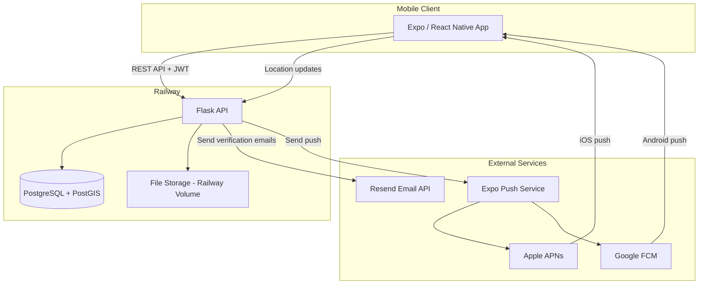
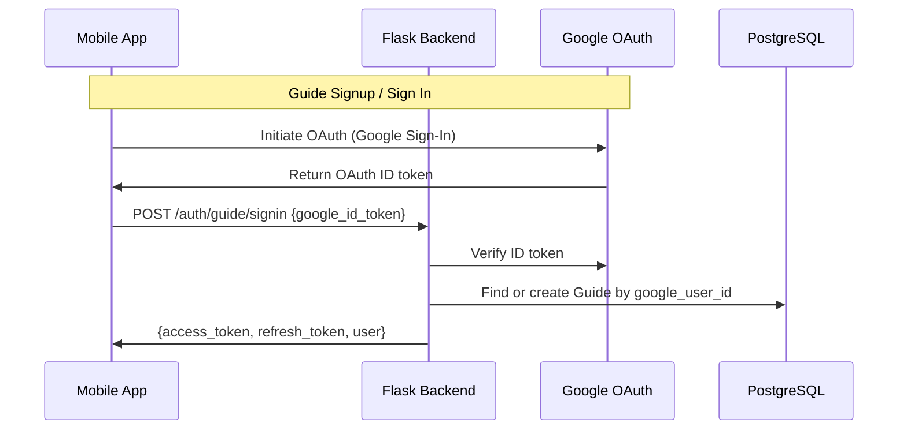
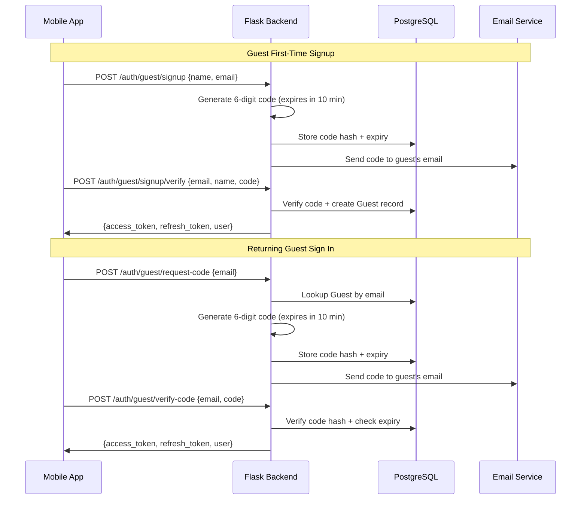
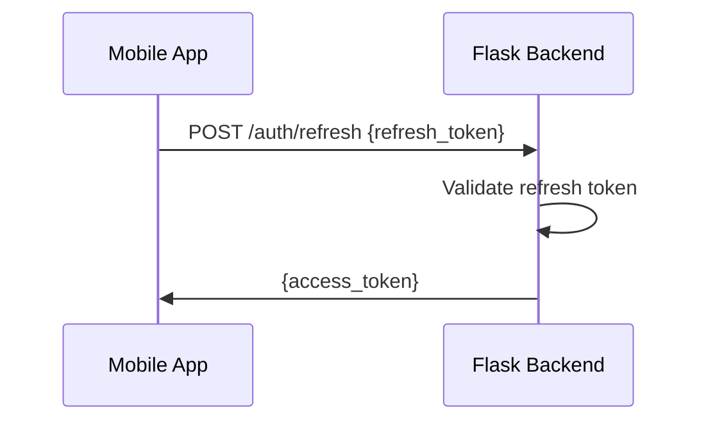
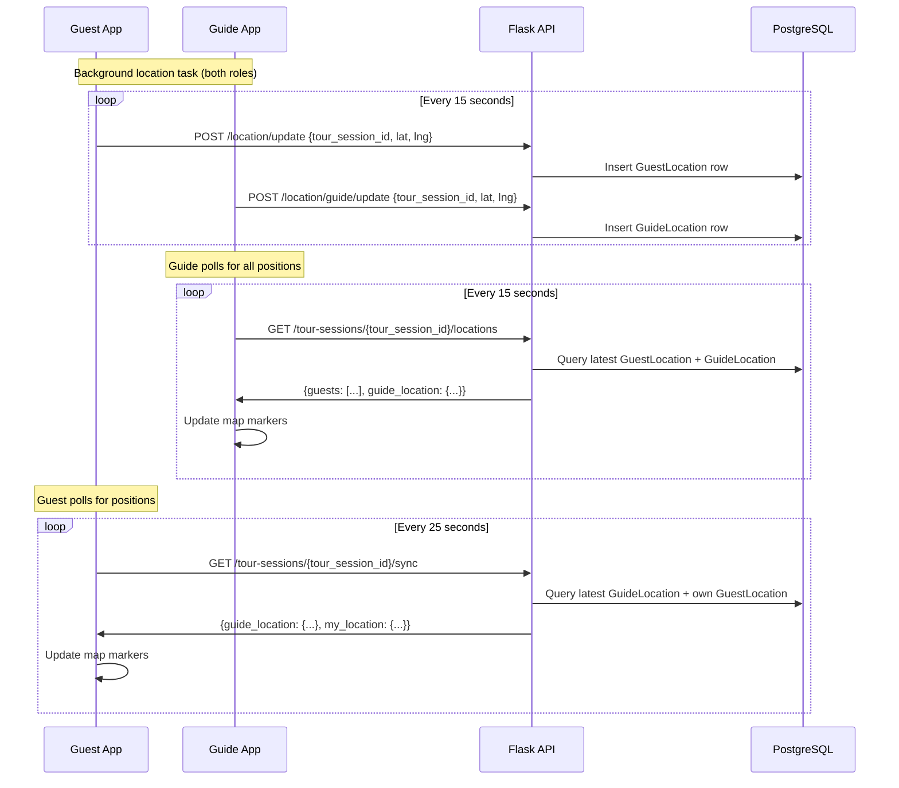
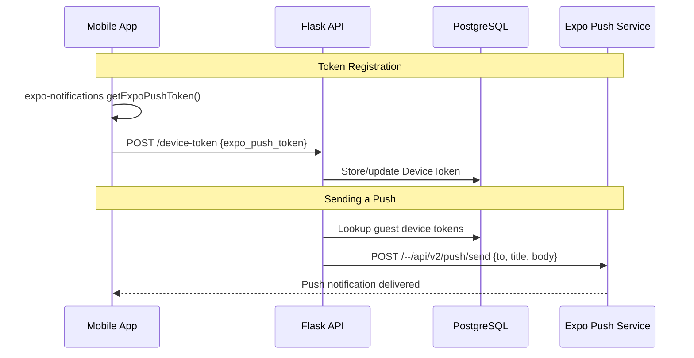

# Architecture

Audience: Architect, Tech Lead

## Overview

TripToe is composed of two codebases deployed on a single infrastructure provider:

```
triptoe-mobile (Expo / React Native)  →  triptoe-backend (Flask)  →  PostgreSQL + PostGIS
                                                                       (all hosted on Railway)
```

### Design Principles

- **Single provider** — All infrastructure runs on Railway to minimize operational complexity and cost
- **Mobile-first** — The mobile app is the only client; there is no web frontend
- **Self-contained auth** — Authentication is built into the backend (Google OAuth for guides, email verification codes for guests, JWT via flask-jwt-extended)
- **Push via Expo** — Push notifications use Expo Push Service, which abstracts APNs and FCM

## System Architecture



## Technology Stack

### Mobile Client (triptoe-mobile)

| Concern | Technology |
|---|---|
| Framework | Expo SDK 55 (React Native 0.83) |
| Navigation | Expo Router (file-based) with bottom tabs (Ionicons) |
| Styling | NativeWind (Tailwind CSS for React Native) |
| State management | Zustand |
| HTTP client | Axios |
| Maps | react-native-maps (Google Maps native) |
| Location | expo-location (foreground + background) |
| Timezone detection | expo-localization (device timezone auto-detect) |
| Date/time pickers | @react-native-community/datetimepicker |
| Push notifications | expo-notifications |
| QR scanning | expo-camera |
| Deep linking | expo-linking (`useURL()` hook) |
| Network images | expo-image (uses Coil on Android — does not cache failed loads unlike React Native's Fresco) |
| Secure storage | expo-secure-store (for JWT tokens) |

Components, hooks, utilities, color tokens, and coding patterns are documented in `triptoe-mobile/CLAUDE.md`. That file is the primary reference for frontend engineers — it stays current because it's co-located with the code.
- Theme colors for JS props (mirrors `tailwind.config.js` tokens)

#### Real-time Updates (Silent Polling Strategy)

To ensure the UI stays updated without jarring loading spinners, the app uses a **Silent Polling Strategy**:

- **Initial Load**: Shows `LoadingScreen` and resets component state.
- **Background Refresh**: Every 25–30 seconds, the app fetches fresh data from the API and updates state "silently."
- **Affected Screens**:
    - `tour_session_details.tsx`: Updates guest list and check-in counts.
    - `tour_booking_details.tsx`: Updates session metadata and status.
- **Auto-Termination**: Polling intervals are cleared automatically when the tour status transitions to `completed`.

#### Guest Dashboard Refresh Strategy

The guest dashboard uses a three-layer refresh approach:
- **On focus**: Fetches fresh booking data from the API when the screen gains focus (`useFocusEffect`)
- **Local timer**: A 60-second `setInterval` updates `Date.now()` to re-evaluate which tours are "starting soon" (within 60 minutes) — triggers the day-of nudge (meeting place photo + "To Meeting Point" button) with zero network cost
- **Pull-to-refresh**: Manual swipe-down to fetch fresh data from the API

#### Post-Tour Tabs

When a tour session is completed, both guide and guest detail screens switch to a tabbed layout:

| Role | Tabs (in order) |
|---|---|
| **Guide** (Session Details) | Guests, Reviews, Photos, Messages |
| **Guest** (Tour Details) | Review & Tip, Guide's Picks (conditional), Photos, Messages |

The guest's "Guide's Picks" tab only appears if the guide has picks. Default tab for guests is "Review & Tip".

#### Timezone Strategy

Three distinct timezones exist in the system: guide device, guest device, and tour template. The rules are:

- **All tour times display in the tour template's timezone** — via `toLocaleString({ timeZone: tz })` on the frontend. The session creation screen shows a "Times shown in [timezone]" label so guides know which timezone they're setting.
- **Status computation uses UTC math** — `getTourSessionStatus()` compares UTC timestamps (timezone-agnostic), except the "today" check which compares dates in the tour's timezone
- **Session creation uses wall-clock projection** — the date/time pickers return numbers in the phone's local timezone. The frontend extracts those wall-clock values (hour, minute, day) and projects them into the tour template's timezone using `wallClockToUTC()` before sending UTC ISO strings to the backend. This ensures a guide in New York scheduling a tour for 9:00 AM London time sends the correct UTC instant, not 9:00 AM New York time. Recurring session generation uses the same projection per-date to avoid DST drift.
- **API responses always include timezone offset** — the backend serializes datetimes via Python's `.isoformat()` on UTC-aware objects, producing strings like `2026-03-11T15:30:00+00:00`. JavaScript's `new Date()` parses these correctly as UTC.
- **All datetimes stored in UTC** in the database (PostgreSQL `DateTime(timezone=True)`)

#### Navigation

Both guide and guest flows use **bottom tab navigation** (Expo Router `<Tabs>`):

| Role | Tab 1 | Tab 2 | Tab 3 |
|---|---|---|---|
| Guide | My Tours (dashboard) | Schedule (day planner) | Profile |
| Guest | My Tours (dashboard) | Join Tour (QR/code) | Profile |

Non-tab screens are hidden from the tab bar with `href: null`:
- **Guide**: `tour_sessions`, `tour_session_details`, `tour_session_messages`, `create_tour_template`, `create_tour_session`, `edit_tour_template`, `quick_messages`, `guide_picks`, `tip_links`, `edit_account`, `signin`
- **Guest**: `tour_booking_details`, `join_tour_session`, `tour_session_messages`, `signin`, `signup`

#### Edit Navigation

Edit screens use a `back_to` param to return to the originating screen:

| Screen | Accessible from | Back/Save goes to |
|---|---|---|
| Edit Tour Template | My Tours (edit icon + text), Tour Sessions (tap title/thumbnail) | My Tours or Tour Sessions (based on `back_to` param) |
| Edit Session | Tour Sessions (Edit link on card), Schedule (Edit link on card), Session Details (Edit Session button) | Tour Sessions, Schedule, or Session Details (based on `back_to` param) |

Delete Tour always returns to My Tours (since the tour no longer exists). Schedule uses `router.navigate()` instead of `router.replace()` to trigger data reload via `useFocusEffect`.

#### Session Grouping (TabBar)

Both the guide's tour sessions and the guest's My Tours dashboard group sessions into three tabs:

| Tab | Contents | Sort |
|---|---|---|
| **Today** | Sessions starting today (timezone-aware date comparison) | Ascending (soonest first) |
| **Upcoming** | Sessions starting after today | Ascending (soonest first) |
| **Completed** | Sessions whose end_datetime has passed | Descending (most recent first) |

Bucketing uses `end_datetime` for completed (past end = completed) and timezone-aware date comparison for today. The default tab is the first non-empty one (Today → Upcoming → Completed). Auto-select resets when the session list changes (e.g., navigating to a different tour). Both guide and guest use the same client-side grouping via the `useTourSessionTabs` hook.

#### Guide Dashboard Sorting

Tour templates on the guide's My Tours dashboard are sorted by nearest upcoming session first. The `GET /tours` API returns a `next_session_date` field (batch-queried) and each card shows "Next: [date]" when an upcoming session exists.

### Backend (triptoe-backend)

| Concern | Technology |
|---|---|
| Framework | Flask |
| ORM | Flask-SQLAlchemy |
| Migrations | Raw SQL scripts (manually applied) |
| Database | PostgreSQL + PostGIS |
| Auth | Google OAuth (guides) + email verification code (guests) + flask-jwt-extended |
| Email | Resend (verification codes for guest signup/sign-in) |
| Push notifications | HTTP POST to Expo Push API (requires Firebase/FCM for Android delivery) |
| File storage | Railway volume (local disk) |
| CORS | Flask-CORS |
| Scheduled jobs | APScheduler (BackgroundScheduler) |
| WSGI server | Gunicorn |

### Infrastructure (Railway)

| Resource | Purpose |
|---|---|
| Web service | Flask API (deployed from Dockerfile) |
| PostgreSQL | Database with PostGIS extension |
| Volume | File storage (generated QR codes, profile photos, tour cover images, meeting place photos, tour session photos) |

## Data Model

The data model follows a **template-session pattern**: guides create reusable **Tour Templates**, then create **Tour Sessions** for specific occurrences of those tours.

### PostgreSQL Schemas

Tables are organized into five PostgreSQL schemas:

| Schema | Purpose | Tables |
|---|---|---|
| `guide` | Guide and operator data | guide, guide_pick, guide_location, operator, guide_operator_role |
| `guest` | Guest accounts and location | guest, guest_location, verification_code |
| `tour` | Tours, sessions, bookings | tour_template, tour_session, tour_booking, tour_checkin, tour_review, tour_session_photo, archived_booking |
| `message` | Messaging system | message, message_read_receipt, messaging_consent, quick_message, blocked_communication |
| `shared` | Cross-cutting concerns | device_token |

### Entity Relationship Diagram

```mermaid
erDiagram
    Operator ||--o{ TourTemplate : owns
    Operator ||--o{ GuideOperatorRole : has
    Guide ||--o{ GuideOperatorRole : has
    Guide ||--o{ GuidePick : curates
    Guide ||--o{ TourSession : leads
    TourTemplate ||--o{ TourSession : "has"
    TourSession ||--o{ TourBooking : has
    TourSession ||--o{ TourCheckin : has
    TourSession ||--o{ Message : contains
    TourSession ||--o{ MessagingConsent : has
    Guest ||--o{ TourBooking : makes
    Guest ||--o{ TourCheckin : performs
    Guest ||--o{ GuestLocation : reports
    Guest ||--o{ MessagingConsent : grants
    TourBooking ||--o{ TourCheckin : "linked to"
    GuestLocation }o--|| TourSession : "during"
    Message ||--o{ MessageReadReceipt : has
    Guide ||--o{ QuickMessage : creates
    TourBooking ||--o| TourReview : has
    TourSession ||--o{ TourReview : has
    TourSession ||--o{ TourSessionPhoto : has

    Guide {
        string guide_uid PK
        string email_address UK
        string guide_name
        string phone_number
        string google_user_id
        string tip_link
        bool is_active
    }

    Guest {
        string guest_uid PK
        string email_address UK
        string guest_name
        string phone_number
        string account_status
        bool email_verified
        string device_id
    }

    Operator {
        int operator_id PK
        string operator_name
        string operator_type
        string primary_email
        bool is_active
        bool is_verified
        jsonb branding
    }

    GuideOperatorRole {
        int id PK
        string guide_uid FK
        int operator_id FK
        string role
        bool is_primary
    }

    TourTemplate {
        int tour_template_id PK
        int operator_id FK
        string tour_title
        int duration_minutes
        string meeting_place
        point meeting_coordinates
        string timezone
        string cover_image_url
    }

    TourSession {
        int tour_session_id PK
        int tour_template_id FK
        string guide_uid FK
        datetime start_datetime
        datetime end_datetime
        bool allow_guest_messages
        jsonb qr_code_data
    }

    TourBooking {
        int tour_booking_id PK
        int tour_session_id FK
        string guest_uid FK
        datetime booked_at
    }

    TourCheckin {
        int tour_checkin_id PK
        int tour_session_id FK
        string guest_uid FK
        int tour_booking_id FK
        datetime checkin_time
        bool location_sharing_enabled
    }

    GuestLocation {
        int location_id PK
        string guest_uid FK
        int tour_session_id FK
        float latitude
        float longitude
        float accuracy
        datetime recorded_at
    }

    Message {
        int message_id PK
        int tour_session_id FK
        string sender_uid
        string sender_type
        string recipient_uid
        string message_type
        text content
        string status
    }

    MessagingConsent {
        int consent_id PK
        int tour_session_id FK
        string guest_uid FK
        bool receive_guide_messages
        bool send_to_guide
        bool share_phone_with_guide
    }

    MessageReadReceipt {
        int receipt_id PK
        int message_id FK
        string reader_uid
        string reader_type
        datetime read_at
    }

    GuidePick {
        int guide_pick_id PK
        string guide_uid FK
        string place_name
        string category
        text note
        string map_link
        int display_order
        datetime created_at
    }

    QuickMessage {
        int quick_message_id PK
        string guide_uid FK
        string quick_message_name
        text content
        datetime created_at
    }

    TourReview {
        int tour_review_id PK
        int tour_booking_id FK UK
        int tour_session_id FK
        string guest_uid FK
        int rating
        text review_text
        datetime created_at
    }

    TourSessionPhoto {
        int tour_session_photo_id PK
        int tour_session_id FK
        string photo_url
        datetime uploaded_at
    }
```

### Key Design Decisions

- **ID sequences start at 100000** — TourTemplate, TourSession, TourBooking, TourCheckin, and GuestLocation IDs start at 100000 for readability
- **PostgreSQL schemas** — Tables grouped by domain (guide, guest, tour, message, shared) for logical separation
- **PostGIS POINT type** — Meeting point coordinates stored as native PostgreSQL POINT type via a custom `PGPoint` SQLAlchemy type
- **JSONB for flexible data** — QR code data, user preferences, branding, and message metadata use JSONB columns
- **Timezone-aware datetimes** — All timestamps stored in UTC with timezone awareness; tour templates store a `timezone` field so times display in the tour's local timezone
- **Duplicate session prevention** — Backend returns 409 if a session with matching template + start + end already exists
- **Soft deletes for messages** — Messages use `is_deleted` flag rather than hard deletes
- **Archived bookings** — When a tour session is deleted, bookings are moved to an `ArchivedBooking` table rather than being lost
- **Batch session operations** — Sessions can be created in bulk via recurrence (daily/weekly/weekday/custom, up to 52 occurrences) and deleted in bulk (single, this and following, or all for a template). Batch delete skips sessions with bookings/check-ins and reports skipped IDs to the client.
- **Dependency-aware deletion** — Tour templates can only be deleted when they have no sessions; sessions can only be deleted when they have no bookings or check-ins, and cannot be deleted when in progress or completed. Session deletion must clean up all FK-dependent records: `TourCheckin`, `GuestLocation`, `GuideLocation`, `TourReview`, `TourSessionPhoto`, `TourBooking` (manual cleanup), plus `Message`, `MessagingConsent` (CASCADE), and `MessageAnalytics` (SET NULL)
- **One review per booking** — `tour_booking_id` has a unique constraint on `tour_review`, enforced at the database level
- **Image processing** — All uploaded images are server-side center-cropped and resized via a shared `_save_tour_image()` helper using Pillow. Cover images: 1:1 (400×400). Meeting place photos: 4:3 (800×600). Both converted to JPEG quality 85. The helper handles validation, old file cleanup, and directory creation.
- **Model serialization** — `GuidePick.to_dict()` and `TourSessionPhoto.to_dict()` ensure consistent JSON output across all endpoints. `_build_guide_details()` helper in `tour_sessions.py` constructs guide response dicts (with conditional picks for completed sessions).
- **Coordinate parsing** — `parse_coordinates()` in `app/utils/route_helpers.py` converts PostgreSQL POINT format to `{lat, lng}` dicts, shared across `tour_templates.py` and `tour_sessions.py`.
- **External tip payments** — Tips use an external URL (Venmo, PayPal, etc.) stored as `tip_link` on the guide profile; no in-app payment processing

## Authentication

### Auth Strategy

| User | First time | Returning |
|---|---|---|
| **Guide** | Google OAuth | Google OAuth |
| **Guest** | Name + email + 6-digit verification code | Email + 6-digit verification code |

- **Guides** authenticate exclusively via Google OAuth. No passwords to manage.
- **Guests** sign up with name and email, then verify via a 6-digit code sent to their email (expires in 10 minutes). Returning guests sign in with just their email and a new verification code. Both flows are designed for minimal friction (under 60 seconds for walk-up tourists).

### Guide Auth Flow (Google OAuth)



### Guest Auth Flow



### Token Strategy

| Token | Lifetime | Storage | Purpose |
|---|---|---|---|
| Access token | 1 hour | expo-secure-store | API request authentication |
| Refresh token | 30 days | expo-secure-store | Obtain new access tokens |

- Managed by **flask-jwt-extended**
- Access tokens are JWTs containing `{uid, type, exp}`
- Refresh tokens are opaque strings stored in the database
- Axios interceptors automatically refresh expired access tokens

### Token Refresh Flow



## Location Tracking

Both guide and guest use the same mechanism: `expo-location` background location updates via `TaskManager`. A shared `backgroundLocation.ts` service handles both user types — the only difference is which API endpoint receives the updates and when tracking starts.

### How It Works

**Guest:**
1. Guest checks into a tour session (check-in does **not** auto-start location sharing)
2. Guest explicitly taps "Start Sharing Location" to opt in
3. App requests foreground + background location permission
4. `startBackgroundLocationUpdates(tourSessionId, 'guest')` begins sending to `POST /location/update`
5. Guest taps "Stop Sharing" or the tour ends → tracking stops

**Guide:**
1. Guide opens session details while the session is active (status: `check_in_open` or `in_progress`)
2. App automatically requests foreground + background location permission
3. `startBackgroundLocationUpdates(tourSessionId, 'guide')` begins sending to `POST /location/guide/update`
4. Tracking stops when the guide leaves the screen or the session completes

### Shared Background Location Service (`backgroundLocation.ts`)

- Single `TaskManager` background task shared by both user types
- `userType` parameter determines the API endpoint (`/location/update` for guests, `/location/guide/update` for guides)
- Uses `fetch` (not Axios) because the task runs outside React
- Reads JWT from `SecureStore` for authentication
- Shows a persistent foreground service notification (required for Android 14+)
- Configurable via constants: `LOCATION_UPDATE_INTERVAL_SECONDS`, `LOCATION_UPDATE_DISTANCE_METERS`

### Map Display

Both guide and guest maps display positions by **polling the backend** — no local position state:

- **Guide map** polls `GET /tour-sessions/{tour_session_id}/locations` which returns all guest locations + the guide's own location
- **Guest map** polls `GET /tour-sessions/{tour_session_id}/sync` which returns the guide's location + the guest's own location

This means all map positions go through the same path: device → background task → backend → polling → map. No special handling for the phone owner's position.

### Location Data Flow



### Privacy & Technical Requirements

- **Guest consent**: Location is only collected when the guest has explicitly tapped "Start Sharing Location"
- **Guide consent**: Location sharing starts automatically when the session is active, but requires location permission grant
- **Android 14+**: Requires `FOREGROUND_SERVICE_LOCATION` permission and `foregroundServiceType="location"` in the Manifest
- **Background access**: User must grant "Allow all the time" for background location
- **No persistent storage**: Location data is not stored after the tour session ends
- **Foreground service notification**: Persistent notification shown while tracking is active ("Sharing your location with your tour guide/guests")

## QR Codes & Deep Linking

### QR URL Format

QR codes encode HTTPS URLs that work as both deep links (app installed) and web fallbacks (app not installed):

| QR Type | URL Format | Example |
|---------|-----------|---------|
| Session QR | `https://triptoe.app/s/{tour_session_id}` | `https://triptoe.app/s/100025` |
| Template QR | `https://triptoe.app/t/{tour_template_id}` | `https://triptoe.app/t/100000` |

QR generation uses `ERROR_CORRECT_M` (15% recovery) to ensure reliable scanning in real-world conditions (bright sunlight, distance, phone screens).

### Deep Link Flow

**App installed:** Android App Links intercept the HTTPS URL → app opens → `useURL()` in root layout parses the URL via `parseQRData()` → navigates to booking or session picker.

**App not installed:** URL opens in browser → Cloudflare Worker serves fallback page (`book-tour-session.html` or `select-tour-session.html`) → auto-redirect attempts `triptoe://` scheme after 1 second → shows "Download TripToe" button if app not installed.

**Not authenticated:** Deep link URL stored in `useAuthStore.pendingDeepLink` → guest completes auth → root layout detects `pendingDeepLink` + `user` → navigates to correct screen.

### Android App Links

Verified via `/.well-known/assetlinks.json` on `triptoe.app`. Contains SHA-256 fingerprints for both the Google Play signing key and the upload keystore. `intentFilters` in `app.json` declare `/s/` and `/t/` path prefixes.

### URL Formats

`parseQRData()` in `tourUtils.ts` parses:
- `https://triptoe.app/s/{tour_session_id}` — session QR
- `https://triptoe.app/t/{tour_template_id}` — template QR

The `triptoe://` custom scheme is used only in web fallback pages (`book-tour-session.html`, `select-tour-session.html`) for the "Open in App" button — it triggers the app from the browser when the HTTPS deep link didn't intercept.

## Push Notifications

### How It Works

1. On app startup, mobile app registers with Expo Push Service and receives an Expo push token
2. Token is sent to backend and stored in the `device_token` table
3. When a guide sends a message or the system triggers a notification, the backend sends a push via Expo Push API
4. Expo Push Service routes to APNs (iOS) or FCM (Android)

### Push Flow



### DeviceToken Table

```
device_token
├── id (PK)
├── user_uid (guide_uid or guest_uid)
├── user_type ('guide' or 'guest')
├── expo_push_token (string, unique)
├── device_info (JSONB — platform, OS version)
├── is_active (boolean)
├── created_at
└── updated_at
```

## API Structure

### Route Groups

| Prefix | Purpose |
|---|---|
| `/api/v1/auth` | Signup, signin, token refresh |
| `/api/v1/tours` | Tour template CRUD, `GET /tours/<id>/sessions` (all sessions for a template), ratings aggregation, template QR generation (`GET /tour-templates/<id>/qr`), public upcoming sessions (`GET /tour-templates/<id>/upcoming-sessions`) |
| `/api/v1/tour-sessions` | Tour session CRUD (single + batch create), `DELETE /tour-sessions/batch` (this_and_following / all), session QR generation, guest locations, message history |
| `/api/v1/guides` | Guide-specific views: `GET /guides/upcoming-sessions` (all upcoming sessions with template data, single JOIN query) |
| `/api/v1/bookings` | Guest bookings (by code or QR scan) |
| `/api/v1/checkins` | Guest check-in, update location sharing preference |
| `/api/v1/location` | Guest + guide location updates, stop sharing |
| `/api/v1/reviews` | Guest review submission, guide review retrieval |
| `/api/v1/messages` | Broadcast and direct messaging |
| `/api/v1/messaging` | Quick message management (guide's reusable message presets) |
| `/api/v1/guide-picks` | Guide's Picks CRUD, reorder, and public retrieval by guide UID |
| `/api/v1/operators` | Operator management |
| `/api/v1/device-token` | Push notification token registration |

### Authentication

All endpoints except signup/signin require a valid JWT in the `Authorization: Bearer <token>` header. The backend validates the token and extracts `uid` and `type` to identify the caller.

## Deployment

### Railway Setup

```
Railway Project: triptoe
├── Service: triptoe-backend (Flask, from Dockerfile)
│   ├── Environment variables: DATABASE_URL, JWT_SECRET, etc.
│   └── Auto-deploys from GitHub main branch
├── PostgreSQL: triptoe-db
│   └── PostGIS extension enabled
└── Volume: /uploads (QR codes, tour session photos, profile photos)
```

### Backend Deployment Flow

```
Developer pushes to GitHub  →  Railway detects change  →  Builds from Dockerfile  →  Deploys new version
```

### Mobile App Distribution

The mobile app is built using Expo EAS (Expo Application Services) and distributed through the app stores. The app is not hosted on Railway — it runs natively on users' phones.

```
Developer pushes to GitHub  →  Expo EAS Build  →  App binary (.ipa / .apk)  →  Apple App Store / Google Play Store  →  User's phone
```

During development, builds can be tested via Expo Go or internal distribution before submitting to the stores.

### Environment Variables

| Variable | Purpose |
|---|---|
| `DATABASE_URL` | PostgreSQL connection string (provided by Railway) |
| `JWT_SECRET` | Secret key for signing JWTs |
| `JWT_REFRESH_SECRET` | Secret key for signing refresh tokens |
| `ALLOWED_ORIGINS` | CORS allowed origins |

