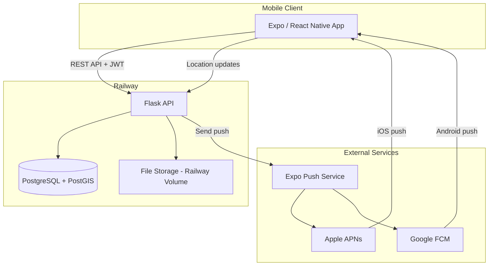
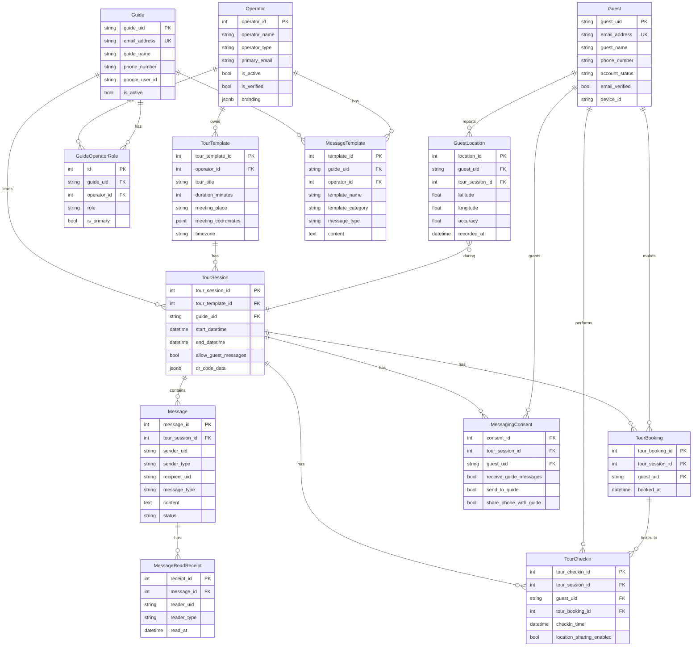
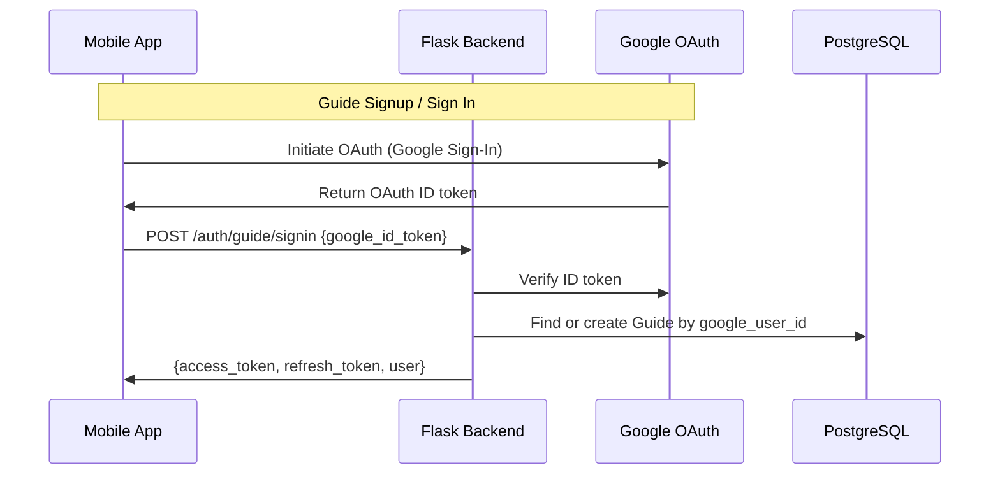
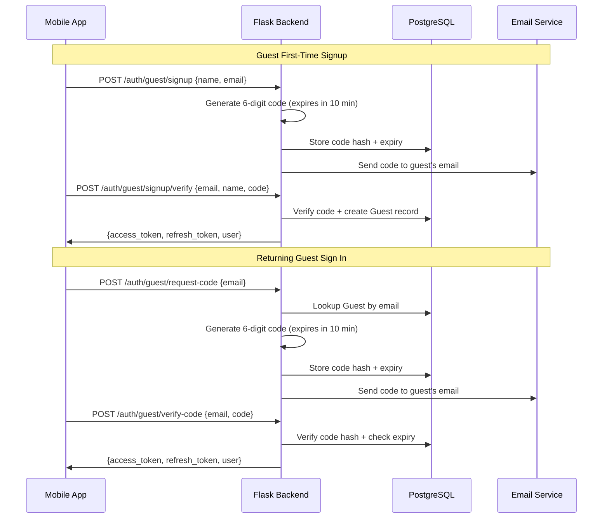
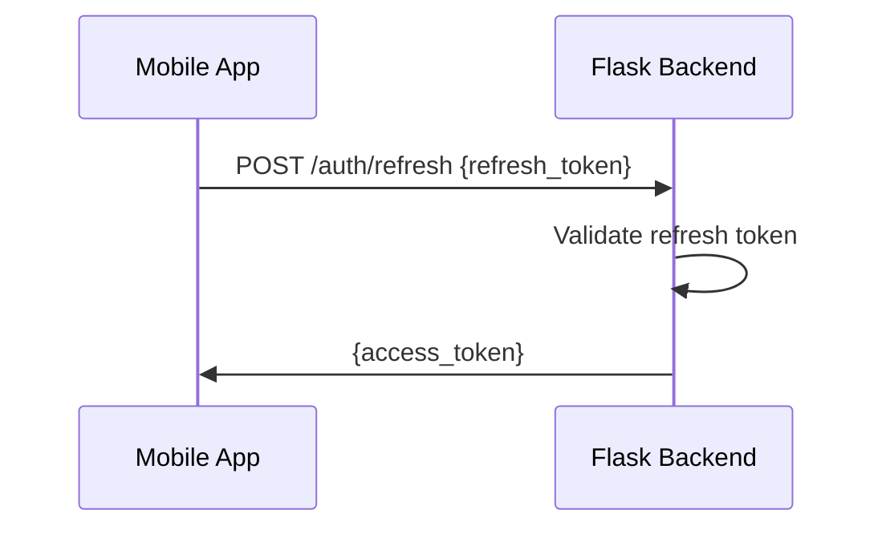
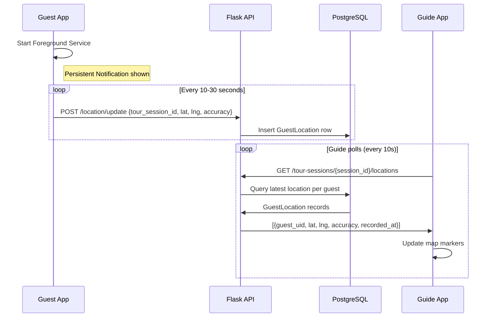
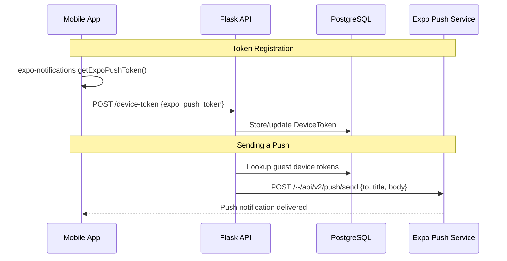

# Architecture

Audience: Architect, Tech Lead

## Overview

TripToe is composed of two codebases deployed on a single infrastructure provider:

```
triptoe-mobile (Expo / React Native)  →  triptoe-backend (Flask)  →  PostgreSQL + PostGIS
                                                                       (all hosted on Railway)
```

### Design Principles

- **Single provider** — All infrastructure runs on Railway to minimize operational complexity and cost
- **Mobile-first** — The mobile app is the only client; there is no web frontend
- **Self-contained auth** — Authentication is built into the backend (Google OAuth for guides, email verification codes for guests, JWT via flask-jwt-extended)
- **Push via Expo** — Push notifications use Expo Push Service, which abstracts APNs and FCM

## System Architecture



## Technology Stack

### Mobile Client (triptoe-mobile)

| Concern | Technology |
|---|---|
| Framework | Expo SDK 55 (React Native 0.83) |
| Navigation | Expo Router (file-based) with bottom tabs (Ionicons) |
| Styling | NativeWind (Tailwind CSS for React Native) |
| State management | Zustand |
| HTTP client | Axios |
| Maps | react-native-maps (Google Maps native) |
| Location | expo-location (foreground + background) |
| Timezone detection | expo-localization (device timezone auto-detect) |
| Date/time pickers | @react-native-community/datetimepicker |
| Push notifications | expo-notifications |
| QR scanning | expo-camera |
| Secure storage | expo-secure-store (for JWT tokens) |

#### UI Component Library (`src/components/ui/`)

| Component | Purpose |
|---|---|
| `Button` | Variants: primary, secondary, ocean, danger, ghost, ghost-ocean, ghost-danger. Supports `compact` prop. |
| `Card` | Card container with consistent padding and border |
| `Input` | Styled text input |
| `LoadingScreen` | Full-screen loading spinner |
| `EmptyState` | Placeholder for empty lists |
| `TimezonePicker` | Full-screen modal with searchable IANA timezone list |
| `StatusBadge` | Tour status pill (upcoming, today, check-in open, in progress, completed) |
| `TabBar` | Segmented pill-style tab bar (used for session grouping: This Week / Upcoming / Past) |

#### Color Theme (TripToe Design System)

| Token | Base Color | Usage |
|---|---|---|
| `tourBlue` | `#1A4B7D` | Guide primary, tab accents, branding |
| `oceanBlue` | `#82c4da` | Guest primary, tab accents |
| `pinOrange` | `#FF5722` | CTAs, warnings |
| `actionGreen` | `#4CAF50` | Success, active status |
| `charcoal` | `#333333` | Text, neutral |

Each color has 50–900 shades defined in `tailwind.config.js`.

#### Shared Utilities (`src/utils/`)

| Utility | Purpose |
|---|---|
| `tourStatus.ts` | `getTourStatus()` — computes tour status (upcoming/today/check_in_open/in_progress/completed) from start/end datetimes and tour timezone |
| `formatDate.ts` | `formatDate()`, `formatTime()`, `formatDateTime()`, `formatTimeRange()` — all display times in the tour template's timezone |
| `apiError.ts` | `getApiError()` — extracts `error.response?.data?.error` with fallback |
| `confirmAction.ts` | `confirmAction()` — reusable destructive action confirmation (Alert + async try/catch) |

#### Shared Hooks (`src/hooks/`)

| Hook | Purpose |
|---|---|
| `useHeaderBackButton.ts` | Adds a back arrow to the header that navigates via `router.replace()` (for hidden tab screens) |
| `useSessionTabs.ts` | Groups sessions/bookings into This Week / Upcoming / Past tabs with smart sorting (ascending for future, descending for past) |
| `useTourStatus.ts` | Calculates and periodically updates the tour status (heartbeat) |

#### Real-time Updates (Silent Polling Strategy)

To ensure the UI stays updated without jarring loading spinners, the app uses a **Silent Polling Strategy**:

- **Initial Load**: Shows `LoadingScreen` and resets component state.
- **Background Refresh**: Every 25–30 seconds, the app fetches fresh data from the API and updates state "silently."
- **Affected Screens**:
    - `tour_session_details.tsx`: Updates guest list and check-in counts.
    - `tour_booking_details.tsx`: Updates session metadata and status.
- **Auto-Termination**: Polling intervals are cleared automatically when the tour status transitions to `completed`.

#### Timezone Strategy

Three distinct timezones exist in the system: guide device, guest device, and tour template. The rules are:

- **All tour times display in the tour template's timezone** — via `toLocaleString({ timeZone: tz })` on the frontend
- **Status computation uses UTC math** — `getTourStatus()` compares UTC timestamps (timezone-agnostic), except the "today" check which compares dates in the tour's timezone
- **Session creation sends naive ISO strings** — the frontend strips timezone offset; the backend interprets them in the tour template's timezone via `parse_local_datetime()`
- **All datetimes stored in UTC** in the database

#### Navigation

Both guide and guest flows use **bottom tab navigation** (Expo Router `<Tabs>`):

| Role | Tab 1 | Tab 2 | Tab 3 |
|---|---|---|---|
| Guide | My Tours (dashboard) | Create Tour | Profile |
| Guest | My Tours (dashboard) | Join Tour (QR/code) | Profile |

Non-tab screens are hidden from the tab bar with `href: null`:
- **Guide**: `tour_sessions`, `tour_session_details`, `create_tour_session`, `edit_tour_template`, `signin`
- **Guest**: `tour_booking_details`, `join_tour_session`, `signin`, `signup`

#### Session Grouping (TabBar)

Both the guide's tour sessions and the guest's My Tours dashboard group sessions into three tabs:

| Tab | Contents | Sort |
|---|---|---|
| **This Week** | Non-completed sessions through Sunday | Ascending (soonest first) |
| **Upcoming** | Non-completed sessions after this week | Ascending (soonest first) |
| **Past** | Completed sessions | Descending (most recent first) |

The default tab is the first non-empty one (This Week → Upcoming → Past). Logic is shared via the `useSessionTabs` hook and `TabBar` component.

#### Guide Dashboard Sorting

Tour templates on the guide's My Tours dashboard are sorted by nearest upcoming session first. The `GET /tours` API returns a `next_session_date` field (batch-queried) and each card shows "Next: [date]" when an upcoming session exists.

### Backend (triptoe-backend)

| Concern | Technology |
|---|---|
| Framework | Flask |
| ORM | Flask-SQLAlchemy |
| Migrations | Raw SQL scripts (manually applied) |
| Database | PostgreSQL + PostGIS |
| Auth | Google OAuth (guides) + email verification code (guests) + flask-jwt-extended |
| Push notifications | HTTP POST to Expo Push API |
| File storage | Railway volume (local disk) |
| CORS | Flask-CORS |
| WSGI server | Gunicorn |

### Infrastructure (Railway)

| Resource | Purpose |
|---|---|
| Web service | Flask API (deployed from Dockerfile) |
| PostgreSQL | Database with PostGIS extension |
| Volume | File storage (generated QR codes, profile photos) |

## Data Model

The data model follows a **template-session pattern**: guides create reusable **Tour Templates**, then create **Tour Sessions** for specific occurrences of those tours.

### PostgreSQL Schemas

Tables are organized into five PostgreSQL schemas:

| Schema | Purpose | Tables |
|---|---|---|
| `guide` | Guide and operator data | guide, operator, guide_operator_role |
| `guest` | Guest accounts and location | guest, guest_location, verification_code |
| `tour` | Tours, sessions, bookings | tour_template, tour_session, tour_booking, tour_checkin, archived_booking |
| `message` | Messaging system | message, message_read_receipt, messaging_consent, message_template, blocked_communication |
| `shared` | Cross-cutting concerns | device_token |

### Entity Relationship Diagram



### Key Design Decisions

- **ID sequences start at 100000** — TourTemplate, TourSession, TourBooking, TourCheckin, and GuestLocation IDs start at 100000 for readability
- **PostgreSQL schemas** — Tables grouped by domain (guide, guest, tour, message, shared) for logical separation
- **PostGIS POINT type** — Meeting point coordinates stored as native PostgreSQL POINT type via a custom `PGPoint` SQLAlchemy type
- **JSONB for flexible data** — QR code data, user preferences, branding, and message metadata use JSONB columns
- **Timezone-aware datetimes** — All timestamps stored in UTC with timezone awareness; tour templates store a `timezone` field so times display in the tour's local timezone
- **Duplicate session prevention** — Backend returns 409 if a session with matching template + start + end already exists
- **Soft deletes for messages** — Messages use `is_deleted` flag rather than hard deletes
- **Archived bookings** — When a tour session is deleted, bookings are moved to an `ArchivedBooking` table rather than being lost
- **Dependency-aware deletion** — Tour templates can only be deleted when they have no sessions; sessions can only be deleted when they have no bookings or check-ins

## Authentication

### Auth Strategy

| User | First time | Returning |
|---|---|---|
| **Guide** | Google OAuth | Google OAuth |
| **Guest** | Name + email + 6-digit verification code | Email + 6-digit verification code |

- **Guides** authenticate exclusively via Google OAuth. No passwords to manage.
- **Guests** sign up with name and email, then verify via a 6-digit code sent to their email (expires in 10 minutes). Returning guests sign in with just their email and a new verification code. Both flows are designed for minimal friction (under 60 seconds for walk-up tourists).

### Guide Auth Flow (Google OAuth)



### Guest Auth Flow



### Token Strategy

| Token | Lifetime | Storage | Purpose |
|---|---|---|---|
| Access token | 1 hour | expo-secure-store | API request authentication |
| Refresh token | 30 days | expo-secure-store | Obtain new access tokens |

- Managed by **flask-jwt-extended**
- Access tokens are JWTs containing `{uid, type, exp}`
- Refresh tokens are opaque strings stored in the database
- Axios interceptors automatically refresh expired access tokens

### Token Refresh Flow



## Location Tracking

### How It Works

1. Guest checks into a tour session (check-in does **not** auto-start location sharing)
2. Guest explicitly taps "Start Sharing Location" to opt in
3. Mobile app requests **Foreground Permissions** and then **Background Location** permission ("Allow all the time").
4. The app starts a **Foreground Service** (required for Android 14+).
5. A persistent notification is shown to the user while sharing is active.
6. Mobile app uses `expo-location` + `TaskManager` to update position even when the app is in the background.
7. Location updates sent to backend via `POST /api/v1/location/update`
8. Guide's map view polls `GET /api/v1/tour-sessions/{session_id}/locations` every 10s.
9. Location sharing stops automatically when the tour ends or the user taps "Stop Sharing".

### Location Data Flow



### Privacy & Technical Requirements

- **Consent**: Location is only collected when the guest has explicitly enabled sharing.
- **Android 14+**: Requires `FOREGROUND_SERVICE_LOCATION` permission and `foregroundServiceType="location"` in the Manifest.
- **Background Access**: User must manually select "Allow all the time" in Android settings.
- **Notifications**: Notification permission must be granted for the foreground service to run.

## Push Notifications

### How It Works

1. On app startup, mobile app registers with Expo Push Service and receives an Expo push token
2. Token is sent to backend and stored in the `device_token` table
3. When a guide sends a message or the system triggers a notification, the backend sends a push via Expo Push API
4. Expo Push Service routes to APNs (iOS) or FCM (Android)

### Push Flow



### DeviceToken Table

```
device_token
├── id (PK)
├── user_uid (guide_uid or guest_uid)
├── user_type ('guide' or 'guest')
├── expo_push_token (string, unique)
├── device_info (JSONB — platform, OS version)
├── is_active (boolean)
├── created_at
└── updated_at
```

## API Structure

### Route Groups

| Prefix | Purpose |
|---|---|
| `/api/v1/auth` | Signup, signin, token refresh |
| `/api/v1/tours` | Tour template CRUD, `GET /tours/<id>/sessions` |
| `/api/v1/tour-sessions` | Tour session CRUD, QR generation, guest locations, message history |
| `/api/v1/guides/<uid>` | Guide-specific views (upcoming, in-progress, completed) |
| `/api/v1/bookings` | Guest bookings (by code or QR scan) |
| `/api/v1/checkins` | Guest check-in, update location sharing preference |
| `/api/v1/location` | Guest location updates, stop sharing |
| `/api/v1/messages` | Broadcast and direct messaging |
| `/api/v1/operators` | Operator management |
| `/api/v1/device-token` | Push notification token registration |

### Authentication

All endpoints except signup/signin require a valid JWT in the `Authorization: Bearer <token>` header. The backend validates the token and extracts `uid` and `type` to identify the caller.

## Deployment

### Railway Setup

```
Railway Project: triptoe
├── Service: triptoe-backend (Flask, from Dockerfile)
│   ├── Environment variables: DATABASE_URL, JWT_SECRET, etc.
│   └── Auto-deploys from GitHub main branch
├── PostgreSQL: triptoe-db
│   └── PostGIS extension enabled
└── Volume: /uploads (QR codes, photos)
```

### Backend Deployment Flow

```
Developer pushes to GitHub  →  Railway detects change  →  Builds from Dockerfile  →  Deploys new version
```

### Mobile App Distribution

The mobile app is built using Expo EAS (Expo Application Services) and distributed through the app stores. The app is not hosted on Railway — it runs natively on users' phones.

```
Developer pushes to GitHub  →  Expo EAS Build  →  App binary (.ipa / .apk)  →  Apple App Store / Google Play Store  →  User's phone
```

During development, builds can be tested via Expo Go or internal distribution before submitting to the stores.

### Environment Variables

| Variable | Purpose |
|---|---|
| `DATABASE_URL` | PostgreSQL connection string (provided by Railway) |
| `JWT_SECRET` | Secret key for signing JWTs |
| `JWT_REFRESH_SECRET` | Secret key for signing refresh tokens |
| `ALLOWED_ORIGINS` | CORS allowed origins |

