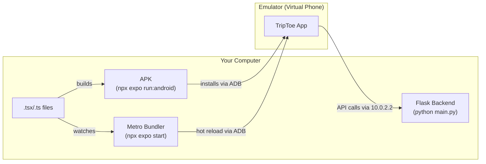

# Android Emulator Setup

Audience: Developer

Step-by-step guide to running TripToe on Android emulators for local development. This setup does not require Android Studio.

## Key Terms

| Term | What it is |
|------|-----------|
| **Android SDK** | The tools needed to build Android apps. Includes ADB, the emulator, and build tools. Does not require Android Studio — can be installed standalone. |
| **ADB** (Android Debug Bridge) | A command-line tool that communicates between your computer and Android devices/emulators. Used to install apps, check connected devices, and debug. |
| **Emulator** | A virtual Android phone that runs on your computer. Behaves like a real phone — you can install and run apps on it. Each emulator is called an AVD. |
| **AVD** (Android Virtual Device) | A specific emulator configuration — e.g. "Pixel_7 running Android 15". You can create multiple AVDs to simulate different devices. |
| **Expo** | A framework built on top of React Native that simplifies mobile app development. Handles building, bundling, and running the app. |
| **Metro** | The JavaScript bundler that Expo uses. It watches your code for changes and serves the JavaScript bundle to the emulator. Think of it as the development server for the mobile app — similar to how `python main.py` serves the backend. |
| **APK** | The installable file for an Android app (like `.exe` for Windows). |
| **Native code/changes** | Changes to the Android/iOS platform layer — e.g. adding a package with native code (`expo-camera`, `expo-location`), changing `app.json` settings, or modifying files in the `android/` folder. Native changes require a rebuild. |
| **JavaScript changes** | Changes to `.tsx`/`.ts` files — screens, components, styles, API calls, stores. These are picked up automatically by Metro (hot reload) without rebuilding. |
| **Hot reload** | When you save a JavaScript file, Metro automatically pushes the change to the emulator without restarting the app. This is why you don't need to rebuild for most code changes. |
| **Development build** | The version of the app built with `npx expo run:android`. It includes developer tools and connects to Metro for hot reload. Different from a production build. |
| **`10.0.2.2`** | A special IP address inside the Android emulator that maps to `localhost` on your computer. The emulator's own `localhost` refers to itself, not your PC. |

## How It All Fits Together



- **First time**: `npx expo run:android` builds the APK, uses ADB to install it on the emulator, and starts Metro
- **After that**: Metro watches your code and pushes changes to the app automatically
- **The app** talks to the Flask backend through `10.0.2.2` (the emulator's way of reaching your computer's localhost)

## 1. Installation

### Android SDK (Command Line Tools)

If you don't already have the Android SDK at `C:\Users\<your-username>\AppData\Local\Android\Sdk`, download **"Command line tools only"** from the bottom of the Android developer downloads page and extract to `C:\Android\Sdk`.

### Java (OpenJDK 17)

```powershell
winget install Microsoft.OpenJDK.17
```

Verify installation:

```powershell
ls "C:\Program Files\Microsoft\jdk*"
```

Note the exact folder name (e.g. `jdk-17.0.18.8-hotspot`).

## 2. Set Environment Variables

Open **Windows Settings > System > About > Advanced system settings > Environment Variables**.

Under **User variables**, add or edit:

| Variable | Value |
|----------|-------|
| `ANDROID_HOME` | `C:\Users\<your-username>\AppData\Local\Android\Sdk` |
| `JAVA_HOME` | `C:\Program Files\Microsoft\jdk-17.0.18.8-hotspot` (use your actual folder name) |

Under **User variables**, edit `Path` and add these entries:

```
%ANDROID_HOME%\emulator
%ANDROID_HOME%\platform-tools
```

Close and reopen your terminal for changes to take effect.

For a quick fix in the current terminal session without restarting:

```powershell
$env:ANDROID_HOME = "$env:LOCALAPPDATA\Android\Sdk"
$env:JAVA_HOME = "C:\Program Files\Microsoft\jdk-17.0.18.8-hotspot"
$env:Path += ";$env:ANDROID_HOME\emulator;$env:ANDROID_HOME\platform-tools"
```

## 3. Create Emulators

Check if you already have emulators:

```powershell
emulator -list-avds
```

If you see devices listed (e.g. `Pixel_7`, `Pixel_8`), skip to step 4.

If no AVDs exist, install SDK packages and create them:

```powershell
# Install required SDK packages
sdkmanager "platform-tools" "platforms;android-35" "build-tools;35.0.0" "system-images;android-35;google_apis;x86_64"

# Create two emulators (one for guide testing, one for guest testing)
avdmanager create avd -n Pixel_7 -k "system-images;android-35;google_apis;x86_64" -d pixel_7
avdmanager create avd -n Pixel_8 -k "system-images;android-35;google_apis;x86_64" -d pixel_8
```

## 4. Start Emulators

Open two separate terminals. Start one emulator in each:

```powershell
# Terminal 1 — Guide device
emulator -avd Pixel_7 -no-snapshot
```

```powershell
# Terminal 2 — Guest device
emulator -avd Pixel_8 -no-snapshot
```

Wait for both to reach the Android home screen. The `-no-snapshot` flag forces a clean boot, which avoids input and boot issues.

Verify both emulators are connected:

```powershell
adb devices
```

You should see two entries like:

```
emulator-5554   device
emulator-5556   device
```

Device IDs are assigned in order of startup: the first emulator started gets `emulator-5554`, the second gets `emulator-5556`. If a device shows `offline`, wait for it to finish booting.

## 5. Build and Install the App

Make sure the backend is running first (`python main.py` in `triptoe-backend`).

### First-time build

```powershell
cd C:\dev\triptoe\triptoe-mobile
npx expo run:android
```

This builds the APK, installs it on one emulator, and starts Metro. If both emulators are running, it installs on the first one started (lowest device ID). The first build takes several minutes.

### Install on the second emulator

No rebuild needed — reuse the same APK:

```powershell
adb -s emulator-5556 install -r android/app/build/outputs/apk/debug/app-debug.apk
```

### Rebuild after `app.json` changes

If you changed app icon, app name, permissions, or added native plugins in `app.json`:

```powershell
npx expo prebuild --clean
npx expo run:android
```

Then reinstall on the second emulator with the `adb install` command above.

### Uninstall the app

If cached state won't update (e.g. old icon persists), uninstall first:

```powershell
adb uninstall com.triptoe.mobile                          # first emulator
adb -s emulator-5556 uninstall com.triptoe.mobile         # second emulator
```

Then rebuild with `npx expo run:android`.

### Kill a stuck port

If Metro won't start because port 8081 is busy:

```powershell
npx kill-port 8081
```

## 6. Metro Bundler

`npx expo run:android` (from step 5) already starts Metro for you. Do **not** run `npx expo start` separately while it's running — you'll get port conflicts.

Both emulators connect to the same Metro server automatically.

### When to use `npx expo start` instead

If the app is already built and installed on both emulators but Metro isn't running (e.g. you closed the terminal), you can start just the Metro bundler without rebuilding:

```powershell
npx expo start
```

### When to use `npx expo start --clear`

If the app is behaving strangely or not picking up changes (e.g. stale `.env` values, old cached code), clear the Metro cache:

```powershell
npx expo start --clear
```

After restarting Metro, press `r` in the terminal to reload the app on both emulators. If an emulator doesn't respond to `r`, force close the app on that emulator and reopen it.

## 7. Testing Location Sharing (Background Updates)

TripToe uses a **Foreground Service** for real-time location sharing. This requires specific permissions and configurations, especially on Android 14+.

### Required Permissions

When the app asks for location, you must follow these steps on the **Guest** emulator:
1. **Initial Prompt**: Select **"While using the app"**.
2. **Background Prompt**: Android will likely ask for "Background Location". Choose **"Allow in settings"** (or similar).
3. **Settings Screen**: Find **TripToe** in the list, select **Location**, and change it to **"Allow all the time"**.
4. **Notifications**: On Android 13+, you **must** allow notifications for the foreground service to display its required status bar notification.

### Verifying the Service

If location sharing is working correctly:
- A **persistent notification** should appear in the Android notification drawer: "TripToe — Sharing your location with your tour guide".
- A **location icon** will appear in the top status bar.
- The Guide app (on the other emulator) will show a blue marker for the Guest.

### Troubleshooting Location Service

If you get `startLocationUpdatesAsync has been rejected`:

1. **Verify Manifest**: Ensure `AndroidManifest.xml` has `FOREGROUND_SERVICE_LOCATION` and `LocationTaskService` declared (see `app.json` permissions).
2. **Full Reinstall**: Native permission changes often require a clean install:
   ```powershell
   adb -s emulator-5556 uninstall com.triptoe.mobile
   adb -s emulator-5556 install -r android/app/build/outputs/apk/debug/app-debug.apk
   ```
3. **Check System Location**: Ensure the emulator's system-wide location is ON:
   ```powershell
   adb -s emulator-5556 shell settings put secure location_mode 3
   ```

## Understanding the Architecture (Why the "Blank Screen" happens)

React Native apps are two separate systems working together. Understanding this is key to troubleshooting:

1.  **The Native Container (The Shell)**: The Android app installed on your phone. It contains the "muscles" (Camera, Location, Push Notifications). This only changes when you run `npx expo run:android`.
2.  **The JavaScript Bundle (The Brain)**: Your code (`.tsx` files). This is served by **Metro**. It changes every time you save a file.

**A Blank White Screen usually means the "Bridge" between the Shell and the Brain is broken.**

### Mismatch Scenarios:
- **Missing Muscles**: Your JS (Brain) tries to use the Camera, but your APK (Shell) was built before you added the camera library. Result: Red Error Screen.
- **Stale Brain**: You updated your APK (Shell), but Metro is still serving an old, cached version of your JS from its memory. Result: Blank White Screen.
- **Lost Connection**: The Shell is looking for the Brain at an old IP address. Result: "Problem loading project" or "Loading..." hanging forever.

### The "Golden Rule" of Troubleshooting:
- If you **change code** or **styles**: Refresh Metro (`r`) or Clear Metro Cache (`npx expo start -c`).
- If you **install a library** (`npm install`): You MUST do a **Deep Rebuild** (`npx expo run:android`).

## 8. The Foolproof Library Installation Workflow
When you install a new package that contains native code (like `expo-image-picker`), use this sequence to ensure the Shell and Brain are perfectly synchronized.

1. **Kill everything**: Stop Metro (`Ctrl+C`) and close the app on your emulators.
2. **Install the package**: `npx expo install <package-name>`
3. **Build the Shell (Exits when done)**: 
   ```powershell
   cd android; ./gradlew assembleDebug; cd ..
   ```
4. **Install the Shell**: Push the fresh APK to all running emulators:
   ```powershell
   adb -s emulator-5554 install -r android/app/build/outputs/apk/debug/app-debug.apk
   adb -s emulator-5556 install -r android/app/build/outputs/apk/debug/app-debug.apk
   ```
5. **Start a Fresh Brain**: Force Metro to clear its cache:
   ```powershell
   npx expo start -c
   ```
6. **Open the App**: Tap the TripToe icon on the emulators.

## Troubleshooting

| Issue | Solution |
|-------|----------|
| `emulator` is not recognized | Add `%ANDROID_HOME%\emulator` to your PATH — see step 2 |
| `adb` is not recognized | Add `%ANDROID_HOME%\platform-tools` to your PATH — see step 2 |
| `JAVA_HOME is set to an invalid directory` | Set `JAVA_HOME` permanently in environment variables — see step 2 |
| Emulator stuck on Android logo for 10+ min | Close it, restart with `emulator -avd <name> -no-snapshot` |
| Emulator black screen | Click power button on emulator toolbar or press home button to wake it |
| Can't type in emulator | Restart emulator with `-no-snapshot` flag |
| `startLocationUpdatesAsync` rejected | Manifest mismatch or missing "Allow all the time" permission. Uninstall and reinstall the APK — see step 7 |
| Notification not showing | Check App Info > Notifications. Must be ON for foreground services to work |
| Map is blank/gray | Ensure Google Maps API key is valid in `app.json` and emulator has internet |
| App shows "Checking info..." spinner | App lost connection to Metro. Force close the app, make sure Metro is running (`npx expo start`), reopen the app |
| Both emulators reload when pressing `r` | Normal — one Metro server serves both emulators |
| `Port 8081 is being used` | Kill the old process: `npx kill-port 8081`, then restart Metro |
| App icon not updating after change | Uninstall first (`adb uninstall com.triptoe.mobile`), then run `npx expo prebuild --clean` and `npx expo run:android` |
| Changed `app.json` but nothing happened | `app.json` changes (icon, permissions, name) require `npx expo prebuild --clean` then `npx expo run:android` |
| **"App react context shouldn't be created before"** crash | Stale native build cache. Run `cd android && ./gradlew clean`, then rebuild with `npx expo run:android` (or manually install APK with `adb`). |
| **"There was a problem loading the project"** screen | Often caused by invalid deep links (URI schema) or stale JS bundle. Tap **"Go To Home"** or **"Reload"** on the emulator screen. If persistent, restart Metro with `npx expo start -c`. |
| **Emulator stuck "Reloading" from `192.168...`** | The emulator is trying to use your laptop's Wi-Fi IP instead of the stable machine IP. Force it back to `10.0.2.2` by clearing the app cache: `adb -s <device-id> shell pm clear com.triptoe.mobile`, then restart the app: `adb -s <device-id> shell am start -a android.intent.action.VIEW -d "exp+triptoe-mobile://expo-development-client/?url=http%3A%2F%2F10.0.2.2%3A8081"`. |
| **Emulator has no internet / Can't see backend** | Sometimes the internal bridge hangs. "Wake it up" by pinging your computer from inside the emulator: `adb -s <device-id> shell ping -c 3 10.0.2.2`. |


