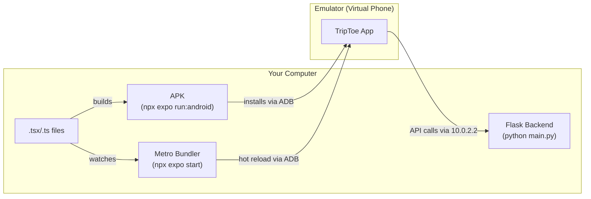

# Android Emulator Setup

Audience: Developer

Step-by-step guide to running TripToe on Android emulators for local development. This setup does not require Android Studio.

## Key Terms

| Term | What it is |
|------|-----------|
| **Android SDK** | The tools needed to build Android apps. Includes ADB, the emulator, and build tools. Does not require Android Studio — can be installed standalone. |
| **ADB** (Android Debug Bridge) | A command-line tool that communicates between your computer and Android devices/emulators. Used to install apps, check connected devices, and debug. |
| **Emulator** | A virtual Android phone that runs on your computer. Behaves like a real phone — you can install and run apps on it. Each emulator is called an AVD. |
| **AVD** (Android Virtual Device) | A specific emulator configuration — e.g. "Pixel_7 running Android 15". You can create multiple AVDs to simulate different devices. |
| **Expo** | A framework built on top of React Native that simplifies mobile app development. Handles building, bundling, and running the app. |
| **Metro** | The JavaScript bundler that Expo uses. It watches your code for changes and serves the JavaScript bundle to the emulator. Think of it as the development server for the mobile app — similar to how `python main.py` serves the backend. |
| **APK** | The installable file for an Android app (like `.exe` for Windows). |
| **Native code/changes** | Changes to the Android/iOS platform layer — e.g. adding a package with native code (`expo-camera`, `expo-location`), changing `app.json` settings, or modifying files in the `android/` folder. Native changes require a rebuild. |
| **JavaScript changes** | Changes to `.tsx`/`.ts` files — screens, components, styles, API calls, stores. These are picked up automatically by Metro (hot reload) without rebuilding. |
| **Hot reload** | When you save a JavaScript file, Metro automatically pushes the change to the emulator without restarting the app. This is why you don't need to rebuild for most code changes. |
| **Development build** | The version of the app built with `npx expo run:android`. It includes developer tools and connects to Metro for hot reload. Different from a production build. |
| **`10.0.2.2`** | A special IP address inside the Android emulator that maps to `localhost` on your computer. The emulator's own `localhost` refers to itself, not your PC. |

## How It All Fits Together



- **First time**: `npx expo run:android` builds the APK, uses ADB to install it on the emulator, and starts Metro
- **After that**: Metro watches your code and pushes changes to the app automatically
- **The app** talks to the Flask backend through `10.0.2.2` (the emulator's way of reaching your computer's localhost)

## 1. Install Android SDK (Command Line Tools)

If you don't already have the Android SDK at `C:\Users\<your-username>\AppData\Local\Android\Sdk`, download **"Command line tools only"** from the bottom of the Android developer downloads page and extract to `C:\Android\Sdk`.

## 2. Install Java (OpenJDK 17)

```powershell
winget install Microsoft.OpenJDK.17
```

Verify installation:

```powershell
ls "C:\Program Files\Microsoft\jdk*"
```

Note the exact folder name (e.g. `jdk-17.0.18.8-hotspot`).

## 3. Set Environment Variables

Open **Windows Settings > System > About > Advanced system settings > Environment Variables**.

Under **User variables**, add or edit:

| Variable | Value |
|----------|-------|
| `ANDROID_HOME` | `C:\Users\<your-username>\AppData\Local\Android\Sdk` |
| `JAVA_HOME` | `C:\Program Files\Microsoft\jdk-17.0.18.8-hotspot` (use your actual folder name) |

Under **User variables**, edit `Path` and add these entries:

```
%ANDROID_HOME%\emulator
%ANDROID_HOME%\platform-tools
```

Close and reopen your terminal for changes to take effect.

For a quick fix in the current terminal session without restarting:

```powershell
$env:ANDROID_HOME = "$env:LOCALAPPDATA\Android\Sdk"
$env:JAVA_HOME = "C:\Program Files\Microsoft\jdk-17.0.18.8-hotspot"
$env:Path += ";$env:ANDROID_HOME\emulator;$env:ANDROID_HOME\platform-tools"
```

## 4. Check Existing Emulators

```powershell
emulator -list-avds
```

If you see devices listed (e.g. `Pixel_7`, `Pixel_8`), skip to step 6.

## 5. Create Emulators

If no AVDs exist, create them:

```powershell
# Install required SDK packages
sdkmanager "platform-tools" "platforms;android-35" "build-tools;35.0.0" "system-images;android-35;google_apis;x86_64"

# Create two emulators (one for guide testing, one for guest testing)
avdmanager create avd -n Pixel_7 -k "system-images;android-35;google_apis;x86_64" -d pixel_7
avdmanager create avd -n Pixel_8 -k "system-images;android-35;google_apis;x86_64" -d pixel_8
```

## 6. Start Emulators

Open two separate terminals. Start one emulator in each:

```powershell
# Terminal 1 — Guide device
emulator -avd Pixel_7 -no-snapshot
```

```powershell
# Terminal 2 — Guest device
emulator -avd Pixel_8 -no-snapshot
```

Wait for both to reach the Android home screen. The `-no-snapshot` flag forces a clean boot, which avoids input and boot issues.

## 7. Verify Devices Are Connected

```powershell
adb devices
```

You should see two entries like:

```
emulator-5554   device
emulator-5556   device
```

Device IDs are assigned in order of startup: the first emulator started gets `emulator-5554`, the second gets `emulator-5556`. If a device shows `offline`, wait for it to finish booting.

## 8. Build and Install the App

Make sure the backend is running first (`python main.py` in `triptoe-backend`).

### First-time build

```powershell
cd C:\dev\triptoe\triptoe-mobile
npx expo run:android
```

This builds the APK, installs it on one emulator, and starts Metro. If both emulators are running, it installs on the first one started (lowest device ID). The first build takes several minutes.

### Install on the second emulator

No rebuild needed — reuse the same APK:

```powershell
adb -s emulator-5556 install -r android/app/build/outputs/apk/debug/app-debug.apk
```

### Rebuild after `app.json` changes

If you changed app icon, app name, permissions, or added native plugins in `app.json`:

```powershell
npx expo prebuild --clean
npx expo run:android
```

Then reinstall on the second emulator with the `adb install` command above.

### Uninstall the app

If cached state won't update (e.g. old icon persists), uninstall first:

```powershell
adb uninstall com.triptoe.mobile                          # first emulator
adb -s emulator-5556 uninstall com.triptoe.mobile         # second emulator
```

Then rebuild with `npx expo run:android`.

### Kill a stuck port

If Metro won't start because port 8081 is busy:

```powershell
npx kill-port 8081
```

## 9. Metro Bundler

`npx expo run:android` (from step 8) already starts Metro for you. Do **not** run `npx expo start` separately while it's running — you'll get port conflicts.

Both emulators connect to the same Metro server automatically.

### When to use `npx expo start` instead

If the app is already built and installed on both emulators but Metro isn't running (e.g. you closed the terminal), you can start just the Metro bundler without rebuilding:

```powershell
npx expo start
```

### When to use `npx expo start --clear`

If the app is behaving strangely or not picking up changes (e.g. stale `.env` values, old cached code), clear the Metro cache:

```powershell
npx expo start --clear
```

After restarting Metro, press `r` in the terminal to reload the app on both emulators. If an emulator doesn't respond to `r`, force close the app on that emulator and reopen it.

## 10. Daily Workflow

Once the initial setup is done, your daily workflow is:

1. Start the backend: `python main.py` (in `triptoe-backend`)
2. Start emulator(s): `emulator -avd Pixel_7` (and `Pixel_8` if testing both roles)
3. Start Metro: `npx expo start` (in `triptoe-mobile`)
4. Open TripToe on the emulator(s)

You do NOT need to rebuild (`npx expo run:android`) unless you:
- Change native code or add a new native package
- Change `.env` values (rebuild once, then install APK on both emulators)

For JavaScript-only changes, Metro hot-reloads automatically.

## Troubleshooting

| Issue | Solution |
|-------|----------|
| `emulator` is not recognized | Add `%ANDROID_HOME%\emulator` to your PATH — see step 3 |
| `adb` is not recognized | Add `%ANDROID_HOME%\platform-tools` to your PATH — see step 3 |
| `JAVA_HOME is set to an invalid directory` | Set `JAVA_HOME` permanently in environment variables — see step 3 |
| Emulator stuck on Android logo for 10+ min | Close it, restart with `emulator -avd <name> -no-snapshot` |
| Emulator black screen | Click power button on emulator toolbar or press home button to wake it |
| Can't type in emulator | Restart emulator with `-no-snapshot` flag |
| App shows "Checking info..." spinner | App lost connection to Metro. Force close the app, make sure Metro is running (`npx expo start`), reopen the app |
| App still shows "Checking info..." after restart | Reinstall: `adb -s <device-id> install -r android/app/build/outputs/apk/debug/app-debug.apk` |
| Both emulators reload when pressing `r` | Normal — one Metro server serves both emulators |
| Only one emulator reloads on `r` | The other lost Metro connection. Force close and reopen the app on it |
| `Port 8081 is being used` | Kill the old process: `npx kill-port 8081`, then restart Metro |
| "Play Protect not certified" warning | Dismiss it. Not needed for Expo development |
| Google Sign-In fails | Expected on emulators without full Google Play Services. Test on a physical device |
| Push notifications don't work | Expected on emulators. Test on a physical device |
| App icon not updating after change | Uninstall first (`adb uninstall com.triptoe.mobile`), then run `npx expo prebuild --clean` and `npx expo run:android` |
| Changed `app.json` but nothing happened | `app.json` changes (icon, permissions, name) require `npx expo prebuild --clean` then `npx expo run:android` |
| Port 8081 busy | Run `npx kill-port 8081` then restart Metro |
