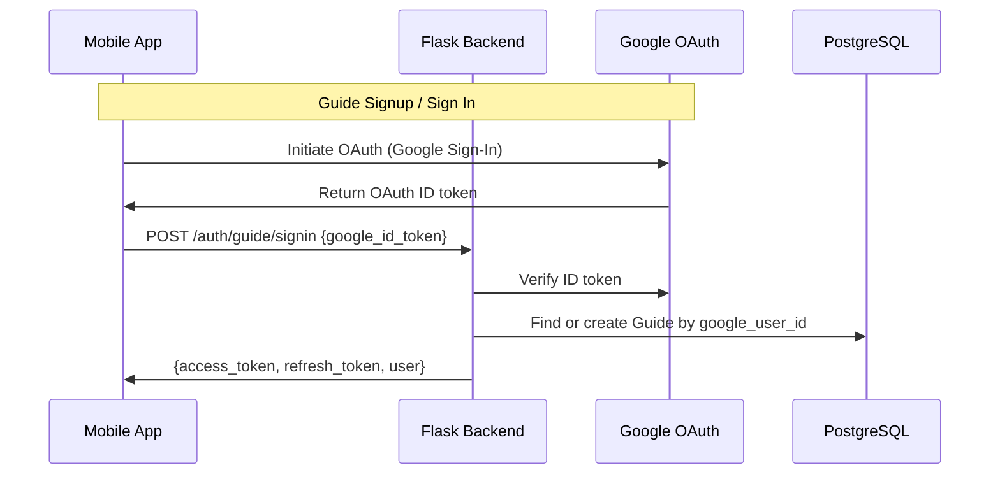
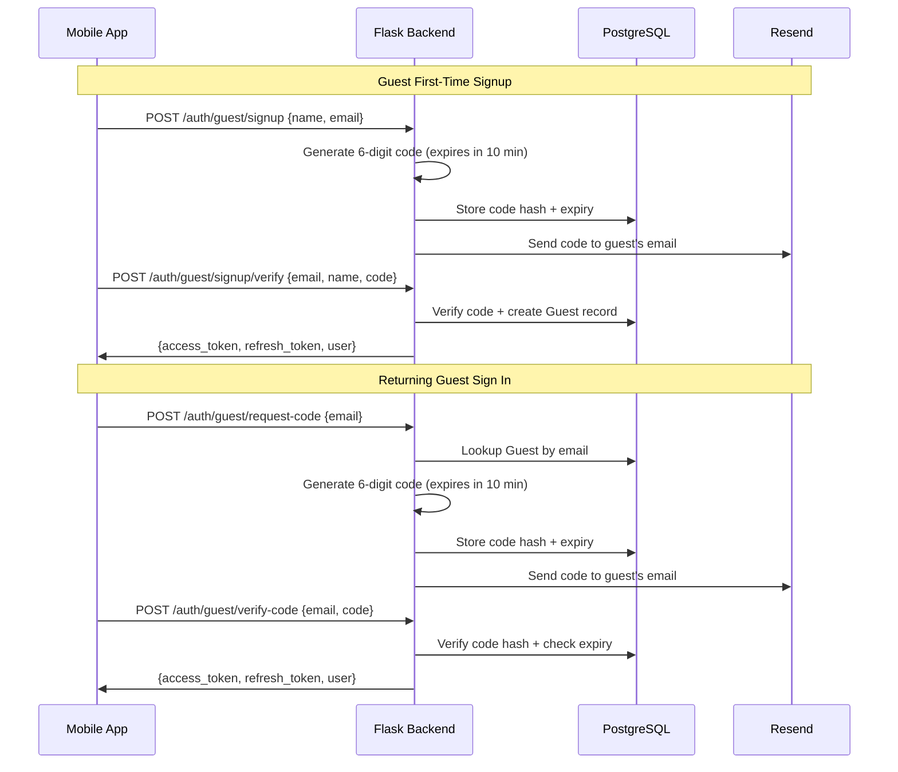
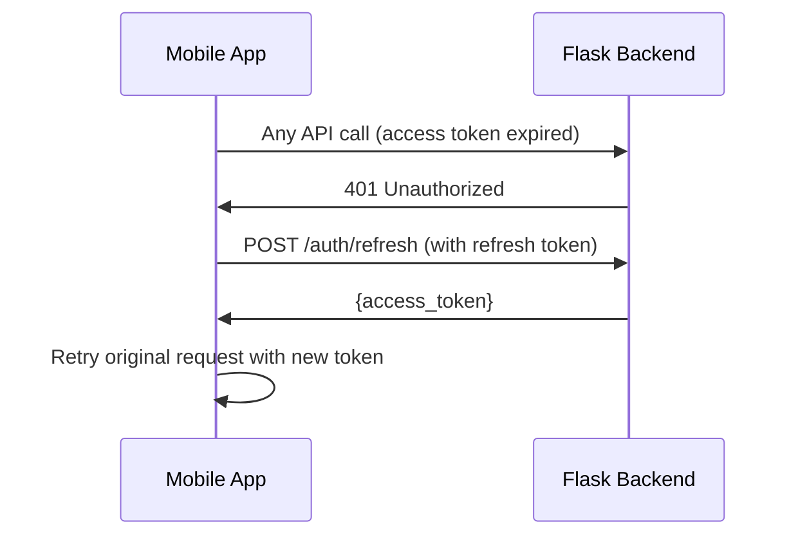

# Authentication

Audience: Architect, Developer

Companion to [2_architecture.md](2_architecture.md). Covers auth strategies, flows, token management, and session restoration.

## Strategy

| User | First time | Returning |
|---|---|---|
| **Guide** | Google OAuth | Google OAuth |
| **Guest** | Name + email + 6-digit verification code | Email + 6-digit verification code |

- **Guides** authenticate exclusively via Google OAuth. No passwords to manage.
- **Guests** sign up with name and email, then verify via a 6-digit code sent to their email (expires in 10 minutes). Returning guests sign in with just their email and a new verification code. Both flows are designed for minimal friction (under 60 seconds for walk-up tourists).

## Guide Auth Flow (Google OAuth)

### Guide Identity Matching

The backend looks up guides in this order:
1. By `google_user_id` (Google's stable `sub` claim — never changes even if the user changes their email)
2. By `email_address` (fallback for pre-existing accounts created before `google_user_id` was tracked)

If matched by email but `google_user_id` is not set, the backend backfills it for future lookups.

## Guest Auth Flow

### Verification Code Details

- Codes are 6 digits, generated randomly
- Stored as a hash (not plaintext) in `guest.verification_code` table
- Expire after 10 minutes
- Sent via Resend email API from `noreply@triptoe.app`

## Token Strategy

| Token | Lifetime | Storage | Purpose |
|---|---|---|---|
| Access token | 30 days | expo-secure-store | API request authentication |
| Refresh token | 90 days | expo-secure-store | Obtain new access tokens |

- Managed by **flask-jwt-extended**
- Access tokens are JWTs containing `{uid, type, exp}`
- Axios interceptors automatically refresh expired access tokens

### Token Refresh Flow

The refresh is handled transparently by the Axios response interceptor in `src/services/api.ts`. A token refresh queue prevents concurrent requests from triggering multiple refresh calls.

## Session Restoration (App Boot)

On cold start, `_layout.tsx` calls `useAuthStore.restoreSession()` which:

1. Reads `user`, `access_token`, and `refresh_token` from `expo-secure-store`
2. If all exist → sets `user` in the store, `loading = false`
3. If any are missing → sets `user = null`, `loading = false`

Other effects in `_layout.tsx` and deep-link route files wait for `loading === false` before making auth decisions. This prevents a logged-in user from being briefly treated as logged out during the async restore.

### Persisted Flags (Survive Logout)

Two flags are persisted in `SecureStore` and intentionally **not cleared on logout**:

| Flag | Set when | Purpose |
|---|---|---|
| `has_guest_account` | Guest signs in | Deep-link routes choose "Sign In" vs "Sign Up" without an API call |
| `last_user_type` | Any user signs in (`'guide'` or `'guest'`) | Welcome screen auto-skips to the correct signin on cold start |

### Returning User Auto-Skip

On cold start, `index.tsx` checks `lastUserType`:
- `'guide'` → auto-redirect to `/(guide)/signin` (Google OAuth)
- `'guest'` → auto-redirect to `/(guest)/signin` (or signup if `hasGuestAccount` is false)
- `null` (first-time user) → show the welcome screen with role selection

The auto-skip fires only once per cold start (tracked via a `useRef`). If the user taps "Sign in as Guest" / "Sign in as Guide" on the signin screen, they navigate back to the welcome screen and can pick the other role.

### Tab Bar on Auth Screens

Auth screens (`signin`, `signup`) are inside the `(guide)` and `(guest)` tab navigators but hide the tab bar via `tabBarStyle: { display: 'none' }`. This prevents unauthenticated users from tapping into protected tab screens (which would crash).

## Auth Protection

`_layout.tsx` has a `useEffect` that watches `[user, loading, segments]`:

- If `user` is null and the current route is inside `(guide)` or `(guest)` (excluding signin/signup screens), redirect to `/` (welcome screen)
- This prevents unauthenticated access to protected screens

## Backend Auth Decorator

Protected endpoints use `@require_auth()` or `@require_auth('guide')`:

- Validates the JWT from the `Authorization: Bearer <token>` header
- Extracts `uid` and `type` into `request.current_user`
- `@require_auth('guide')` additionally rejects non-guide tokens with 403

## Account Deletion

Both guides and guests can delete their account from the app's Account screen. The backend `DELETE /auth/account`:

- Anonymizes personal data (name, email, phone, bio, photo, etc.) rather than deleting the record
- Deactivates all push notification tokens
- Keeps tour session data intact for the guide's records (bookings become anonymous)

## API Endpoints

| Endpoint | Method | Purpose |
|---|---|---|
| `/auth/guide/signin` | POST | Guide Google OAuth signin/signup |
| `/auth/guest/signup` | POST | Guest signup (send verification code) |
| `/auth/guest/signup/verify` | POST | Verify code + create guest account |
| `/auth/guest/request-code` | POST | Returning guest sign-in (send code) |
| `/auth/guest/verify-code` | POST | Verify code + sign in |
| `/auth/refresh` | POST | Refresh access token |
| `/auth/check-email` | POST | Check if email is already registered |
| `/auth/guide/account` | GET/PUT | Guide profile read/update |
| `/auth/guest/account` | GET/PUT | Guest profile read/update |
| `/auth/account` | DELETE | Account deletion (both roles) |
| `/auth/request-account-deletion` | POST | Request account deletion via email link |

## Files

| File | Role |
|---|---|
| `triptoe-backend/app/routes/auth.py` | All auth endpoints |
| `triptoe-backend/app/utils/auth_helpers.py` | UID generation, verification code helpers |
| `triptoe-backend/app/services/email_service.py` | Resend API integration |
| `triptoe-mobile/src/stores/useAuthStore.ts` | Zustand store: user state, login/logout, session restore |
| `triptoe-mobile/src/services/auth.ts` | Auth API calls |
| `triptoe-mobile/src/services/api.ts` | Axios instance with JWT interceptor + token refresh |
| `triptoe-mobile/app/(guide)/signin.tsx` | Guide Google OAuth screen |
| `triptoe-mobile/app/(guest)/signin.tsx` | Guest email + code signin |
| `triptoe-mobile/app/(guest)/signup.tsx` | Guest name + email + code signup |
