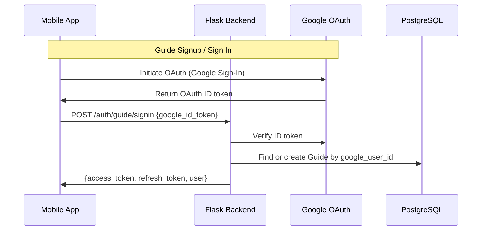
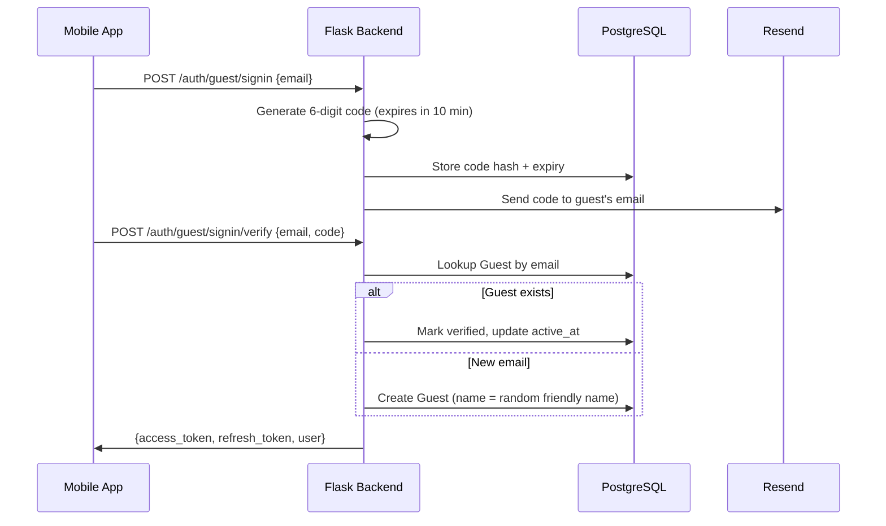
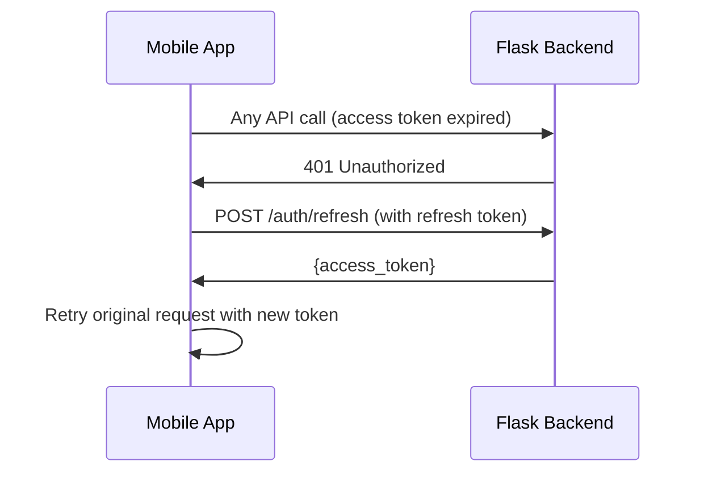

# Authentication

Audience: Architect, Developer

Companion to [2_architecture.md](2_architecture.md). Covers auth strategies, flows, token management, and session restoration.

## Strategy

| User | First time | Returning |
|---|---|---|
| **Guide** | Google OAuth or Apple Sign-In | Google OAuth or Apple Sign-In |
| **Guest** | Email + 6-digit verification code | Email + 6-digit verification code |

- **Guides** authenticate via Google OAuth or Apple Sign-In. No passwords to manage.
- **Guests** use a single unified flow: enter email, receive a 6-digit code (expires in 10 minutes), verify. The verify endpoint creates the account if the email is new, signs in if existing — there is no separate signup vs signin path. No name is collected; the backend assigns a random friendly name (e.g. "Brave Dolphin", "Sunny Koala") which the guest can change later on their profile screen. Designed for minimal friction (under 60 seconds for walk-up tourists).

## Guide Auth Flow (Google OAuth)

### Guide Identity Matching

The backend looks up guides in this order:
1. By `google_user_id` (Google's stable `sub` claim — never changes even if the user changes their email)
2. By `email_address` (fallback for pre-existing accounts created before `google_user_id` was tracked)

If matched by email but `google_user_id` is not set, the backend backfills it for future lookups.

## Guest Auth Flow

The verify endpoint catches `IntegrityError` on guest creation. If two near-simultaneous verify requests for the same new email race, the second one re-queries by email and signs in cleanly instead of returning a 500.

### Verification Code Details

- Codes are 6 digits, generated randomly
- Stored as a hash (not plaintext) in `guest.verification_code` table
- Expire after 10 minutes
- Sent via Resend email API from `noreply@triptoe.app`
- Requesting a new code for the same email **deletes any existing unused code** for that email (server-side, in the same transaction). The mobile UI surfaces this with a 30-second cooldown on the Resend control so users don't accidentally invalidate the code they're currently typing.

### Guest Auth UX (Mobile)

The unified guest sign-in screen (`app/(guest)/signin.tsx`) is a single two-step flow: enter email → tap Send → enter the 6-digit code → `router.replace` to the dashboard (or the deep-link target). The same screen handles both first-time signup (creates account) and returning sign-in. Several details are deliberate:

- **Email format validation** before the API call. Catches typos like a missing `@` so the backend doesn't issue a code for an unreachable address.
- **Auto-submit** when the verification code field reaches 6 characters. Removes the "Verify" tap. Gated on `!submitting` so a backspace-and-retype during an in-flight request can't double-submit.
- **OS keyboard auto-fill**: the code input has `textContentType="oneTimeCode"` (iOS) and `autoComplete="one-time-code"` (Android). When supported, the user taps a Gboard suggestion containing the freshly-arrived code and the auto-submit fires immediately.
- **"Wrong email? Edit" inline link** under the email field once a code has been sent. Tapping it re-enables the email field, clears the code input, and resets the resend cooldown — no need to navigate back and lose state.
- **Inline resend control** under the verification code field. Shows "Resend in {N}s" countdown for 30 seconds after each send, then becomes a tappable "Resend code" link.
- **Named tour context** when arriving via a deep link. If `pendingDeepLink` is set, the screen fetches the tour title (and start time for sessions) via the public `GET /tours/{id}` or `GET /tour-sessions/{id}` endpoint and shows "Sign in to join *Central Park Walking Tour · Apr 12, 2:00 PM*" instead of the generic "Sign in below to join your tour". Failure falls back silently to the generic copy.
- **Curated error copy.** The catch blocks for `handleVerify` and `handleSendCode` ignore the backend's literal error string and show user-facing copy. The one exception is the "expired" vs "wrong code" distinction, which is driven by checking `error.response.data.error` for the substring `expired`.
- **Auth endpoints bypass the JWT refresh interceptor.** `src/services/api.ts` checks the request URL and returns `Promise.reject(error)` immediately for any `/auth/*` endpoint that 401s, so the interceptor doesn't try to refresh a non-existent token (which would surface "No refresh token" instead of the real backend error).

### Friendly Name Nudge

When a guest signs in, the auth store computes `hasGeneratedName` by checking if `user.name` matches the "Adjective Animal" pattern via `isGeneratedName()` in `src/utils/guestName.ts` (matches against the same 24×24 word lists as the backend's `generate_friendly_name()`). The flag is recomputed in three places:

- `login()` — after a successful signin/signup
- `restoreSession()` — on app boot
- `updateUserName()` — after the guest saves their profile

The dashboard reads `hasGeneratedName` directly from the store and shows a tappable card ("You're signed in as Brave Dolphin. Tap to set your real name.") that routes to the account screen. The account screen shows an inline hint below the name input. Both disappear permanently once the guest sets a name that does not match the generated pattern.

### Account Status

The `Guest.account_status` column has three values:

| Value | Meaning |
|---|---|
| `'basic'` | Guest exists in the DB but has not verified email ownership. The walk-up tourist booking path at `tour_sessions.py` creates a `'basic'` guest from just a name when a guide books on their behalf. |
| `'verified'` | Guest has proven ownership of their email by entering a verification code. Set by `/auth/guest/signin/verify`. |
| `'deleted'` | Soft-deleted account. |

The `is_verified()` method on the model returns `account_status == 'verified'`. As of this writing, no endpoint reads it to gate functionality — it's a design hook for future features (e.g. "verified-only" tours).

## Token Strategy

| Token | Lifetime | Storage | Purpose |
|---|---|---|---|
| Access token | 30 days | expo-secure-store | API request authentication |
| Refresh token | 90 days | expo-secure-store | Obtain new access tokens |

- Managed by **flask-jwt-extended**
- Access tokens are JWTs containing `{uid, type, exp}`
- Axios interceptors automatically refresh expired access tokens

### Token Refresh Flow

The refresh is handled transparently by the Axios response interceptor in `src/services/api.ts`. A token refresh queue prevents concurrent requests from triggering multiple refresh calls.

## Session Restoration (App Boot)

On cold start, `_layout.tsx` calls `useAuthStore.restoreSession()` which:

1. Reads `user`, `access_token`, and `refresh_token` from `expo-secure-store`
2. If all exist → sets `user` in the store, `loading = false`
3. If any are missing → sets `user = null`, `loading = false`

Other effects in `_layout.tsx` and deep-link route files wait for `loading === false` before making auth decisions. This prevents a logged-in user from being briefly treated as logged out during the async restore.

### Logout Cleanup

`logout()` clears tokens, user state, `pendingDeepLink`, and `hasGeneratedName`. It intentionally preserves `lastUserType` so the welcome screen can auto-skip for returning users.

### Persisted Flag (Survives Logout)

| Flag | Set when | Purpose |
|---|---|---|
| `last_user_type` | Any user signs in (`'guide'` or `'guest'`) | Welcome screen auto-skips to the correct auth screen on cold start |

### Returning User Auto-Skip

On cold start, `index.tsx` checks `lastUserType`:
- `'guide'` → auto-redirect to `/(guide)/signin` (Google OAuth)
- `'guest'` → auto-redirect to `/(guest)/signin` (unified email + code)
- `null` (first-time user) → show the welcome screen with role selection

The auto-skip fires via a `useEffect` (not `useFocusEffect`) and only once per cold start (tracked via a `useRef`). If the user taps the "Sign in as Guide" / "Sign in as Guest" role-switch button, they navigate back to the welcome screen and can pick the other role.

### Auth Screens in the Stack

Auth screens (`signin` for both guides and guests) are Stack siblings of `(tabs)`, not tab entries. They have no tab bar because they live outside the tab navigator entirely. `_layout.tsx`'s auth-protection guard treats `signin` and `signup` as public — any other route inside `(guide)` or `(guest)` redirects unauthenticated users back to the welcome screen.

## Auth Protection

`_layout.tsx` has a `useEffect` that watches `[user, loading, segments]`:

- If `user` is null and the current route is inside `(guide)` or `(guest)` (excluding `signin` and `signup`), redirect to `/` (welcome screen)
- This prevents unauthenticated access to protected screens

## Backend Auth Decorator

Protected endpoints use `@require_auth()` or `@require_auth('guide')`:

- Validates the JWT from the `Authorization: Bearer <token>` header
- Extracts `uid` and `type` into `request.current_user`
- `@require_auth('guide')` additionally rejects non-guide tokens with 403

## Account Deletion

Both guides and guests can delete their account from the app's Account screen. The backend `DELETE /auth/account`:

- Anonymizes personal data (name, email, phone, bio, photo, etc.) rather than deleting the record
- Deactivates all push notification tokens
- Keeps tour session data intact for the guide's records (bookings become anonymous)

## API Endpoints

| Endpoint | Method | Purpose |
|---|---|---|
| `/auth/guide/signin` | POST | Guide Google OAuth signin/signup |
| `/auth/guide/signin/apple` | POST | Guide Apple Sign-In signin/signup |
| `/auth/guest/signin` | POST | Send 6-digit code to email (works for new and existing guests) |
| `/auth/guest/signin/verify` | POST | Verify code, create account if new, sign in if existing |
| `/auth/refresh` | POST | Refresh access token |
| `/auth/guide/account` | GET/PUT | Guide profile read/update |
| `/auth/guest/account` | GET/PUT | Guest profile read/update |
| `/auth/account` | DELETE | Account deletion (both roles) |
| `/auth/request-account-deletion` | POST | Request account deletion via email link |

The legacy split endpoints (`/auth/guest/signup`, `/auth/guest/signup/verify`, `/auth/guest/request-code`, `/auth/guest/verify-code`) have been removed.

## Files

| File | Role |
|---|---|
| `triptoe-backend/app/routes/auth.py` | All auth endpoints |
| `triptoe-backend/app/utils/auth_helpers.py` | UID generation, verification code helpers |
| `triptoe-backend/app/services/google_auth_service.py` | Google ID token verification |
| `triptoe-backend/app/services/apple_auth_service.py` | Apple identity token verification |
| `triptoe-backend/app/services/email_service.py` | Resend API integration |
| `triptoe-mobile/src/stores/useAuthStore.ts` | Zustand store: user state, login/logout, session restore |
| `triptoe-mobile/src/services/auth.ts` | Auth API calls |
| `triptoe-mobile/src/services/api.ts` | Axios instance with JWT interceptor + token refresh |
| `triptoe-mobile/app/(guide)/signin.tsx` | Guide Google OAuth screen |
| `triptoe-mobile/app/(guest)/signin.tsx` | Unified guest email + code screen (creates account on first verify, signs in on subsequent) |
| `triptoe-mobile/src/components/ui/Banner.tsx` | Reusable accent-bar banner used by the friendly-name nudge |
| `triptoe-mobile/src/utils/guestName.ts` | `isGeneratedName()` — detects backend-generated friendly names |
