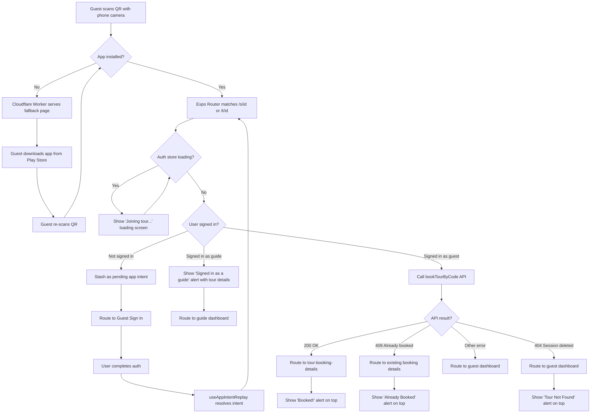
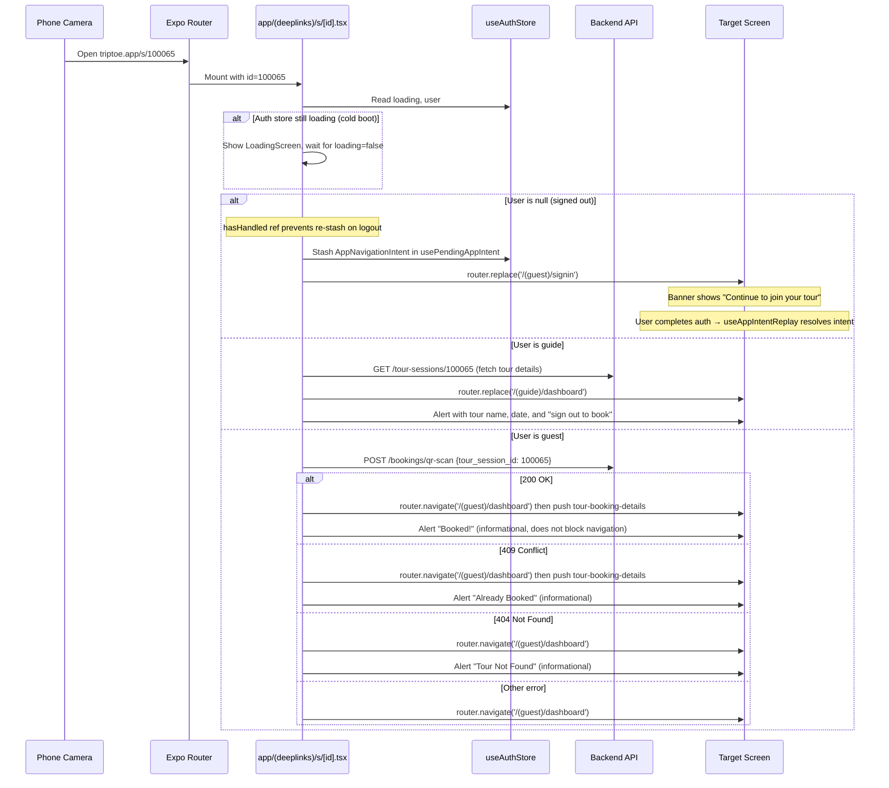
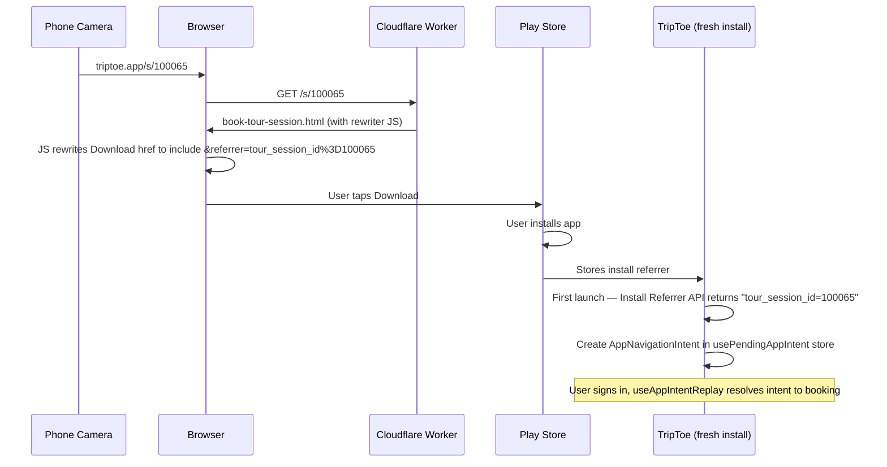

# Tour Joining Flow

Audience: Architect, Developer

Companion to [2_architecture.md](2_architecture.md). Covers the end-to-end journey from "guest scans a QR code" to "guest is booked and viewing their tour."

## Overview

Guides print QR codes for their tours. A guest scans the QR with their phone camera. The system must handle every combination of:

- **App state**: installed vs not installed, foreground vs background vs killed
- **Auth state**: signed in as guest, signed in as guide, signed out (returning), signed out (new user)
- **Session state**: valid, already booked, deleted/expired

The flow is split between three systems: the **Cloudflare Worker** (web fallback), **Expo Router** (file-based deep-link routes), and the **pending app intent store** (intent replay after login).

## QR Code Format

| Type | URL | Generated by |
|---|---|---|
| Session | `https://triptoe.app/s/{tour_session_id}` | `GET /tour-sessions/{id}/qr` |
| Template | `https://triptoe.app/t/{tour_template_id}` | `GET /tour-templates/{id}/qr` |

QR generation uses `ERROR_CORRECT_M` (15% error recovery) for reliability in outdoor/sunlight conditions.

## End-to-End Flow



## Route Files

### `app/(deeplinks)/s/[id].tsx` — Session Deep Link

Handles `https://triptoe.app/s/{id}` and `triptoe://s/{id}` (Expo's normalized form).

Deep link handlers navigate to the **dashboard first**, then push the detail screen on top. This ensures back navigation from the detail screen returns to the tabbed dashboard instead of stranding the user on a blank screen.



A fallback `headerLeft` (home icon) on `tour-booking-details` handles edge cases where `navigation.canGoBack()` is false — it navigates to the dashboard directly.

### `app/(deeplinks)/t/[id].tsx` — Template Deep Link

Handles `https://triptoe.app/t/{id}` and `triptoe://t/{id}`.

Simpler than the session flow — no booking API call. Routes to the dashboard first, then pushes the session picker on top so back navigation lands on the tabbed dashboard.

| Auth state | Behavior |
|---|---|
| Guest | Navigate to guest dashboard, then push `select-tour-session` with `{ tour_template_id: id }` |
| Guide | Fetches template title, shows alert, routes to guide dashboard |
| Signed out | Stashes app intent, routes to guest sign-in |
| Cold boot | Waits for `loading === false` before deciding |

## Cloudflare Worker Fallback

When the app is **not installed**, the HTTPS URL opens in the phone's browser. The Cloudflare Worker (`triptoe-docs/site/worker.js`) rewrites the path to a static HTML page:

| Path pattern | Served file | Content |
|---|---|---|
| `/s/{digits}` | `book-tour-session.html` | "Join This Tour" + Play Store download button |
| `/t/{digits}` | `select-tour-session.html` | "Join This Tour" + Play Store download button |

After installing the app, the guest re-scans the QR. This time Android App Links intercept the URL and open the app directly.

## Android App Links

Verified via `/.well-known/assetlinks.json` hosted on `triptoe.app` (Cloudflare Pages). Contains SHA-256 fingerprints for:
- Google Play signing key (production)
- Upload keystore (development)

`app.json` declares intent filters for `/s/` and `/t/` path prefixes under `https://triptoe.app`.

## Pending App Intent (Post-Login Replay)

When a deep link, install referrer, or notification tap arrives while the user is signed out, the system creates an `AppNavigationIntent` object and stashes it in the `usePendingAppIntent` store (`src/stores/usePendingAppIntent.ts`). This is Zustand state, not persisted to disk. Deep links, install referrer results, and notification taps all use the same store — there is no separate code path per source.

After the user completes sign-in, the `useAppIntentReplay` hook (`src/hooks/useAppIntentReplay.ts`) consumes the intent and calls `resolveAppIntent()` from `src/utils/appIntentRouter.ts`. The resolver dispatches based on intent type: deep link intents route through the file-based routes (`/s/{id}`, `/t/{id}`), while notification intents use navigation helpers. Notification intents include a `recipient_type` field for role-aware routing — if the signed-in user's role doesn't match (e.g. a guide notification for a guest user), the resolver routes to the user's own dashboard instead.

### Clearing the pending intent

The intent is cleared in these cases:
- **After post-login replay starts**: `useAppIntentReplay` consumes the pending intent before calling `resolveAppIntent()`, so notification intents and role-mismatch fallbacks are one-shot.
- **After deep-link route handling completes**: `/s/[id].tsx` and `/t/[id].tsx` clear the intent in their success, guide, and error paths. The deep-link intent is not cleared before the file route runs, because early clearing caused the welcome screen to race the handler.
- **User logs out**: `useLogoutCleanup` clears the intent store so a stale tour context banner does not persist on the auth screen.
- **User taps "Sign in as Guide" / "Sign in as Guest"**: role-switch clears the intent store and routes to the welcome screen.
- **App killed**: intent is Zustand state only (not persisted to `SecureStore`), so it's lost on app kill.

### Logout re-stash guard

The deep link handlers watch `[id, user, authLoading]`. When the user logs out, `user` becomes null and the effect re-fires. Without a guard, the no-user branch would re-stash the intent (which logout just cleared) and redirect to auth. A `hasHandled` ref in each handler ensures the stash-and-redirect only fires once per mount — on the initial navigation, not on logout-triggered re-renders.

## Deferred Deep Linking (Install Referrer)

Users without the app installed scan a QR with the phone camera and land on the Cloudflare Worker's fallback HTML page (`book-tour-session.html` or `select-tour-session.html`). The Download button on those pages constructs a Play Store URL that encodes the tour identifier in the `referrer` query parameter:

```
https://play.google.com/store/apps/details?id=com.triptoe.mobile&referrer=tour_session_id%3D{id}
```

The encoding is done client-side via a small inline script that reads `window.location.pathname` to extract the ID. The Cloudflare Worker itself is unchanged — it still serves the static HTML — but the static HTML embeds the rewriting logic.

After install, the freshly-launched app reads the referrer string via Google's Install Referrer API (`react-native-play-install-referrer`), parses the `tour_session_id` or `tour_template_id` value, and creates an `AppNavigationIntent` in the `usePendingAppIntent` store. The existing replay path via `useAppIntentReplay` then takes over after sign-in — same channel as a QR scan or notification tap, no separate first-install code path.

A `SecureStore` flag (`install_referrer_consumed`) ensures the referrer is read **only once**, on the first launch after install. The flag is set **before** the async lookup so a crash mid-flow can't loop. The Install Referrer Library returns the original referrer indefinitely, so without this guard a second launch could re-fire the deep link long after the user has moved on.



**Local testing limitation**: `adb install` always returns an empty install referrer — this is a Google Play platform restriction, not a bug. The end-to-end flow can only be verified by uploading an AAB to the Play Console internal test track and installing through Play. To test:

1. Upload AAB to Play Console (internal test track)
2. Open the session/template URL in a phone browser (not the TripToe app)
3. Tap Download, install from Play Store
4. Open the app
5. Verify: welcome is skipped, guest sign-in screen shows with tour context header
6. Verify code and confirm tour is booked (session) or session picker shows (template)

**Organic installs** (users finding the app via Play Store search, not via a QR link) have an empty referrer string and the lookup is a no-op. No harm.

**R8/ProGuard**: R8 is currently disabled (`enableProguardInReleaseBuilds: false` in app.json via `expo-build-properties`). Enabling R8 strips the `react-native-play-install-referrer` native classes since they are called from JavaScript via the React Native bridge, not from Java directly. If R8 is re-enabled in the future, add ProGuard keep rules for `react-native-play-install-referrer` and test the full install referrer flow through a real Play Store install before shipping.

### Install Referrer Failure Modes

| Failure | What happens | User impact |
|---|---|---|
| Install referrer library stripped by R8 | Intent never created | Welcome shows, user manually signs up, lands on empty dashboard (tour not booked) |
| Referrer string empty (organic install) | Referrer returns empty string | Welcome shows normally, no auto-skip. Correct behavior. |
| Network error fetching tour name for header | Tour label stays null | Generic header shown instead of named tour. Flow still works. |
| User navigates back from sign-in to welcome | hasAutoSkipped is true, auto-skip does not re-fire | Welcome shows with role buttons. Intent still set and will replay after login. |
| User switches to guide role from sign-in | Intent store cleared | Intent cleared. Guide signs in normally. Correct behavior. |

### Welcome Screen Auto-Skip on Install Referrer

When a pending intent is set on cold start (from the install referrer, a cold-start notification tap, or a deep link), the welcome screen (`index.tsx`) checks `usePendingAppIntent.intent` and auto-skips directly to the guest sign-in screen. A new guest who installs via QR → Play Store → opens the app lands on the sign-in screen immediately instead of seeing the welcome/role-selection page. The tour QR acts as implicit role selection — no need for the user to manually choose "Guest."

### Clearing the Tour Context Header

The guest sign-in screen shows a contextual header when a pending intent is set. For deep link intents it shows "Sign in to join *{tour name}*"; for notification intents it shows "Sign in to view your message". When the intent is consumed (resolved after auth), the screen clears this header so it doesn't persist across logout or role switches.

## Cold-Start Notification Handling

When the app is launched from a notification tap while completely closed, the app reads the notification response via `getLastNotificationResponseAsync()` and creates an `AppNavigationIntent` in the `usePendingAppIntent` store. A response ID is tracked to deduplicate — `clearLastNotificationResponseAsync()` is called after reading so the same notification is not processed twice on subsequent cold starts.

## Cold Boot Race

When the app is **completely closed** and the user scans a QR (or taps a notification):

1. Expo Router mounts `app/(deeplinks)/s/[id].tsx` during cold start
2. `useAuthStore.loading` is `true` while `restoreSession()` reads from `SecureStore`
3. The route file checks `if (authLoading) return;` — shows `<LoadingScreen message="Joining tour..." />` and waits
4. `restoreSession()` completes → `loading` becomes `false`
5. `useEffect` re-runs with stable auth state → routes correctly

Without this guard, a logged-in user would be briefly treated as logged out (because `user` is `null` while the store is loading), bounced to the sign-in screen, then replayed — causing a visual flash.

## In-App QR Scanner

Separately from the deep-link flow, guests can scan QR codes from **inside the app** via the "Join Tour" tab (`book-tour-session.tsx`). This uses `expo-camera`'s `CameraView` and calls `parseQRData()` on the raw QR string (which is always the `https://triptoe.app/...` form, not the scheme-normalized form).

The in-app scanner handles booking, 409/404 errors, and template-vs-session routing inline — it does not use the file-based route files.

`parseQRData()` in `src/utils/tourUtils.ts` matches both URL forms:
- `https://triptoe.app/s/{id}` (raw QR string, used by in-app scanner)
- `triptoe://s/{id}` (Expo-normalized scheme, used by intent replay)

## Auth State Matrix

| Auth state | Session QR (`/s/{id}`) | Template QR (`/t/{id}`) |
|---|---|---|
| Guest (signed in) | Book → booking details (alert on top) | Route to session picker |
| Guide (signed in) | Alert with tour details → guide dashboard | Alert with tour title → guide dashboard |
| Signed out (any guest) | Stash intent → guest sign-in (with banner) → replay | Same |
| Signed out, taps role-switch | Intent cleared → lands on welcome | Same |
| Session deleted (404) | "Tour Not Found" alert → guest dashboard | N/A (template still exists) |
| Already booked (409) | Existing booking details (alert on top) | N/A (no booking at template level) |
| Cold boot (logged in) | Waits for auth restore → processes normally | Same |

## Files

| File | Role |
|---|---|
| `app/(deeplinks)/s/[id].tsx` | Session deep-link route (booking, auth-gating, error handling) |
| `app/(deeplinks)/t/[id].tsx` | Template deep-link route (session picker, auth-gating) |
| `src/stores/usePendingAppIntent.ts` | Zustand store for `AppNavigationIntent` — unified stash for deep links, install referrer, and notification taps |
| `src/hooks/useAppIntentReplay.ts` | Consumes pending intent after sign-in and calls `resolveAppIntent()` |
| `src/utils/appIntentRouter.ts` | `resolveAppIntent()` — dispatches intents to file routes (deep links) or navigation helpers (notifications) |
| `app/(guest)/signin.tsx` | Unified guest auth screen; banner when a pending intent is set; "Sign in as Guide" button clears it |
| `app/(guest)/book-tour-session.tsx` | In-app QR scanner (separate from deep-link flow) |
| `src/utils/tourUtils.ts` | `parseQRData()` — parses both URL forms |
| `app/index.tsx` | Welcome screen — auto-skips to guest auth when a pending intent is set (install referrer / notification / deep link implicit role selection) |
| `src/stores/useAuthStore.ts` | User state + `hasGeneratedName` flag (no longer holds pending intent) |
| `triptoe-docs/site/worker.js` | Cloudflare Worker — rewrites `/s/` and `/t/` to fallback HTML |
| `triptoe-docs/site/book-tour-session.html` | "Download TripToe" fallback for session QRs; inline JS encodes the tour ID into the Play Store referrer parameter |
| `triptoe-docs/site/select-tour-session.html` | "Download TripToe" fallback for template QRs; inline JS encodes the tour ID into the Play Store referrer parameter |
| `react-native-play-install-referrer` (npm) | Wraps Google's Install Referrer API; surfaces the referrer string to JS on first launch after install |

## Backend Endpoints Used

| Endpoint | Called by | Purpose |
|---|---|---|
| `POST /bookings/qr-scan` | `app/(deeplinks)/s/[id].tsx` | Book a session by ID. Returns 200 (booked), 409 (already booked), 404 (not found) |
| `GET /tour-sessions/{id}` | `app/(deeplinks)/s/[id].tsx` (guide path) | Fetch tour title + date for the guide alert |
| `GET /tours/{id}` | `app/(deeplinks)/t/[id].tsx` (guide path) | Fetch template title for the guide alert |
| `GET /tour-sessions/{id}/qr` | Guide app (QR modal) | Generate session QR code image |
| `GET /tour-templates/{id}/qr` | Guide app (QR modal) | Generate template QR code image |

## Guest Naming

Guest signup does not collect a name. The backend assigns a random friendly name on account creation (e.g. "Brave Dolphin", "Sunny Koala") via `generate_friendly_name()` in `utils/auth_helpers.py`. The same generator is used for unauthenticated walk-up bookings via `/bookings/qr-scan` when no `guest_name` is provided.

This avoids exposing any personal information (email prefix, real name) to the guide. Guests can update their name on the account screen at any time. Guides see the friendly name in the guest list, messages, reviews, and map markers until the guest changes it.

## iOS Deep Linking

The deep link handlers, auth flow, intent replay, and race condition guards are all platform-agnostic — they work unchanged on iOS. The `usePendingAppIntent` store and `useAppIntentReplay` hook have no platform-specific code.

### What works on iOS without changes
- Universal Links (Apple's equivalent of Android App Links) — Expo Router handles them through the same file-based route files
- `app.json` `intentFilters` translate to `associatedDomains` in the iOS build config
- All `(deeplinks)` route files, auth screen guards, welcome screen segments guard, and intent replay

### What requires iOS-specific work
- **`apple-app-site-association` file** on `triptoe.app` (equivalent of `assetlinks.json` for Android). Must be hosted at `/.well-known/apple-app-site-association` via Cloudflare.
- **Associated Domains entitlement** in `app.json` iOS config (e.g. `applinks:triptoe.app`).
- **No install referrer API on iOS.** Apple does not provide an equivalent of Google's Install Referrer API. Deferred deep linking (QR → App Store → install → open with tour context) requires either a third-party service (Branch, AppsFlyer) or a custom solution. Without this, iOS users who install via QR will land on the welcome screen without tour context — they must re-scan the QR after installing.
