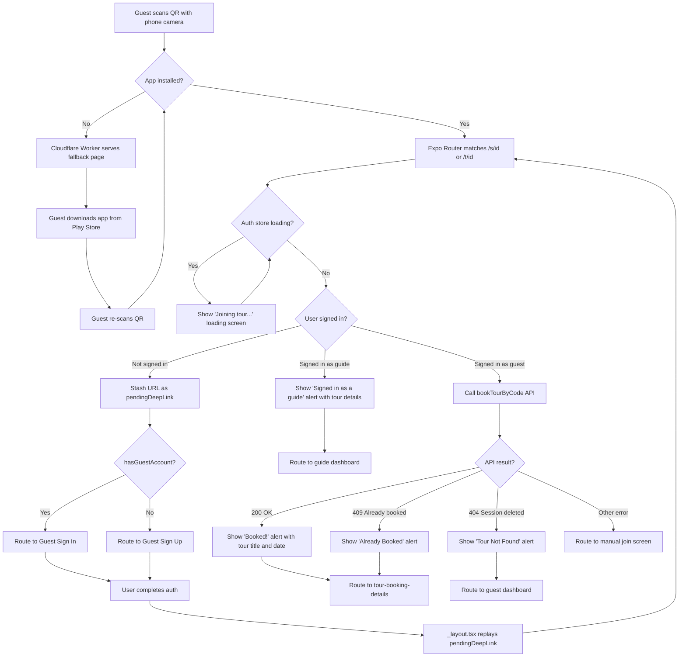
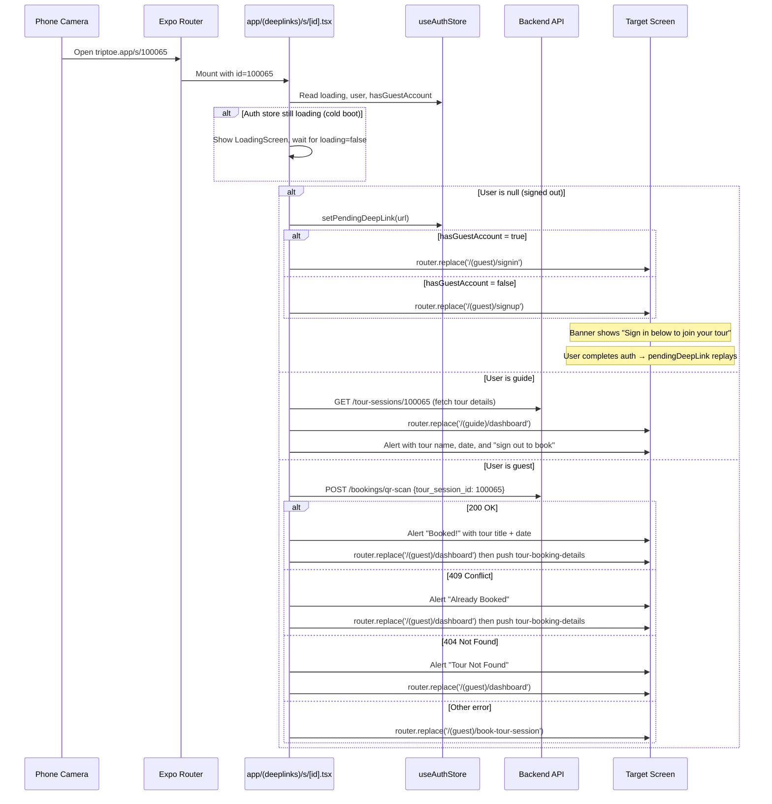
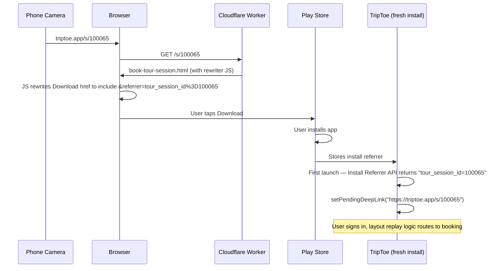

# Tour Joining Flow

Audience: Architect, Developer

Companion to [2_architecture.md](2_architecture.md). Covers the end-to-end journey from "guest scans a QR code" to "guest is booked and viewing their tour."

## Overview

Guides print QR codes for their tours. A guest scans the QR with their phone camera. The system must handle every combination of:

- **App state**: installed vs not installed, foreground vs background vs killed
- **Auth state**: signed in as guest, signed in as guide, signed out (returning), signed out (new user)
- **Session state**: valid, already booked, deleted/expired

The flow is split between three systems: the **Cloudflare Worker** (web fallback), **Expo Router** (file-based deep-link routes), and the **auth store** (pending deep-link replay after login).

## QR Code Format

| Type | URL | Generated by |
|---|---|---|
| Session | `https://triptoe.app/s/{tour_session_id}` | `GET /tour-sessions/{id}/qr` |
| Template | `https://triptoe.app/t/{tour_template_id}` | `GET /tour-templates/{id}/qr` |

QR generation uses `ERROR_CORRECT_M` (15% error recovery) for reliability in outdoor/sunlight conditions.

## End-to-End Flow



## Route Files

### `app/(deeplinks)/s/[id].tsx` — Session Deep Link

Handles `https://triptoe.app/s/{id}` and `triptoe://s/{id}` (Expo's normalized form).

Deep link handlers navigate to the **dashboard first**, then push the detail screen on top. This ensures back navigation from the detail screen returns to the tabbed dashboard instead of stranding the user on a blank screen.



A fallback `headerLeft` (home icon) on `tour-booking-details` handles edge cases where `navigation.canGoBack()` is false — it navigates to the dashboard directly.

### `app/(deeplinks)/t/[id].tsx` — Template Deep Link

Handles `https://triptoe.app/t/{id}` and `triptoe://t/{id}`.

Simpler than the session flow — no booking API call. Routes to the dashboard first, then pushes the session picker on top so back navigation lands on the tabbed dashboard.

| Auth state | Behavior |
|---|---|
| Guest | Navigate to guest dashboard, then push `select-tour-session` with `{ tour_template_id: id }` |
| Guide | Fetches template title, shows alert, routes to guide dashboard |
| Signed out | Stashes pendingDeepLink, routes to guest signin/signup |
| Cold boot | Waits for `loading === false` before deciding |

## Cloudflare Worker Fallback

When the app is **not installed**, the HTTPS URL opens in the phone's browser. The Cloudflare Worker (`triptoe-docs/site/worker.js`) rewrites the path to a static HTML page:

| Path pattern | Served file | Content |
|---|---|---|
| `/s/{digits}` | `book-tour-session.html` | "Join This Tour" + Play Store download button |
| `/t/{digits}` | `select-tour-session.html` | "Join This Tour" + Play Store download button |

After installing the app, the guest re-scans the QR. This time Android App Links intercept the URL and open the app directly.

## Android App Links

Verified via `/.well-known/assetlinks.json` hosted on `triptoe.app` (Cloudflare Pages). Contains SHA-256 fingerprints for:
- Google Play signing key (production)
- Upload keystore (development)

`app.json` declares intent filters for `/s/` and `/t/` path prefixes under `https://triptoe.app`.

## Pending Deep Link (Post-Login Replay)

When a deep link arrives while the user is signed out, the URL is stashed in `useAuthStore.pendingDeepLink` (Zustand state, not persisted to disk).

After the user completes signin/signup, `_layout.tsx` has a `useEffect` watching `[user, pendingDeepLink]`:

1. `parseQRData(pendingDeepLink)` extracts the type and ID
2. `setPendingDeepLink(null)` clears the stash
3. `router.replace('/s/{id}')` or `router.replace('/t/{id}')` routes to the file-based route
4. The route file runs its normal flow (now with `user` set)

### Clearing the pending deep link

The pending link is cleared in these cases:
- **After replay**: `_layout.tsx` clears it immediately before routing
- **User taps "Sign in as Guide" / "Sign in as Guest"**: signin/signup role-switch button calls `setPendingDeepLink(null)` to cancel the intent and routes to the welcome screen
- **App killed**: `pendingDeepLink` is Zustand state only (not persisted to `SecureStore`), so it's lost on app kill

## Deferred Deep Linking (Install Referrer)

Users without the app installed scan a QR with the phone camera and land on the Cloudflare Worker's fallback HTML page (`book-tour-session.html` or `select-tour-session.html`). The Download button on those pages constructs a Play Store URL that encodes the tour identifier in the `referrer` query parameter:

```
https://play.google.com/store/apps/details?id=com.triptoe.mobile&referrer=tour_session_id%3D{id}
```

The encoding is done client-side via a small inline script that reads `window.location.pathname` to extract the ID. The Cloudflare Worker itself is unchanged — it still serves the static HTML — but the static HTML embeds the rewriting logic.

After install, the freshly-launched app reads the referrer string via Google's Install Referrer API (`react-native-play-install-referrer`), parses the `tour_session_id` or `tour_template_id` value, and constructs a synthetic `pendingDeepLink` URL (`https://triptoe.app/s/{id}` or `/t/{id}`). The existing replay path in `_layout.tsx` then takes over after sign-in — same channel as a QR scan, no separate first-install code path.

A `SecureStore` flag (`install_referrer_consumed`) ensures the referrer is read **only once**, on the first launch after install. The flag is set **before** the async lookup so a crash mid-flow can't loop. The Install Referrer Library returns the original referrer indefinitely, so without this guard a second launch could re-fire the deep link long after the user has moved on.



**Local testing limitation**: `adb install` always returns an empty install referrer — this is a Google Play platform restriction, not a bug. The end-to-end flow can only be verified by uploading an AAB to the Play Console internal test track and installing through Play. For unit-testing the parser logic, set the SecureStore flag, manually call `useAuthStore.getState().setPendingDeepLink(...)` from a debug screen, and confirm the replay path fires correctly.

**Organic installs** (users finding the app via Play Store search, not via a QR link) have an empty referrer string and the lookup is a no-op. No harm.

## Cold Boot Race

When the app is **completely closed** and the user scans a QR:

1. Expo Router mounts `app/(deeplinks)/s/[id].tsx` during cold start
2. `useAuthStore.loading` is `true` while `restoreSession()` reads from `SecureStore`
3. The route file checks `if (authLoading) return;` — shows `<LoadingScreen message="Joining tour..." />` and waits
4. `restoreSession()` completes → `loading` becomes `false`
5. `useEffect` re-runs with stable auth state → routes correctly

Without this guard, a logged-in user would be briefly treated as logged out (because `user` is `null` while the store is loading), bounced to the signin screen, then replayed — causing a visual flash.

## In-App QR Scanner

Separately from the deep-link flow, guests can scan QR codes from **inside the app** via the "Join Tour" tab (`book-tour-session.tsx`). This uses `expo-camera`'s `CameraView` and calls `parseQRData()` on the raw QR string (which is always the `https://triptoe.app/...` form, not the scheme-normalized form).

The in-app scanner handles booking, 409/404 errors, and template-vs-session routing inline — it does not use the file-based route files.

`parseQRData()` in `src/utils/tourUtils.ts` matches both URL forms:
- `https://triptoe.app/s/{id}` (raw QR string, used by in-app scanner)
- `triptoe://s/{id}` (Expo-normalized scheme, used by pending deep-link replay)

## Auth State Matrix

| Auth state | Session QR (`/s/{id}`) | Template QR (`/t/{id}`) |
|---|---|---|
| Guest (signed in) | Book → "Booked!" alert → booking details | Route to session picker |
| Guide (signed in) | Alert with tour details → guide dashboard | Alert with tour title → guide dashboard |
| Signed out (returning guest) | Stash → guest signin (with banner) → replay | Same |
| Signed out (new user) | Stash → guest signup (with banner) → replay | Same |
| Signed out, taps role-switch | pendingDeepLink cleared → lands on welcome | Same |
| Session deleted (404) | "Tour Not Found" alert → guest dashboard | N/A (template still exists) |
| Already booked (409) | "Already Booked" alert → existing booking details | N/A (no booking at template level) |
| Cold boot (logged in) | Waits for auth restore → processes normally | Same |

## Files

| File | Role |
|---|---|
| `app/(deeplinks)/s/[id].tsx` | Session deep-link route (booking, auth-gating, error handling) |
| `app/(deeplinks)/t/[id].tsx` | Template deep-link route (session picker, auth-gating) |
| `app/_layout.tsx` | Pending deep-link replay after login |
| `app/(guest)/signin.tsx` | Banner when `pendingDeepLink` is set; "Sign in as Guide" button clears it |
| `app/(guest)/signup.tsx` | Same |
| `app/(guest)/book-tour-session.tsx` | In-app QR scanner (separate from deep-link flow) |
| `src/utils/tourUtils.ts` | `parseQRData()` — parses both URL forms |
| `src/stores/useAuthStore.ts` | `pendingDeepLink` state + `hasGuestAccount` flag |
| `triptoe-docs/site/worker.js` | Cloudflare Worker — rewrites `/s/` and `/t/` to fallback HTML |
| `triptoe-docs/site/book-tour-session.html` | "Download TripToe" fallback for session QRs; inline JS encodes the tour ID into the Play Store referrer parameter |
| `triptoe-docs/site/select-tour-session.html` | "Download TripToe" fallback for template QRs; inline JS encodes the tour ID into the Play Store referrer parameter |
| `react-native-play-install-referrer` (npm) | Wraps Google's Install Referrer API; surfaces the referrer string to JS on first launch after install |

## Backend Endpoints Used

| Endpoint | Called by | Purpose |
|---|---|---|
| `POST /bookings/qr-scan` | `app/(deeplinks)/s/[id].tsx` | Book a session by ID. Returns 200 (booked), 409 (already booked), 404 (not found) |
| `GET /tour-sessions/{id}` | `app/(deeplinks)/s/[id].tsx` (guide path) | Fetch tour title + date for the guide alert |
| `GET /tours/{id}` | `app/(deeplinks)/t/[id].tsx` (guide path) | Fetch template title for the guide alert |
| `GET /tour-sessions/{id}/qr` | Guide app (QR modal) | Generate session QR code image |
| `GET /tour-templates/{id}/qr` | Guide app (QR modal) | Generate template QR code image |
