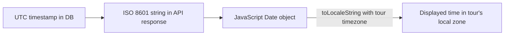
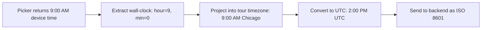
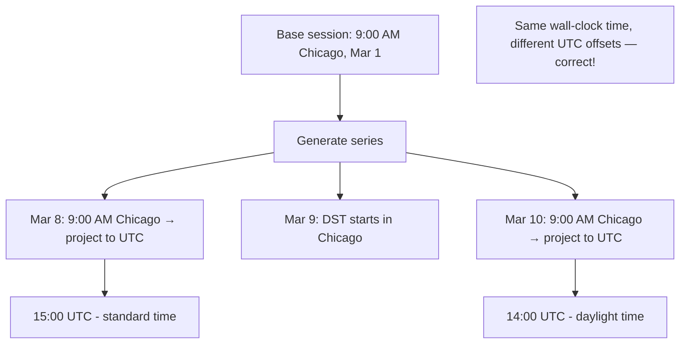

# Timezone Strategy

Audience: Architect, Developer

Companion to [2_architecture.md](2_architecture.md). Covers how TripToe handles the three distinct timezones in the system and avoids common DST/timezone pitfalls.

## The Three Timezones

| Timezone | Where it comes from | Example |
|---|---|---|
| **Guide device** | The phone's OS locale | `America/New_York` |
| **Guest device** | The phone's OS locale | `Europe/London` |
| **Tour template** | Set by the guide when creating/editing a tour | `America/Chicago` |

All three can differ. A guide in New York running tours in Chicago serves guests whose phones are set to London time. The system must handle this correctly at every layer.

## Rules

### 1. All tour times display in the tour template's timezone

The frontend formats all tour-related times using `toLocaleString({ timeZone: tz })` where `tz` is the tour template's `timezone` field. This applies to:

- Session start/end times on cards, headers, and detail screens
- Session creation date/time pickers
- The "Times shown in [timezone]" label on the session creation screen
- The `ActiveTourBanner` time display
- Message timestamps (shown in tour timezone, not device timezone)



### 2. Status computation uses UTC math

`getTourSessionStatus()` in `tourUtils.ts` computes session status by comparing UTC timestamps. No timezone conversion is needed because both the session's stored datetimes and JavaScript's `Date.now()` are in UTC.

```typescript
// Simplified logic
const now = Date.now();
const start = new Date(start_at).getTime();
const end = new Date(end_at).getTime();

if (now > end) return 'completed';
if (now >= start) return 'in_progress';
if (now >= start - CHECKIN_WINDOW_MS) return 'check_in_open';
// ...
```

**Exception**: The "today" check (for the Today/Upcoming/Completed tabs) compares **dates in the tour's timezone**, not UTC dates. A session at 11 PM Chicago time is "today" in Chicago even though it's "tomorrow" in UTC.

### 3. Session creation uses wall-clock projection

When a guide creates a session, the date/time pickers return values in the **phone's local timezone** (this is how React Native's `DateTimePicker` works). The frontend must project those wall-clock values (hour, minute, day) into the **tour template's timezone** before sending UTC to the backend.



This is handled by `pickerDateToUTCISO(pickerDate, tourTimezone)` in `src/utils/recurrence.ts`:

1. Extracts hours, minutes, year, month, day from the picker's Date object
2. Constructs a date string in the tour's timezone: `"2026-04-24T09:00:00"` + tour timezone
3. Converts to UTC ISO string for the API

**Why this matters**: Without wall-clock projection, a guide in New York scheduling a Chicago tour for 9:00 AM would accidentally schedule it for 9:00 AM New York time (10:00 AM Chicago, or 8:00 AM Chicago depending on the season). The guide sees "9:00 AM" in the picker and expects 9:00 AM in the tour's city.

### 4. Recurring sessions handle DST per-date

When generating recurring sessions (daily, weekly, custom), `generateRecurringSessions()` applies wall-clock projection **per date**, not once for the whole series. This prevents DST transitions from shifting session times by an hour.



If we projected once and added 7-day intervals in UTC, sessions after the DST transition would appear at 8:00 AM or 10:00 AM local time instead of the intended 9:00 AM.

### 5. API responses always include timezone offset

The backend serializes datetimes via Python's `.isoformat()` on UTC-aware objects, producing strings like `2026-03-11T15:30:00+00:00`. JavaScript's `new Date()` parses these correctly as UTC instants.

### 6. All datetimes stored in UTC

PostgreSQL columns use `DateTime(timezone=True)` which stores values as `TIMESTAMPTZ` — internally normalized to UTC regardless of the session's timezone setting.

## Common Pitfalls (and how TripToe avoids them)

| Pitfall | How it's avoided |
|---|---|
| Displaying times in the guest's device timezone instead of the tour's timezone | All formatting uses `toLocaleString({ timeZone: tourTimezone })` |
| Scheduling in the guide's device timezone instead of the tour's timezone | `pickerDateToUTCISO()` projects wall-clock into tour timezone |
| DST drift in recurring sessions | Per-date projection in `generateRecurringSessions()` |
| Comparing dates across timezones for "today" bucketing | Date comparison uses tour timezone: `toLocaleDateString('en-CA', { timeZone })` |
| Naive datetime in the database | `DateTime(timezone=True)` enforces `TIMESTAMPTZ` |

## Timezone Detection

When creating a new tour template, the default timezone is auto-detected from the guide's device via `expo-localization`:

```typescript
const deviceTimezone = getCalendars()[0]?.timeZone || 'UTC';
```

The guide can change this via the `TimezonePicker` component on the create/edit tour form. The selected timezone is stored on the `TourTemplate` record and used for all sessions under that template.

## Files

| File | Role |
|---|---|
| `src/utils/recurrence.ts` | `pickerDateToUTCISO()`, `generateRecurringSessions()` — wall-clock projection |
| `src/utils/tourUtils.ts` | `getTourSessionStatus()`, `getTimezone()` — status computation, timezone fallback |
| `src/utils/formatDate.ts` | `formatDate()`, `formatTime()`, `formatDateTime()`, `formatTimeRange()` — all accept a timezone parameter |
| `src/components/ui/TimezonePicker.tsx` | Timezone selection dropdown on tour template form |
| `triptoe-backend/app/utils/datetime_helpers.py` | `to_iso_string()`, `parse_iso_datetime()`, `parse_local_datetime()` |
| `triptoe-backend/app/models/tour.py` | `TourTemplate.timezone` column |
