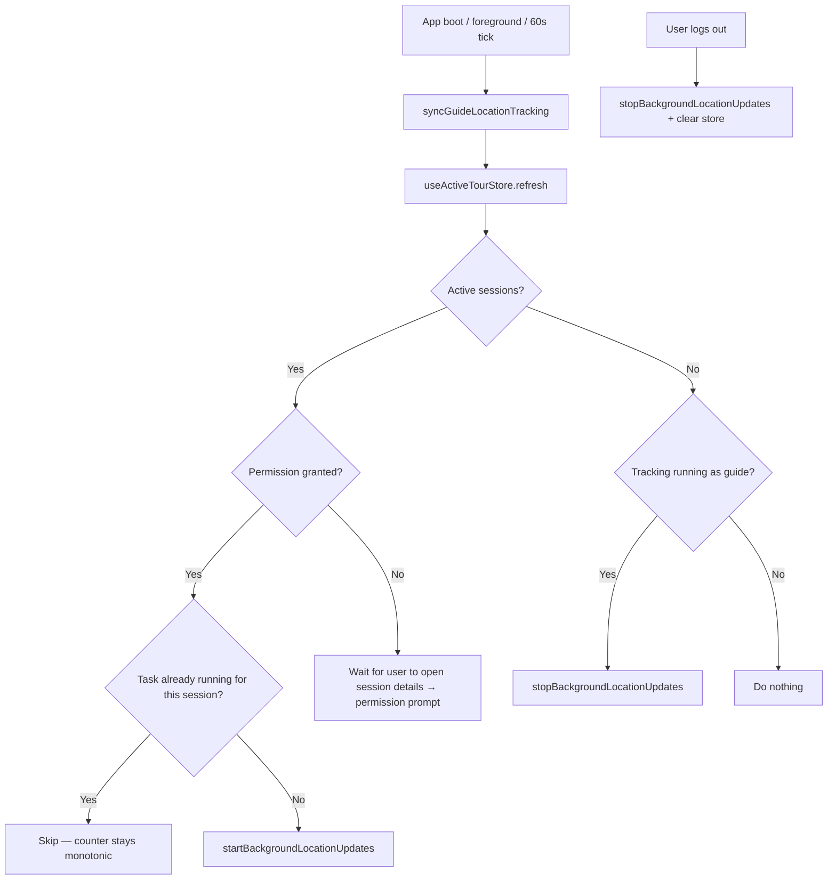
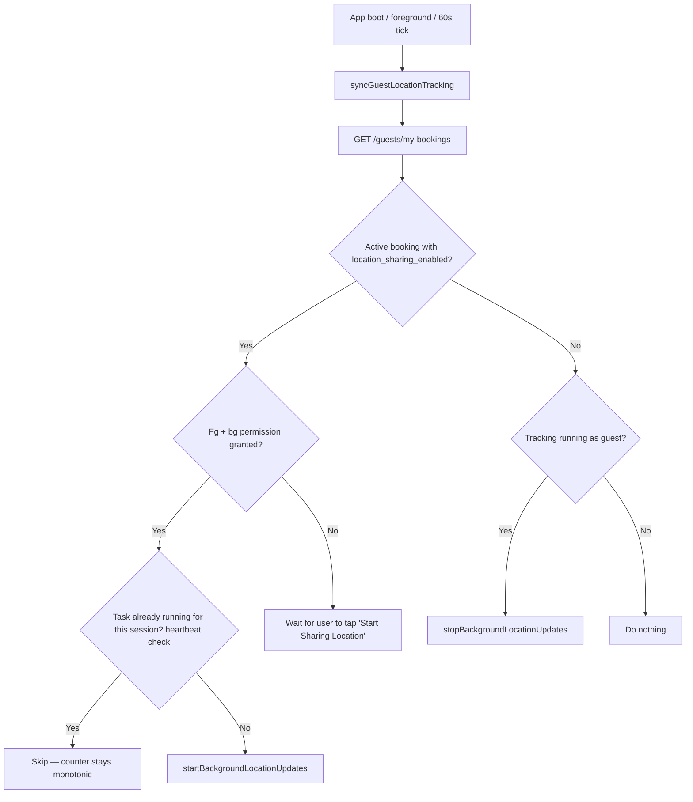
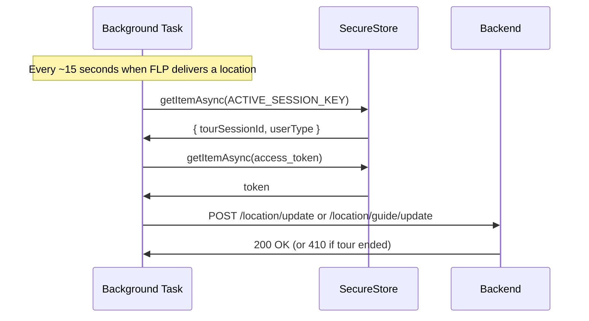
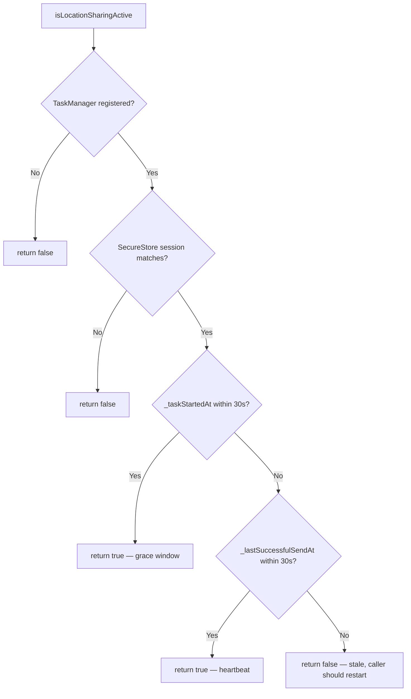
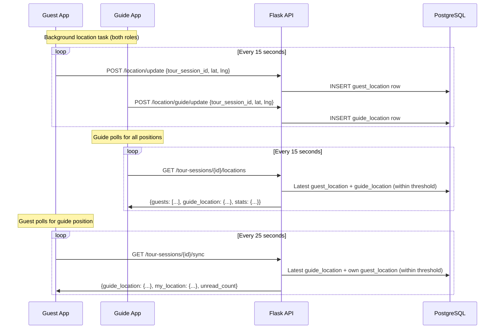

# Location Tracking

Audience: Architect, Developer

Companion to [2_architecture.md](2_architecture.md). Covers how guide and guest location sharing works end-to-end, including background tracking, auto-start, boot resume, map display, and privacy.

## Overview

Both guide and guest use the same underlying mechanism: `expo-location` background location updates via `TaskManager`. A shared `backgroundLocation.ts` service handles both user types. The only differences are which API endpoint receives the updates and how tracking starts.

## How It Works

### Guest

1. Guest checks into a tour session (check-in does **not** auto-start location sharing)
2. Guest explicitly taps "Start Sharing Location" once to opt in — this sets `location_sharing_enabled=true` on their check-in record
3. App requests foreground + background location permission
4. `startBackgroundLocationUpdates(tourSessionId, 'guest')` begins sending to `POST /location/update`
5. The guest's layout-level sync (`syncGuestLocationTracking`) keeps tracking alive on every 60-second tick, on app foreground, and on layout mount — independent of which screen the guest is on. See "Why Guest Tracking Is Also Screen-Independent" below.
6. Guest taps "Stop Sharing" or the tour ends → tracking stops
7. Sharing preference is **sticky**: `location_sharing_enabled` on the booking's check-in survives across app restarts. On the next app launch, the layout-level sync reads it from `/guests/my-bookings` and auto-starts tracking without the guest having to tap anything.

### Guide

1. Root layout (`_layout.tsx`) calls `syncGuideLocationTracking()` from `guideLocationSync.ts` on mount, every 60 seconds, and on app foreground via `AppState`
2. The sync helper reads active sessions from `useActiveTourStore`, checks permission silently (no prompt), and starts tracking if there's a session in the tracking window
3. Permission prompt is triggered from `tour-session-details.tsx` on first visit to an active session
4. `startBackgroundLocationUpdates(tourSessionId, 'guide')` sends to `POST /location/guide/update`
5. Tracking stops when no active sessions remain or on logout

### Why Guide Tracking Is Screen-Independent

Guide location tracking is driven by `useActiveTourStore` at the root layout level, not by any individual screen. The store is a Zustand store that:

- Fetches the guide's upcoming sessions via `getGuideUpcomingTourSessions(false)`
- Filters to sessions where status is `check_in_open` or `in_progress`
- Exposes `activeSessions` to the layout's auto-start effect and to dashboard/schedule for the `ActiveTourBanner`

This means the guide's location is tracked as long as the app is open (any screen) and a session is active. The guide dashboard, schedule screen, and session details screen all read from the same store.



### Why Guest Tracking Is Also Screen-Independent

Guest tracking used to be coupled to the booking details screen — the auto-resume logic only ran from `tour-booking-details.tsx`'s initial load. If the guest force-closed the app and it relaunched to a different screen (account, dashboard), tracking stayed broken until the user manually navigated back to the booking.

The guest now has its own layout-level sync (`guestLocationSync.ts`), mirroring the guide architecture. On every 60-second tick, on AppState 'active', and on layout mount, `syncGuestLocationTracking()`:

1. Calls `GET /guests/my-bookings` — the backend returns `location_sharing_enabled` per booking from the most recent check-in
2. Filters for the first active booking where `checked_in` and `location_sharing_enabled` are both true and the session status is `check_in_open` or `in_progress`
3. Calls `isLocationSharingActive(sessionId)` — if true (task registered AND recent heartbeat or within startup grace), skips the restart so the task counter stays monotonic
4. Otherwise calls `startBackgroundLocationUpdates(sessionId, 'guest')` to restart tracking
5. If no qualifying booking exists, stops tracking (guarded on `userType === 'guest'` so it doesn't interfere with guide tracking if roles get mixed)

Both guide and guest sync use the same "check then start" pattern. An earlier iteration had the guest sync unconditionally restart every tick as an escape hatch for stale-positive `isTaskRegisteredAsync` signals — but that caused a 60-second counter reset churn. The heartbeat-based liveness check (see below) made `isLocationSharingActive` trustworthy, so both syncs can now safely skip the restart when healthy.



## Background Location Service (`backgroundLocation.ts`)

- Single `TaskManager` background task shared by both user types
- `userType` parameter determines the API endpoint (`/location/update` for guests, `/location/guide/update` for guides)
- Uses raw `fetch()` (not Axios) because the background task runs outside React's component tree
- Shows a persistent foreground service notification (required for Android 14+)
- Updates every `LOCATION_UPDATE_INTERVAL_SECONDS` (default: 15 seconds)

### Stateless Task: Read SecureStore on Every Callback

The background task holds **no module-level session or token state**. On every callback it reads the active session (`tourSessionId`, `userType`) and the access token from `SecureStore`:

- No in-memory cache of the session or token
- No reference capture across hot reloads, process restarts, or reinstalls
- No stale-state class of bugs

```typescript
TaskManager.defineTask(BACKGROUND_LOCATION_TASK, async ({ data, error }) => {
  const session = await getPersistedSession();       // fresh read
  if (!session) return;
  const token = await SecureStore.getItemAsync('access_token');  // fresh read
  if (!token) return;
  // ... build + send the request ...
});
```

**Why not cache the token in memory?** An earlier iteration cached `activeAccessToken` in a module variable populated by the caller. When the main app's axios interceptor refreshed the JWT on a 401, the new token went to SecureStore, but the background task kept using the old cached value and silently got 401s on every send. The entire stale-cache class of bug is eliminated by reading fresh on every callback.

**Performance?** `SecureStore.getItemAsync` is a few milliseconds per call. At a 15-second cadence, the overhead is negligible.

### Fetch Retry on Network Errors

React Native's `fetch` throws a `TypeError` with the message "Network request failed" when the underlying HTTP request fails before getting a response — DNS miss, TLS handshake timeout, socket closed mid-flight, idle connection reuse on a dead keep-alive, etc. These are usually transient, and the very next attempt often succeeds because the stack re-establishes the connection.

The background task wraps its fetch in `fetchLocationUpdateWithRetry` which catches `TypeError` **once** and retries immediately:

```typescript
async function fetchLocationUpdateWithRetry(url, init, callNum): Promise<Response | null> {
  try {
    return await fetch(url, init);
  } catch (err) {
    const isNetworkError = err instanceof Error && err.message.includes('Network request failed');
    if (!isNetworkError) throw err;
    console.log(`[BG-LOC #${callNum}] Fetch failed, retrying once`);
    try {
      const response = await fetch(url, init);
      console.log(`[BG-LOC #${callNum}] Retry succeeded`);
      return response;
    } catch {
      console.log(`[BG-LOC #${callNum}] Retry also failed, giving up until next callback`);
      return null;
    }
  }
}
```

**Retry rules:**

- **ONE immediate retry only.** No backoff, no loop. The 15-second task interval is the effective upper bound on time spent in one callback.
- **ONLY on client-side network errors** (the `TypeError` from the fetch itself). 4xx, 5xx, and other non-OK responses are NOT retried — they indicate the request was actually delivered and the server made a decision. Retrying those would be wasted work or harmful (e.g., 410 signals the tour ended and has its own deferred-stop path).
- **`null` return** means both attempts threw; caller drops the update and waits for the next callback.
- **Non-network errors are re-thrown** to the outer task handler so genuine programmer errors aren't silenced by the retry logic.

### Burst Suppression

Google's Fused Location Provider dumps cached location fixes in rapid succession when a listener is first registered — 5-10 callbacks in the first second, ignoring `setMinUpdateIntervalMillis`. Forwarding all of them to the backend triggers FLP's internal rate limiter ("location delivery blocked - too fast"), which silences delivery for **minutes** afterward.

The background task swallows the burst with a JS-side rate limiter:

```typescript
const BURST_SUPPRESSION_INTERNAL_WORKAROUND_MS = 10_000;
let _lastForwardedAt = 0;

// Inside the task callback:
const now = Date.now();
if (now - _lastForwardedAt < BURST_SUPPRESSION_INTERNAL_WORKAROUND_MS) {
  return;  // suppress — burst guard
}
// Claim the window SYNCHRONOUSLY, before any await. Any concurrent
// callback that runs during our fetch will see the updated timestamp
// and get correctly suppressed at its own check.
_lastForwardedAt = now;
// ... await token, await fetch, etc ...
```

**Why set `_lastForwardedAt` before the fetch rather than after a successful response?**

An earlier version assigned `_lastForwardedAt = now` only inside the `if (response.ok)` branch — the intent was to avoid "poisoning" the suppression window on failed sends, so the next legitimate callback could retry immediately. But this created a race condition: two callbacks firing in the same event-loop tick could both pass the guard (since neither had written yet), both `await` the fetch, and both successfully forward a location — producing a duplicate DB row.

Assigning the timestamp synchronously right after the guard passes means concurrent callbacks can't race. The "don't poison on failure" concern turns out to be a non-issue in practice because the task's time interval (15s) is already greater than the suppression window (10s), so the next legitimate callback always passes the check after a failure anyway.

The constant has a warning name and a comment that calls it out as a workaround, not a tunable.

### Distance Filter Must Stay Zero

The `distanceInterval` option on `Location.startLocationUpdatesAsync` maps directly to `setMinUpdateDistanceMeters` on Google's `LocationRequest`. FLP combines the time filter and the distance filter as an **AND condition**: updates are only delivered when enough time has elapsed AND the device has moved at least the distance. Any non-zero value means a stationary phone (dining table, pocket, standing still) never satisfies the filter and receives zero callbacks — the `timeInterval` does NOT act as a fallback.

The code pins the value to 0 via a screaming constant:

```typescript
const LOCATION_DISTANCE_FILTER_MUST_STAY_ZERO = 0;
// ...
distanceInterval: LOCATION_DISTANCE_FILTER_MUST_STAY_ZERO,
```

The name is intentional. Anyone grepping for the option sees the warning, not a plain number they might tune.

### State Persistence

The active session (`tourSessionId`, `userType`) is persisted to `SecureStore` under `ACTIVE_SESSION_KEY`. This survives app crashes, OS kills, reinstalls, and phone restarts. On app boot, the layout-level syncs (`syncGuideLocationTracking`, `syncGuestLocationTracking`) read the current source of truth from the backend or store and make the native task match.



### Start Semantics: Both Syncs Skip When Healthy (via Heartbeat)

`startBackgroundLocationUpdates` itself is idempotent — it always calls `Location.startLocationUpdatesAsync` regardless of whether the task is "already registered". Expo-location handles the duplicate internally.

Both `syncGuideLocationTracking` and `syncGuestLocationTracking` call `isLocationSharingActive(sessionId)` before starting. If it returns `true`, the sync skips the restart — counter stays monotonic, no unnecessary native reconfigures.

The trustworthiness of this check comes from the heartbeat described below. Earlier versions had the guest sync unconditionally restart every tick (the check was not safe to trust), which caused a 60-second restart churn. With the heartbeat in place, the guest sync behaves like the guide.

### Heartbeat Liveness Check

`isLocationSharingActive` cannot rely on `TaskManager.isTaskRegisteredAsync` alone. The registration signal returns a **stale-positive** in several real scenarios:

1. **`adb install -r` over a running app** — the new process inherits the task registration but the native foreground service is dead
2. **App force-close + relaunch** — the JS-native task binding can land in a zombie state where `TaskService: Handling intent` keeps firing on the native side but the JS executor never runs
3. **OS-initiated service restart** after a crash — the registration survives but the location client may not be reattached

In all of these, `isTaskRegisteredAsync` says "yes, it's running" but no callbacks reach JS. From the sync layer's perspective, the task looks healthy and it skips the restart that would actually fix the problem. The observed symptom was "task sent 2 records after relaunch and then total silence."

**The fix** is to require **proof of liveness** in the process. `backgroundLocation.ts` tracks two module-level timestamps:

- `_taskStartedAt` — set when `startBackgroundLocationUpdates` returns successfully
- `_lastSuccessfulSendAt` — set inside the task callback on each confirmed successful fetch

`isLocationSharingActive` then returns `true` iff:

1. The task is registered in TaskManager, AND
2. The persisted session in SecureStore matches the requested `tourSessionId`, AND
3. Either we're inside the startup grace window (`_taskStartedAt` is recent, within 30s) OR we have recent proof of liveness (`_lastSuccessfulSendAt` is within 30s)

If none of the liveness conditions hold, the check returns `false` — even if `isTaskRegisteredAsync` says yes — and the caller is expected to restart. On a fresh process both timestamps are 0, so the check returns false and the layout-level syncs restart the task cleanly. **Intentional** — fresh processes should never trust inherited registration.

The heartbeat is **in-process** state, not persisted. It doesn't need to survive process restarts — a fresh process should force a fresh start anyway. Module-level state here is acceptable because it's a heuristic, not the source of truth.



### Deferred 410 Stop

When the backend returns **HTTP 410 Gone** (tour ended), the task needs to stop the native foreground service. But calling `Location.stopLocationUpdatesAsync()` **synchronously from within a task callback** corrupts the JS-native task binding:

1. `stopLocationUpdatesAsync` → `unregisterTask` → `consumer.didUnregister()` tears down the `LocationTaskConsumer` (nulls `mTask`, stops foreground service, removes location client)
2. Meanwhile the outer event handler in TaskManager.js is still in its `finally` block awaiting `notifyTaskFinishedAsync` for the current event
3. The teardown races with the finalization — subsequent task events arrive at TaskService with no consumer to execute them, and the JS executor silently never runs
4. `dumpsys activity services` shows no LocationTaskService. `TaskService: Handling intent` logs stop appearing. The bug is invisible except by testing after a force-stop + relaunch.

The fix is to defer the native stop to a macrotask:

```typescript
} else if (response.status === 410) {
  console.log(`[BG-LOC #${callNum}] Tour ended (410), deferring native stop`);
  await SecureStore.deleteItemAsync(ACTIVE_SESSION_KEY);  // subsequent callbacks bail
  setTimeout(() => {
    stopBackgroundLocationUpdates('tour-ended-410-deferred').catch(() => {});
  }, 0);
}
```

The `setTimeout(0)` lets the current task callback return, the finally's `notifyTaskFinishedAsync` complete, and the native cycle finish — *then* the native teardown runs cleanly on the next event loop tick. Verified working in production testing: both guide and guest phones handle tour-end 410s and then cleanly pick up the next scheduled tour via their layout syncs.

## Scenario Matrix

| Scenario | Guide | Guest |
|---|---|---|
| App never opened today | No tracking (expected) | No tracking (expected) |
| App in background, any screen | **Continues** | **Continues** |
| Phone restarts during tour | **Resumes on boot** via layout sync | **Resumes on boot** via layout sync |
| App crash / OS kills app | **Resumes on boot** | **Resumes on boot** |
| User navigates to Account/Dashboard | **Continues** | **Continues** |
| Guest force-closes app, reopens mid-tour | N/A | **Auto-resumes** via layout sync — no manual tap, no navigation needed |
| `adb install -r` over a running app | Layout sync re-registers task on next tick | Layout sync re-registers task on next tick (unconditional restart heals stale service state) |
| Tour ends while app is backgrounded | 410 on next send → deferred stop → clean teardown | Same |
| Tour ends while app is foregrounded | 410 on next send → deferred stop → clean teardown | Same |
| New tour starts after old one ended | Auto-picks up via layout sync within 60s | Auto-picks up via layout sync within 60s (guest must be booked + checked in + opted into sharing) |
| Bad connection / tunnel (< 5 min) | Still visible on map | Still visible on map |
| Bad connection / tunnel (> 5 min) | Disappears from map | Disappears from map |
| Transient network error on a single send | Next callback retries; failed fetch does not poison burst window | Same |
| Network error during store refresh | Tracking **continues** (store preserves previous state) | Tracking **continues** (guest sync catches the thrown error and no-ops) |
| Logout during active tour | Tracking stops immediately, notification disappears | Same |

## Backend Endpoints

### Location Updates

| Endpoint | Auth | Purpose |
|---|---|---|
| `POST /location/update` | Guest | Store guest location (lat, lng, accuracy) |
| `POST /location/guide/update` | Guide | Store guide location |
| `POST /location/stop` | Guest | Signal that guest stopped sharing (no-op; the backend uses a time threshold to detect stale locations) |
| `PUT /checkins/location-sharing` | Guest | Toggle `location_sharing_enabled` on the booking record |

Both update endpoints reject requests for **ended sessions** (HTTP 410 Gone). This prevents the native background task from accumulating stale data when the app is suspended past the tour end time.

### Location Reads

| Endpoint | Auth | Purpose |
|---|---|---|
| `GET /tour-sessions/{id}/locations` | Guide | All guest locations + guide's own location + stats (sharing count, total) |
| `GET /location/guide/{id}` | Guest | Guide's location for a specific session |
| `GET /tour-sessions/{id}/sync` | Guest | Lightweight sync: guide location + guest's own location + unread count |

### Active Location Threshold

Locations are considered "active" if `recorded_at >= now - ACTIVE_LOCATION_THRESHOLD_MINUTES` (default: **5 minutes**). Older rows are excluded from all read endpoints. This means if a user walks into a tunnel for 4 minutes, they remain visible on the map; after 5 minutes they disappear.

## Map Display

Both guide and guest maps display positions by **polling the backend** — no local position state:

- **Guide map** polls `GET /tour-sessions/{id}/locations` every 15 seconds while the session is active
- **Guest map** polls `GET /tour-sessions/{id}/sync` every 25 seconds while the session is active

All map positions go through the same path: device → background task → backend → polling → map. No special handling for the phone owner's position.

When markers appear, `TourMapView` auto-centers: `fitToCoordinates` for 2+ markers, `animateToRegion` for a single marker. This ensures the map doesn't stay stuck on the meeting point when location data arrives.



## Logout Cleanup

A separate `useEffect` in `_layout.tsx` watches for **actual logout** (user was set, then became null — detected via a `useRef` tracking the previous value). It does NOT fire on initial app load where user starts as null while `restoreSession` is pending.

On real logout:
1. Calls `stopBackgroundLocationUpdates()` — kills the foreground service notification immediately
2. Calls `useActiveTourStore.getState().clear()` — resets the store

**Why a separate effect?** The auto-start sync effect also depends on `[user]`. If the logout stop and the auto-start were in the same effect, the stop (fire-and-forget async) would race with the start on the next render cycle, killing the just-started task.

## Permission Flow

Location permission is handled in two stages:

1. **Silent check** (layout-level syncs): both `syncGuideLocationTracking` and `syncGuestLocationTracking` call `Location.getForegroundPermissionsAsync()` — no prompt. If granted, tracking starts. If not, the sync bails out silently and waits.

2. **Explicit prompt**:
   - **Guide**: `tour-session-details.tsx` prompts on first visit to an active session via `requestFullLocationPermission()`. After granting, calls `syncGuideLocationTracking()` directly so tracking starts immediately without waiting for the 60-second tick.
   - **Guest**: `tour-booking-details.tsx` prompts when the guest taps "Start Sharing Location" for the first time. After granting, `handleStartSharing` starts the task directly. Subsequent app launches find `location_sharing_enabled=true` in `/guests/my-bookings` and the guest sync auto-starts without re-prompting.

Neither layout sync prompts for permission at boot. This would be jarring and would be rejected by app store review.

## Privacy

- **Guest consent**: Location is only collected after the guest explicitly taps "Start Sharing Location"
- **Guide consent**: Requires location permission grant (prompted on first active session visit)
- **Android 14+**: Requires `FOREGROUND_SERVICE_LOCATION` permission and `foregroundServiceType="location"` in the Manifest
- **Background access**: User must grant "Allow all the time" for background location
- **Foreground service notification**: Persistent notification shown while tracking is active
- **No persistent storage**: Location data rows accumulate during a session but are only queried within the active threshold window

## Pitfalls (Things That Broke Before)

These are documented so future developers don't repeat them.

| Pitfall | What happened | Rule |
|---|---|---|
| Module-level state in the background task | Caching `activeTourSessionId`, `activeUserType`, or `activeAccessToken` in module variables made the task fragile across hot reloads, reinstalls, token refreshes. The cached values went stale silently while the "is it registered" signal said everything was fine. An earlier iteration with an in-memory token cache shipped the same bug in a different form — the main app refreshed the JWT but the task kept using the old cached token and got 401s on every send. | **Stateless task.** No module-level mutable state beyond logging counters. Read session and token from SecureStore on every callback. The overhead is negligible at a 15-second cadence. |
| Calling `stopLocationUpdatesAsync` from within a task callback | The native `LocationTaskConsumer` tore down its location client and foreground service before the current event's `notifyTaskFinishedAsync` could complete. This corrupted the JS-native task binding: `TaskService: Handling intent` kept firing on the native side, but our JS executor silently never ran. Symptom was invisible except by testing after a force-stop + relaunch. | **Defer self-stops to a macrotask.** Clear the session from SecureStore immediately (so concurrent callbacks bail on "no active session"), then schedule the native stop via `setTimeout(() => stopBackgroundLocationUpdates(...), 0)`. The stop runs after the current callback has fully returned and the task cycle has finalized. |
| `distanceInterval > 0` | Google's Fused Location Provider combines the time filter (`setInterval`) and the distance filter (`setMinUpdateDistanceMeters`) as an AND condition. Any non-zero distance value means a stationary phone (dining table, pocket, standing still) never satisfies the filter and receives zero callbacks — the `timeInterval` does **not** act as a fallback. | **`distanceInterval` must stay 0.** The code uses the warning-named constant `LOCATION_DISTANCE_FILTER_MUST_STAY_ZERO` so anyone grepping for the option sees the rule, not a tunable. |
| Initial-fix burst from FLP | On listener registration, Google FLP delivers any recent cached location fixes in rapid succession, ignoring `setMinUpdateIntervalMillis`. The burst of 5-10 callbacks in the first second trips FLP's internal rate limiter ("location delivery blocked - too fast") and silences all further delivery for minutes. | **JS-side burst suppression.** `BURST_SUPPRESSION_INTERNAL_WORKAROUND_MS` rejects callbacks that arrive less than ~10 seconds after the last successful send. Only consume the budget on confirmed successful fetches so network errors don't poison the window. |
| Stop-then-start the native task rapidly | Rapid `stopLocationUpdatesAsync` → `startLocationUpdatesAsync` cycles caused Android's location provider to enter a throttle state that silenced all delivery for minutes. | **Don't gratuitously cycle.** `startBackgroundLocationUpdates` is idempotent — if the task needs a fresh registration, just call start. Expo-location handles "already running" internally. |
| Trusting `isTaskRegisteredAsync` as a "task is healthy" signal | After force-close + relaunch, `adb install -r`, or an OS-initiated service restart, the task registration can persist in TaskManager's repository while the JS-native binding or foreground service is dead. `isTaskRegisteredAsync` returns `true`, the sync thinks everything is fine, and it skips the restart that would have fixed things. Observed symptom: "2 sends after relaunch and then silence," with `TaskService: Handling intent` still firing on the native side while the JS executor never runs. | **Require proof of liveness.** `isLocationSharingActive` checks a module-level heartbeat (`_lastSuccessfulSendAt`) plus a startup grace window (`_taskStartedAt`). Both are 0 on a fresh process, so the check returns false after force-close and forces a clean restart. An earlier workaround had the guest sync unconditionally restart every 60s — that caused 60-second counter churn but is no longer needed now that the check is trustworthy. |
| Guest auto-resume coupled to a single screen | Earlier, the guest's auto-resume logic only ran from `tour-booking-details.tsx`'s initial load. After `adb install -r` or any force-close that relaunched to the Account page, tracking stayed broken because the user was not on the booking details screen. `isLocationSharingActive` returned a stale positive so manual navigation didn't help either. | **Layout-level sync for both roles.** `syncGuestLocationTracking` runs in `_layout.tsx` the same way `syncGuideLocationTracking` does — on mount, 60s interval, AppState 'active'. Screen navigation is irrelevant. |
| Multiple effects starting tracking | Two `useEffect` hooks depending on `[user]` both called `startBackgroundLocationUpdates` simultaneously, racing each other. | **One effect owns tracking per role.** The guide sync effect and the guest sync effect in `_layout.tsx` are the single owners. No other effect should call start/stop. |
| Logout stop racing with auto-start | The logout cleanup (`stopBackgroundLocationUpdates`) was fire-and-forget in the same effect as auto-start. On app boot, user starts as null → stop fires → user becomes guide → start fires → the late-arriving stop kills the just-started task. | **Separate effect for logout.** Only stop on real logout (user was set, then became null), not on initial null during loading. |
| Store wipe on refresh error | `useActiveTourStore.refresh()` set `activeSessions: []` on network error. The auto-start saw no active sessions and stopped tracking permanently. | **Preserve state on error.** The catch block sets `loading: false` only — never wipes sessions or activeSessions. |
| Stale session ID after tour ends | The persisted session ID wasn't cleared when a tour ended while the app was backgrounded. The task kept sending to the old session, getting 410s silently. | **Backend defense-in-depth plus client defer.** The 410 rejection prevents stale data. The deferred 410 stop clears the session key in SecureStore so all future callbacks bail out. |

## Debugging

To verify the background task is working:

```powershell
# Connect the phone via USB and watch React Native JS logs
adb logcat -s ReactNativeJS
```

The production code has persistent `[BG-LOC #N]`, `[GUIDE-SYNC]`, and `[GUEST-SYNC]` log lines that trace every callback and every sync decision. Key things to look for:

- `[BG-LOC] Started for <role> session=<id>` — a new native task registration was issued
- `[BG-LOC #N] Sent (<role> session=<id>)` — a location was successfully forwarded to the backend
- `[BG-LOC #N] Suppressed (burst guard)` — FLP delivered a cached fix that fell inside the 10-second suppression window
- `[BG-LOC #N] Fetch failed, retrying once` — first fetch attempt threw a `TypeError: Network request failed`; the retry path is about to run
- `[BG-LOC #N] Retry succeeded` — retry completed and the response is being handled normally
- `[BG-LOC #N] Retry also failed, giving up until next callback` — both attempts threw; this update is dropped and the next ~15s tick will try fresh
- `[BG-LOC #N] Tour ended (410), deferring native stop` — the backend rejected the send because the tour ended; the task will stop itself on the next macrotask
- `[BG-LOC] Stopping (reason=..., sent N updates)` — the native task was torn down; the `reason` identifies the caller
- `[GUIDE-SYNC] Starting for session=<id>` / `[GUEST-SYNC] Ensuring tracking for session=<id>` — the layout-level sync fired and decided to start tracking

To correlate with native-side activity (FLP throttling, task service dispatch), dump the full logcat:

```powershell
adb logcat -d | Select-String -Pattern "TaskService|FusedLocation|ReactNativeJS"
```

`TaskService: Handling intent` firing on the native side but no subsequent `[BG-LOC]` in the JS logs indicates a task-binding corruption — usually caused by a violated pitfall from the table above.

To verify data reaches the backend:

```sql
SELECT recorded_at, latitude, longitude
FROM guide.guide_location
WHERE tour_session_id = <id>
ORDER BY recorded_at DESC
LIMIT 10;
```

Entries should appear every ~15 seconds with recent `recorded_at` timestamps.

## Files

| File | Role |
|---|---|
| `src/services/backgroundLocation.ts` | Stateless background task definition, start/stop, burst suppression, deferred 410 stop, warning-named constants |
| `src/services/guideLocationSync.ts` | Guide reconciliation helper. Reads active sessions from `useActiveTourStore`, ensures native task matches state. Skips restart when already healthy. |
| `src/services/guestLocationSync.ts` | Guest reconciliation helper. Reads bookings from `/guests/my-bookings`, finds the first active booking with `location_sharing_enabled=true`, gates on `isLocationSharingActive` before calling start (skips when heartbeat proves liveness). |
| `src/stores/useActiveTourStore.ts` | Zustand store: active session detection for guides (drives guide sync) |
| `src/services/location.ts` | API calls for location read/write |
| `src/utils/permissions.ts` | `requestFullLocationPermission()` — foreground + background |
| `app/_layout.tsx` | Guide + guest sync effects (poll helpers, AppState listener, logout cleanup) |
| `app/(guide)/tour-session-details.tsx` | Permission prompt (triggers on first visit to active session) |
| `app/(guest)/tour-booking-details.tsx` | Manual "Start Sharing" button, derives UI sharing state from native task via `isLocationSharingActive` |
| `src/components/tour/TourMapView.tsx` | Map component (renders markers from polled data, auto-centers) |
| `triptoe-backend/app/routes/location.py` | Guest + guide location update/read endpoints, 410 rejection for ended sessions |
| `triptoe-backend/app/routes/tour_sessions.py` | `/guests/my-bookings` returns `location_sharing_enabled` per booking (consumed by `syncGuestLocationTracking`) |
| `triptoe-backend/app/models/location.py` | GuestLocation + GuideLocation models |
| `triptoe-backend/app/config.py` | `ACTIVE_LOCATION_THRESHOLD_MINUTES` (default: 5) |
