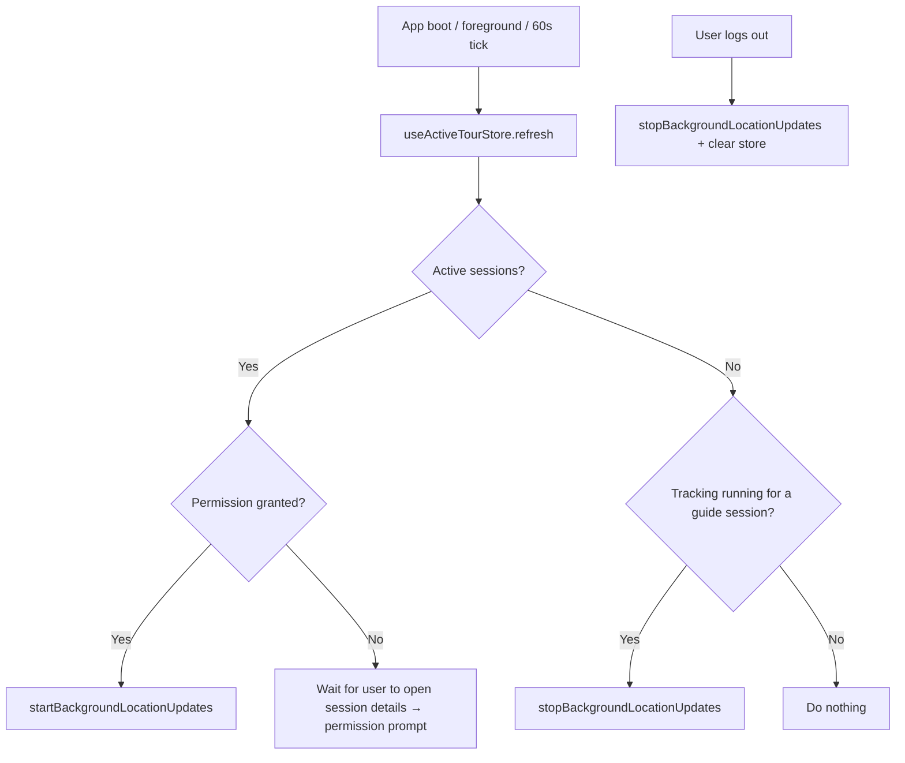
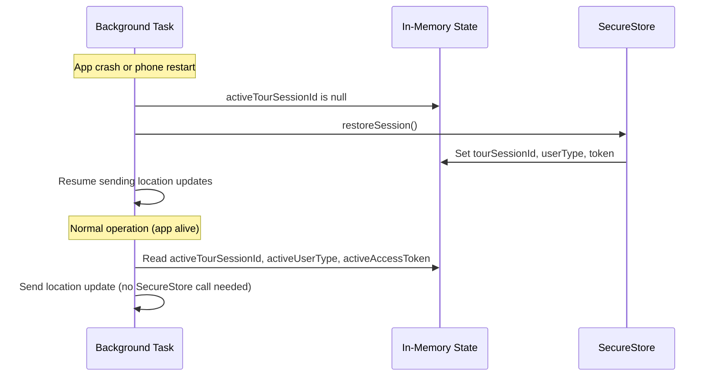
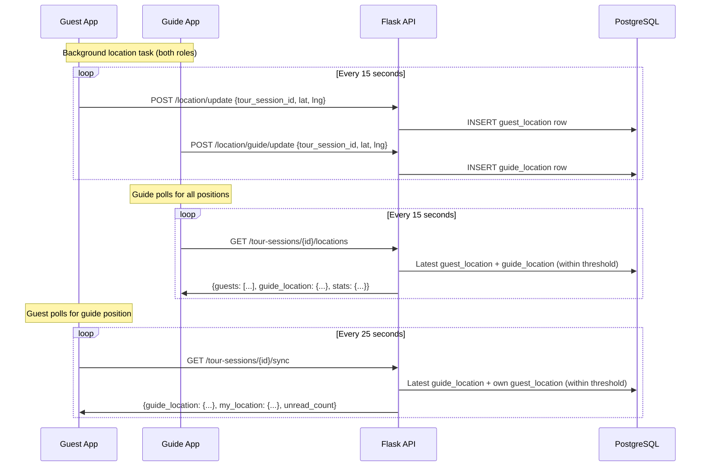

# Location Tracking

Audience: Architect, Developer

Companion to [2_architecture.md](2_architecture.md). Covers how guide and guest location sharing works end-to-end, including background tracking, auto-start, boot resume, map display, and privacy.

## Overview

Both guide and guest use the same underlying mechanism: `expo-location` background location updates via `TaskManager`. A shared `backgroundLocation.ts` service handles both user types. The only differences are which API endpoint receives the updates and how tracking starts.

## How It Works

### Guest

1. Guest checks into a tour session (check-in does **not** auto-start location sharing)
2. Guest explicitly taps "Start Sharing Location" to opt in
3. App requests foreground + background location permission
4. `startBackgroundLocationUpdates(tourSessionId, 'guest', token)` begins sending to `POST /location/update`
5. Guest taps "Stop Sharing" or the tour ends → tracking stops
6. Sharing preference is **sticky**: if the guest closes and reopens the app during an active session, sharing auto-resumes (via `location_sharing_enabled` on the booking record)

### Guide

1. Root layout (`_layout.tsx`) detects an active session via `useActiveTourStore` (polls every 60 seconds + on app foreground via `AppState`)
2. If location permission is already granted, tracking starts automatically — **no specific screen needs to be open**
3. Permission prompt is triggered from `tour-session-details.tsx` on first visit to an active session
4. `startBackgroundLocationUpdates(tourSessionId, 'guide', token)` sends to `POST /location/guide/update`
5. Tracking stops when no active sessions remain or on logout

### Why Guide Tracking Is Screen-Independent

Guide location tracking is driven by `useActiveTourStore` at the root layout level, not by any individual screen. The store is a Zustand store that:

- Fetches the guide's upcoming sessions via `getGuideUpcomingTourSessions(false)`
- Filters to sessions where status is `check_in_open` or `in_progress`
- Exposes `activeSessions` to the layout's auto-start effect and to dashboard/schedule for the `ActiveTourBanner`

This means the guide's location is tracked as long as the app is open (any screen) and a session is active. The guide dashboard, schedule screen, and session details screen all read from the same store.



## Background Location Service (`backgroundLocation.ts`)

- Single `TaskManager` background task shared by both user types
- `userType` parameter determines the API endpoint (`/location/update` for guests, `/location/guide/update` for guides)
- Uses raw `fetch()` (not Axios) because the background task runs outside React's component tree
- Shows a persistent foreground service notification (required for Android 14+)
- Updates every `LOCATION_UPDATE_INTERVAL_SECONDS` (default: 15 seconds)

### Token Handling

The access token is cached **in memory** (`activeAccessToken`) and passed to `startBackgroundLocationUpdates` by the caller. Both `_layout.tsx` (guides) and `tour-booking-details.tsx` (guests) read the token from SecureStore once and pass it in. The background task uses the in-memory token directly, falling back to SecureStore only if the cache is empty (e.g., after a cold restart where in-memory state is lost).

**Why not just read from SecureStore every time?** On some Android devices, repeated async `SecureStore.getItemAsync` calls from a background task cause the task to hang or be throttled by the OS. The task goes silent (no more callbacks) while the foreground service notification stays visible — making the issue hard to detect. The in-memory cache eliminates async bridge calls from the task's hot path.

### State Persistence

The active session (`tourSessionId`, `userType`, `token`) is persisted to `SecureStore` under `ACTIVE_SESSION_KEY`. This survives app crashes, OS kills, and phone restarts. On app boot, the auto-start sync in `_layout.tsx` detects active sessions via `useActiveTourStore` and starts tracking.



### Always-Start (No Skip, No Stop-Then-Start)

`startBackgroundLocationUpdates` always calls `Location.startLocationUpdatesAsync` — it does not check `isTaskRegisteredAsync` first. Expo-location handles the duplicate internally if the task is already running.

**Why not skip if running?** A stale task registration from a previous build or app install can report `isTaskRegisteredAsync = true` while the native location subscription is dead (no more callbacks). Skipping based on this check leaves tracking silently broken.

**Why not stop then start?** The native Android location provider does not tolerate rapid `stopLocationUpdatesAsync` → `startLocationUpdatesAsync` cycles. It delivers a few buffered locations then goes silent permanently.

**The safe approach: always call start.** If the task is genuinely running, the call is a no-op. If it's stale, it creates a fresh subscription.

## Scenario Matrix

| Scenario | Guide | Guest |
|---|---|---|
| App never opened today | No tracking (expected) | No tracking (expected) |
| App in background, any screen | **Continues** | **Continues** |
| Phone restarts during tour | **Resumes on boot** | **Resumes on boot** |
| App crash / OS kills app | **Resumes on boot** | **Resumes on boot** |
| User navigates to Account/Dashboard | **Continues** | **Continues** |
| Guest reopens app mid-tour | N/A | **Auto-resumes** (sticky preference) |
| Tour ends while app is backgrounded | Backend returns 410; stops on next foreground | Same |
| Bad connection / tunnel (< 5 min) | Still visible on map | Still visible on map |
| Bad connection / tunnel (> 5 min) | Disappears from map | Disappears from map |
| Network error during store refresh | Tracking **continues** (store preserves previous state) | N/A |
| Logout during active tour | Tracking stops immediately, notification disappears | Same |

## Backend Endpoints

### Location Updates

| Endpoint | Auth | Purpose |
|---|---|---|
| `POST /location/update` | Guest | Store guest location (lat, lng, accuracy) |
| `POST /location/guide/update` | Guide | Store guide location |
| `POST /location/stop` | Guest | Signal that guest stopped sharing (no-op; the backend uses a time threshold to detect stale locations) |
| `PUT /checkins/location-sharing` | Guest | Toggle `location_sharing_enabled` on the booking record |

Both update endpoints reject requests for **ended sessions** (HTTP 410 Gone). This prevents the native background task from accumulating stale data when the app is suspended past the tour end time.

### Location Reads

| Endpoint | Auth | Purpose |
|---|---|---|
| `GET /tour-sessions/{id}/locations` | Guide | All guest locations + guide's own location + stats (sharing count, total) |
| `GET /location/guide/{id}` | Guest | Guide's location for a specific session |
| `GET /tour-sessions/{id}/sync` | Guest | Lightweight sync: guide location + guest's own location + unread count |

### Active Location Threshold

Locations are considered "active" if `recorded_at >= now - ACTIVE_LOCATION_THRESHOLD_MINUTES` (default: **5 minutes**). Older rows are excluded from all read endpoints. This means if a user walks into a tunnel for 4 minutes, they remain visible on the map; after 5 minutes they disappear.

## Map Display

Both guide and guest maps display positions by **polling the backend** — no local position state:

- **Guide map** polls `GET /tour-sessions/{id}/locations` every 15 seconds while the session is active
- **Guest map** polls `GET /tour-sessions/{id}/sync` every 25 seconds while the session is active

All map positions go through the same path: device → background task → backend → polling → map. No special handling for the phone owner's position.

When markers appear, `TourMapView` auto-centers: `fitToCoordinates` for 2+ markers, `animateToRegion` for a single marker. This ensures the map doesn't stay stuck on the meeting point when location data arrives.



## Logout Cleanup

A separate `useEffect` in `_layout.tsx` watches for **actual logout** (user was set, then became null — detected via a `useRef` tracking the previous value). It does NOT fire on initial app load where user starts as null while `restoreSession` is pending.

On real logout:
1. Calls `stopBackgroundLocationUpdates()` — kills the foreground service notification immediately
2. Calls `useActiveTourStore.getState().clear()` — resets the store

**Why a separate effect?** The auto-start sync effect also depends on `[user]`. If the logout stop and the auto-start were in the same effect, the stop (fire-and-forget async) would race with the start on the next render cycle, killing the just-started task.

## Permission Flow

Location permission is handled in two stages:

1. **Silent check** (`_layout.tsx` auto-start): calls `Location.getForegroundPermissionsAsync()` — no prompt. If granted, tracking starts. If not, the auto-start does nothing and waits for the user to visit session details.

2. **Explicit prompt** (`tour-session-details.tsx`): when the guide opens an active session for the first time, calls `requestFullLocationPermission()` which prompts for both foreground and background. After granting, calls `useActiveTourStore.getState().refresh()` to immediately trigger the auto-start without waiting for the 60-second tick.

The auto-start never prompts for permission at boot. This would be jarring and would be rejected by app store review.

## Privacy

- **Guest consent**: Location is only collected after the guest explicitly taps "Start Sharing Location"
- **Guide consent**: Requires location permission grant (prompted on first active session visit)
- **Android 14+**: Requires `FOREGROUND_SERVICE_LOCATION` permission and `foregroundServiceType="location"` in the Manifest
- **Background access**: User must grant "Allow all the time" for background location
- **Foreground service notification**: Persistent notification shown while tracking is active
- **No persistent storage**: Location data rows accumulate during a session but are only queried within the active threshold window

## Pitfalls (Things That Broke Before)

These are documented so future developers don't repeat them.

| Pitfall | What happened | Rule |
|---|---|---|
| Stop-then-start the native task | Rapid `stopLocationUpdatesAsync` → `startLocationUpdatesAsync` caused Android's location provider to go silent permanently. Only a fresh app restart recovered it. | **Never stop then start.** Always call `startLocationUpdatesAsync` without stopping first. Expo-location handles duplicates internally. |
| Skip-if-running check | `isTaskRegisteredAsync` returned true for a stale task from a previous build. The code skipped `startLocationUpdatesAsync`, so no fresh subscription was created. The task never fired again. | **Never skip based on `isTaskRegisteredAsync`.** Always call start. |
| SecureStore in the background task | Repeated async `SecureStore.getItemAsync` calls from the background task caused it to hang on some Android devices. The foreground notification stayed visible but no data was sent. | **Cache the token in memory.** Pass it to `startBackgroundLocationUpdates` and use `activeAccessToken` in the task. Fall back to SecureStore only on cold restart. |
| Multiple effects starting tracking | Two `useEffect` hooks depending on `[user]` both called `startBackgroundLocationUpdates` simultaneously, racing each other. | **One effect owns tracking.** The auto-start sync effect in `_layout.tsx` is the single owner. No other effect should call start/stop. |
| Logout stop racing with auto-start | The logout cleanup (`stopBackgroundLocationUpdates`) was fire-and-forget in the same effect as auto-start. On app boot, user starts as null → stop fires → user becomes guide → start fires → the late-arriving stop kills the just-started task. | **Separate effect for logout.** Only stop on real logout (user was set, then became null), not on initial null during loading. |
| Store wipe on refresh error | `useActiveTourStore.refresh()` set `activeSessions: []` on network error. The auto-start saw no active sessions and stopped tracking permanently. | **Preserve state on error.** The catch block sets `loading: false` only — never wipes sessions or activeSessions. |
| Stale session ID after tour ends | The persisted session ID wasn't cleared when a tour ended while the app was backgrounded. The task kept sending to the old session, getting 410s silently. | **Backend defense-in-depth.** The 410 rejection prevents stale data. The auto-start clears tracking when no active sessions remain. |

## Debugging

To verify the background task is working:

```powershell
# Connect the phone via USB and watch React Native JS logs
adb logcat -s ReactNativeJS
```

Debug logging is not present in production code. To diagnose, add a temporary `console.log` at the top of the `TaskManager.defineTask` callback in `backgroundLocation.ts`:

```typescript
console.log(`[BG-LOC] TICK sid=${activeTourSessionId} type=${activeUserType} locs=${(data as any)?.locations?.length ?? 0}`);
```

This shows whether the task is being invoked, which session it's targeting, and whether Android is delivering location data.

To verify data reaches the backend:

```sql
SELECT recorded_at, latitude, longitude
FROM guide.guide_location
WHERE tour_session_id = <id>
ORDER BY recorded_at DESC
LIMIT 10;
```

Entries should appear every ~15 seconds with recent `recorded_at` timestamps.

## Files

| File | Role |
|---|---|
| `src/services/backgroundLocation.ts` | Background task definition, start/stop, state persistence, token cache |
| `src/stores/useActiveTourStore.ts` | Zustand store: active session detection (drives guide auto-start) |
| `src/services/location.ts` | API calls for location read/write |
| `src/utils/permissions.ts` | `requestFullLocationPermission()` — foreground + background |
| `app/_layout.tsx` | Guide auto-start effect (polls store, starts/stops tracking, AppState listener, logout cleanup) |
| `app/(guide)/tour-session-details.tsx` | Permission prompt (triggers on first visit to active session) |
| `app/(guest)/tour-booking-details.tsx` | Guest start/stop sharing, auto-resume on reopen, token passing |
| `src/components/tour/TourMapView.tsx` | Map component (renders markers from polled data, auto-centers) |
| `triptoe-backend/app/routes/location.py` | Guest + guide location update/read endpoints, 410 rejection for ended sessions |
| `triptoe-backend/app/models/location.py` | GuestLocation + GuideLocation models |
| `triptoe-backend/app/config.py` | `ACTIVE_LOCATION_THRESHOLD_MINUTES` (default: 5) |
