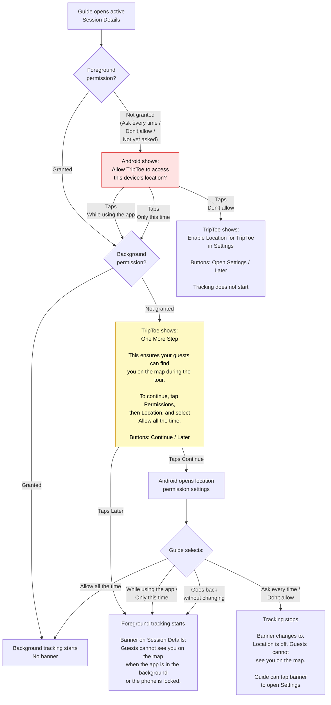
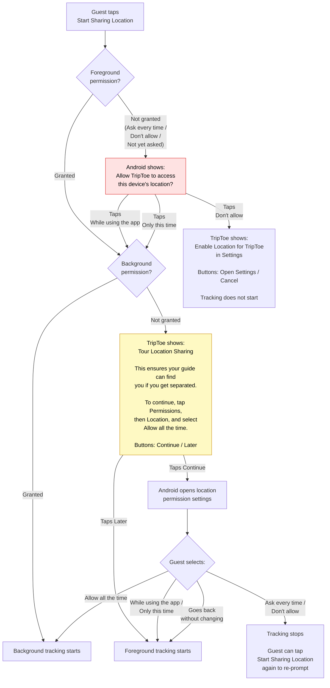

# Permissions

Audience: Architect, Developer

Covers how runtime permissions are requested, denied, and recovered across all native features, for both guide and guest roles, on both Android and iOS.

## Design Principles

- **Ask only when needed.** Never prompt for a permission at app launch. Prompt at the moment the user takes an action that requires it (e.g. tapping "Start Sharing Location," opening the QR scanner, tapping "Camera" in the image picker).
- **Explain before asking.** When the OS requires a two-step permission flow (e.g. iOS foreground-then-background location), show an in-app explanation between the two system prompts so the user understands why they're being asked again.
- **Always offer recovery.** Every permission-denied alert includes an "Open Settings" button (`Linking.openSettings()`) that takes the user directly to TripToe's settings page, where all permissions are listed. The user never has to hunt through system settings.
- **Guide vs guest tone.** Guides must grant location — it's core to the product. Guests can opt out — location sharing is optional for them.

## Permissions by Feature

### Location (Foreground + Background)

**Used by:** Guide location tracking, guest location sharing

**When prompted:**
- **Guide**: automatically on first visit to an active tour session (`tour-session-details.tsx`)
- **Guest**: when they tap "Start Sharing Location" on the tour booking details screen

**Platform behavior:**

| Step | Android | iOS |
|---|---|---|
| Foreground | Single system prompt: "Allow while using the app" | Single system prompt: "Allow While Using App" |
| Background | On Android 10: included in foreground prompt. On Android 11+: separate system prompt or Settings redirect for "Allow all the time" | Always a separate system prompt for "Always." iOS forces a two-step flow — there is no way to ask for "Always" in one step. |

**Guide: Two-prompt flow (iOS and Android 11+):**

Guides need background permission for locked-phone tracking. Users see two system dialogs about "location" back to back. Without context, this feels broken — they already said yes, why are they being asked again? To solve this, the app shows an in-app explanation alert between the two system prompts:

```
[System prompt 1: "Allow While Using App" — user taps Allow]
         ↓
[App alert: "One More Step — Choose 'Always' on the next screen so TripToe
 can keep your guide location visible if your phone locks during the tour."
 — user taps Continue or Later]
         ↓
[System prompt 2: "Always" — user taps Allow]
```

If background permission is already granted (e.g. returning user), the explanation is skipped entirely. If the guide taps "Later", tracking falls back to foreground-only mode (works while app is open, pauses when backgrounded).

**Guest: Foreground only — no background prompt.**

Guests only need foreground location permission. They are not shown the "One More Step" dialog or any background permission prompt. This matches the Uber model: riders (guests) share location while the app is open; drivers (guides) need background tracking.

**Guide vs guest behavior:**

| Scenario | Guide | Guest |
|---|---|---|
| Foreground denied | Alert with "Open Settings" + "Later" | Alert with "Open Settings" + "Cancel" |
| Background prompt | "One More Step" explanation, then system prompt. "Later" skips (falls back to foreground tracking) | "Tour Location Sharing" explanation, then system prompt. "Later" skips (falls back to foreground tracking) |
| Background denied | Informational banner on Session Details: "Guests cannot see you on the map when the app is in the background or the phone is locked." Taps to Settings | No banner — foreground fallback is silent for guests |
| All permissions denied | Alert banner: "Location is off. Guests cannot see you on the map." | No tracking (optional feature) |

Both flows offer "Later" at the background step — foreground tracking still works. Location is degraded, not broken.

The guest flow always offers an opt-out. Location sharing is optional. The app still works for receiving messages, viewing tour details, checking in, and rating.

**Permission copy is platform-specific.** Android alerts include step-by-step Settings navigation ("Tap Permissions, then Location, and select 'Allow all the time'"). iOS alerts reference the system prompt directly ("Select 'Always' on the next screen").

**Recovery (both roles):**

If the user previously denied the permission, the OS will not show the system prompt again. In this case, `requestForegroundPermissionsAsync()` returns `denied` immediately without showing a dialog. The app detects this and shows the "Open Settings" alert, which opens TripToe's settings page where the user can toggle Location back on.

**Implementation:** `src/utils/permissions.ts` — `requestFullLocationPermission(role)`

**Guide permission prompt flow:**



**Guest permission prompt flow:**



### Camera

**Used by:** QR code scanner (guest), image picker for cover photos / meeting place photos / profile photos (both roles)

**When prompted:**
- **QR scanner**: when the guest taps "Scan QR Code" on the Join Tour screen
- **Image picker**: when the user selects "Camera" from the image source picker

**Platform behavior:**

| | Android | iOS |
|---|---|---|
| Permission | `CAMERA` in AndroidManifest | `NSCameraUsageDescription` in Info.plist |
| Prompt | Single system prompt | Single system prompt |
| After denial | OS won't re-prompt; app shows "Open Settings" alert | OS won't re-prompt; app shows "Open Settings" alert |

Camera permission is the same for guides and guests — there's no role-specific behavior.

**Recovery:**

The denied alert says: "To take a photo, enable Camera for TripToe in Settings." with an "Open Settings" button.

**Implementation:**
- Image picker camera: `src/utils/imagePicker.ts` — `pickImageFromCamera()`
- QR scanner camera: `app/(guest)/(tabs)/book-tour-session.tsx` — `handleOpenScanner()`

### Photo Library

**Used by:** Image picker for cover photos / meeting place photos / profile photos (both roles)

**Platform behavior:**

| | Android | iOS |
|---|---|---|
| Permission | Not required (Android uses system file picker) | `NSPhotoLibraryUsageDescription` in Info.plist. On iOS 14+, user can grant "Selected Photos" or "All Photos" |
| Prompt | None needed | System prompt on first access |

Expo's `launchImageLibraryAsync` handles photo library permission internally. No custom permission handling needed.

### Push Notifications

**Used by:** Tour messages, booking confirmations, post-tour nudges (both roles)

**When prompted:** Automatically after sign-in (both guide and guest), triggered by `registerForPushNotifications()` in the root layout.

**Platform behavior:**

| | Android | iOS |
|---|---|---|
| Permission | Android 13+: requires `POST_NOTIFICATIONS` runtime permission. Android 12 and below: granted automatically | Always requires user permission |
| Prompt | System prompt (Android 13+) | System prompt |
| Default if not granted | Notifications silently not delivered | Notifications silently not delivered |

Push notification permission is not re-prompted if denied. The app does not currently show an "Open Settings" recovery alert for notifications — if the user denies, they simply won't receive push notifications. This is acceptable because notifications are not critical to core functionality (location sharing and messaging still work without push).

**Implementation:** `src/utils/permissions.ts` — `requestNotificationPermission()`, called by `src/services/notifications.ts` — `registerForPushNotifications()`

## app.json Permission Configuration

### iOS (`infoPlist`)

| Key | Value |
|---|---|
| `NSLocationWhenInUseUsageDescription` | "TripToe shares your live location with your tour guide and group during active tours so everyone can find each other." |
| `NSLocationAlwaysAndWhenInUseUsageDescription` | "TripToe keeps your location updating in the background during a tour so your guide can see where you are if you fall behind the group. Tracking stops automatically when the tour ends." |
| `NSCameraUsageDescription` | "TripToe uses your camera to take cover photos for your tours and meeting places, and to scan QR codes to join tours." |
| `NSPhotoLibraryUsageDescription` | "TripToe uses your photo library to upload tour cover images, meeting place photos, and your profile photo." |
| `UIBackgroundModes` | `["location", "fetch", "remote-notification"]` |

Apple rejects apps with vague permission strings. Every string must explain the user-facing benefit.

### iOS (expo-location plugin)

```json
["expo-location", {
  "locationAlwaysAndWhenInUsePermission": "...",
  "isIosBackgroundLocationEnabled": true,
  "isAndroidBackgroundLocationEnabled": true,
  "isAndroidForegroundServiceEnabled": true
}]
```

`isIosBackgroundLocationEnabled` must be `true` or iOS background location permission will always return denied even if the user granted "Always."

### Android (`permissions`)

```
ACCESS_FINE_LOCATION, ACCESS_COARSE_LOCATION, ACCESS_BACKGROUND_LOCATION,
FOREGROUND_SERVICE, FOREGROUND_SERVICE_LOCATION,
POST_NOTIFICATIONS, CAMERA
```

`FOREGROUND_SERVICE_LOCATION` is required on Android 14+ for the persistent location tracking notification.

## Common User Issues

| Issue | Cause | What the app does |
|---|---|---|
| "I already said yes, why are you asking again?" | iOS/Android 11+ two-step location flow | Shows "One More Step" explanation between the two system prompts |
| "I clicked the wrong thing and now X doesn't work" | User denied a permission and OS won't re-prompt | Shows alert with "Open Settings" button linking directly to TripToe's settings page |
| "Location stopped when I locked my phone" (guide) | Background location not granted ("While Using App" only) | Shows informational banner: "Guests cannot see you on the map when the app is in the background or the phone is locked." Taps to Settings. Foreground tracking still works while app is open. |
| Permission prompts don't appear at all | User previously denied; OS remembers and won't re-ask | App detects this and shows "Open Settings" alert instead |

## Files

| File | Role |
|---|---|
| `src/utils/permissions.ts` | `requestFullLocationPermission(role)`, `requestForegroundLocation()`, `requestBackgroundLocation()`, `requestNotificationPermission()` |
| `src/utils/imagePicker.ts` | Camera permission handling in `pickImageFromCamera()` |
| `app/(guest)/(tabs)/book-tour-session.tsx` | QR scanner camera permission in `handleOpenScanner()` |
| `app/(guide)/tour-session-details.tsx` | Guide location permission prompt on active session visit |
| `app/(guest)/tour-booking-details.tsx` | Guest location permission prompt on "Start Sharing Location" tap |
| `app/_layout.tsx` | Push notification registration after sign-in |
